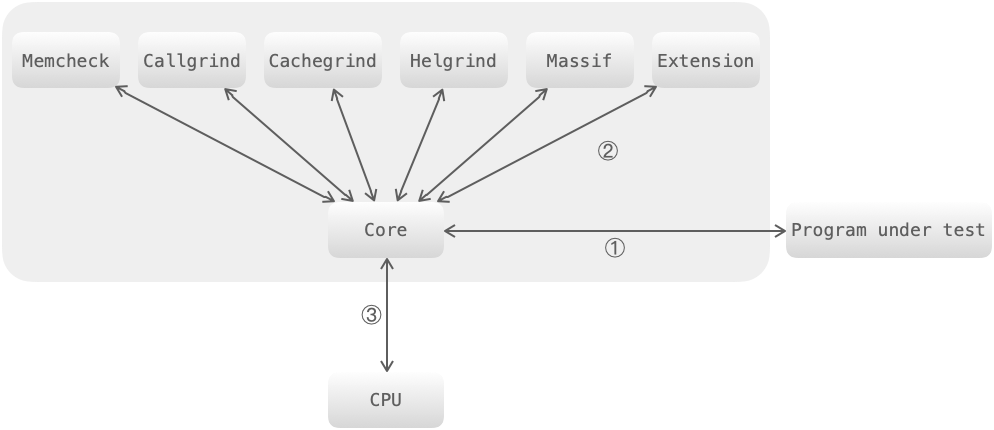

# 内存泄漏检测与预防

对于 `C/C++` 没有 `GC` 程序的语言来说因为内存造成的问题较多，当然一般情况下如果存在严重的内存泄漏，我们通过查看内存使用统计即可检测到内存泄漏，但是细小的内存泄漏很难通过统计观察到，目前一般都是利用各种内存检测工具来检测内存泄漏，当然关键还是在于统计和分析申请和释放的相关日志。内存检测工具有很多，这里重点介绍下 `valgrind` 。



`valgrind` 是一套 `Linux` 下，开放源代码（`GPL V2`）的仿真调试工具的集合，包括以下工具：

- Memcheck：内存检查器（`valgrind` 应用最广泛的工具），能够发现开发中绝大多数内存错误的使用情况，比如：使用未初始化的内存，使用已经释放了的内存，内存访问越界等。
- Callgrind：检查程序中函数调用过程中出现的问题。
- Cachegrind：检查程序中缓存使用出现的问题。
- Helgrind：检查多线程程序中出现的竞争问题。
- Massif：检查程序中堆栈使用中出现的问题。
- Extension：可以利用 `core` 提供的功能，自己编写特定的内存调试工具。

Memcheck 能够检测出内存问题，关键在于其建立了两个全局表：

- Valid-Value 表：对于进程的整个地址空间中的每一个字节（`byte`），都有与之对应的 `8` 个 bits ；对于 `CPU` 的每个寄存器，也有一个与之对应的 `bit` 向量。这些 `bits` 负责记录该字节或者寄存器值是否具有有效的、已初始化的值。
- Valid-Address 表：对于进程整个地址空间中的每一个字节（`byte`），还有与之对应的 `1` 个 bit，负责记录该地址是否能够被读写。

## valgrind检测原理

当要读写内存中某个字节时，首先检查这个字节对应的 `Valid-Address` 表中对应的 `bit`。如果该 `bit` 显示该位置是无效位置，`Memcheck` 则报告读写错误。
内核（`core`）类似于一个虚拟的 `CPU` 环境，这样当内存中的某个字节被加载到真实的 `CPU` 中时，该字节在 `Valid-Value` 表对应的 `bits` 也被加载到虚拟的 `CPU` 环境中。一旦寄存器中的值，被用来产生内存地址，或者该值能够影响程序输出，则 `Memcheck` 会检查 `Valid-Value` 表对应的 `bits`，如果该值尚未初始化，则会报告使用未初始化内存错误。

## 程序实例

```cpp
#include <stdio.h>
#include <stdlib.h> 

int main(void)
{
    char *p = (char *)malloc(1);
    *p = 'a'; 

    char c = *p; 

    printf("\n [%c]\n",c); 

    return 0;
}
```

我们运行memcheck工具时即可检测出未释放的内存:

```text
$ valgrind --tool=memcheck --leak-check=full ./2
==437== Memcheck, a memory error detector
==437== Copyright (C) 2002-2017, and GNU GPL'd, by Julian Seward et al.
==437== Using Valgrind-3.13.0 and LibVEX; rerun with -h for copyright info
==437== Command: ./2
==437==
==437== error calling PR_SET_PTRACER, vgdb might block

[a]
==437==
==437== HEAP SUMMARY:
==437==     in use at exit: 1 bytes in 1 blocks
==437==   total heap usage: 2 allocs, 1 frees, 513 bytes allocated
==437==
==437== 1 bytes in 1 blocks are definitely lost in loss record 1 of 1
==437==    at 0x4C2FB0F: malloc (in /usr/lib/valgrind/vgpreload_memcheck-amd64-linux.so)
==437==    by 0x108676: main (in /mnt/c/work/leetcode/2)
==437==
==437== LEAK SUMMARY:
==437==    definitely lost: 1 bytes in 1 blocks
==437==    indirectly lost: 0 bytes in 0 blocks
==437==      possibly lost: 0 bytes in 0 blocks
==437==    still reachable: 0 bytes in 0 blocks
==437==         suppressed: 0 bytes in 0 blocks
==437==
==437== For counts of detected and suppressed errors, rerun with: -v
==437== ERROR SUMMARY: 1 errors from 1 contexts (suppressed: 0 from 0)
```

## 如何防止内存泄漏

- 内部封装：将内存的分配和释放封装到类中，在构造的时候申请内存，析构的时候释放内存。

```cpp
#include <iostream>
#include <cstring>

using namespace std;

class A
{
private:
    char *p;
    unsigned int p_size;

public:
    A(unsigned int n = 1) // 构造函数中分配内存空间
    {
        p = new char[n];
        p_size = n;
    };
    ~A() // 析构函数中释放内存空间
    {
        if (p != NULL)
        {
            delete[] p; // 删除字符数组
            p = NULL;   // 防止出现野指针
        }
    };
    char *GetPointer()
    {
        return p;
    };
};
void fun()
{
    A ex(100);
    char *p = ex.GetPointer();
    strcpy(p, "Test");
    cout << p << endl;
}
int main()
{
    fun();
    return 0;
}
```

说明：但这样做并不是最佳的做法，在类的对象复制时，程序会出现同一块内存空间释放两次的情况，请看如下程序：

```cpp
void fun1()
{
    A ex(100);
    A ex1 = ex; 
    char *p = ex.GetPointer();
    strcpy(p, "Test");
    cout << p << endl;
}
```

简单解释：对于 fun1 这个函数中定义的两个类的对象而言，在离开该函数的作用域时，会两次调用析构函数来释放空间。但是这两个对象指向的是同一块内存空间，所以导致同一块内存空间被释放两次，可以通过增加计数机制来避免这种情况。

```cpp
#include <iostream>
#include <cstring>
using namespace std;
class A
{
private:
    char *p;
    unsigned int p_size;
    int *p_count; // 计数变量
public:
    A(unsigned int n = 1) // 在构造函数中申请内存
    {
        p = new char[n];
        p_size = n;
        p_count = new int;
        *p_count = 1;
        cout << "count is : " << *p_count << endl;
    };
    // reference count
    A(const A &temp)
    {
        p = temp.p;
        p_size = temp.p_size;
        p_count = temp.p_count;
        (*p_count)++; // 复制时，计数变量 +1
        cout << "count is : " << *p_count << endl;
    }

    // deep copy
    A(const A &temp)
    {
        p = new char[temp.p_size];
        p_size = p_size;    
    }

    ~A()
    {
        (*p_count)--; // 析构时，计数变量 -1
        cout << "count is : " << *p_count << endl; 

        if (*p_count == 0) // 只有当计数变量为 0 的时候才会释放该块内存空间
        {
            cout << "buf is deleted" << endl;
            if (p != NULL) 
            {
                delete[] p; // 删除字符数组
                p = NULL;   // 防止出现野指针
                if (p_count != NULL)
                {
                    delete p_count;
                    p_count = NULL;
                }
            }
        }
    };
    char *GetPointer()
    {
        return p;
    };
};
void fun()
{
    A ex(100);
    char *p = ex.GetPointer();
    strcpy(p, "Test");
    cout << p << endl;

    A ex1 = ex; // 此时计数变量会 +1
    cout << "ex1.p = " << ex1.GetPointer() << endl;
}
int main()
{
    fun();
    return 0;
}
/*
count is : 1
Test
count is : 2
ex1.p = Test
count is : 1
count is : 0
buf is deleted
*/
```

解释下：程序运行结果的倒数 2、3 行是调用两次析构函数时进行的操作，在第二次调用析构函数时，进行内存空间的释放，从而会有倒数第 1 行的输出结果。当然上述程序我们在定义类的拷贝构造函数时，直接定义为深拷贝也可以解决多次释放的问题。

- 使用智能指针：智能指针是 `C++` 中已经对内存泄漏封装好了一个工具，智能指针对象会自动释放所申请的内存。
- 良好的编码习惯：良好的编码习惯可以有效的避免内存泄漏的问题，内存申请和释放要一一对应。
  - 在 C++ 中需要将基类的析构函数定义为虚函数；
  - 遵循 RAII（Resource acquisition is initialization）原则：在对象构造时获取资源，在对象生命期控制对资源的访问使之始终保持有效，最后在对象析构的时候释放资源；
  - 尽量使用智能指针；
  - 有效引入内存检测工具；

## 参考资料

- [General guidelines to avoid memory leaks in C++](https://stackoverflow.com/questions/76796/general-guidelines-to-avoid-memory-leaks-in-c)
- [Find memory leaks with the CRT library](https://docs.microsoft.com/en-us/visualstudio/debugger/finding-memory-leaks-using-the-crt-library?view=vs-2022)
- [Linux 性能分析valgrind（一）之memcheck使用](https://zhuanlan.zhihu.com/p/92074597)
- [The Valgrind Quick Start Guide](https://valgrind.org/docs/manual/quick-start.html#quick-start.mcrun)
- [Using Valgrind to Find Memory Leaks and Invalid Memory Use](https://www.cprogramming.com/debugging/valgrind.html)
- [How do I use valgrind to find memory leaks?](https://stackoverflow.com/questions/5134891/how-do-i-use-valgrind-to-find-memory-leaks)
- [Resource acquisition is initialization](https://en.wikipedia.org/wiki/Resource_acquisition_is_initialization)
