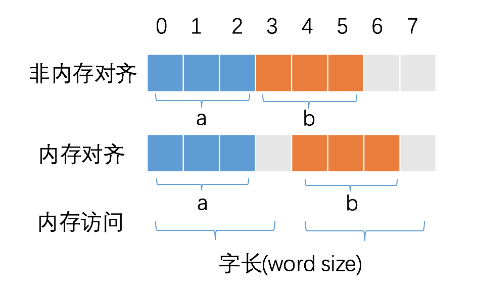
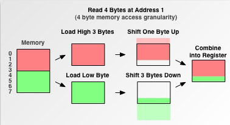

# 内存对齐

## 什么是内存对齐？

- 计算机中内存的地址空间是按照`byte`来划分的，从理论上讲对任何类型变量的访问可以从内存中的任意地址开始
- 但实际情况是：在访问特定类型变量的时候通常在特定的内存地址访问，这就需要对这些数据在内存中存放的位置进行限制
- 各种类型数据按照一定的规则在空间上排列，而不是顺序的一个接一个的排放，这就是对齐
- 编译器将程序中的每个`数据单元`的地址安排在机器字的整数倍的地址指向的内存之中

## 为什么要内存对齐

主要是由于`CPU`的访问内存的特性决定，`CPU`访问内存时并不是以字节为单位来读取内存，而是以机器字长为单位，实际机器字长由`CPU`数据总线宽度决定的。

实际`CPU`运行时，每一次控制内存读写信号发生时，`CPU`可以从内存中读取数据总线宽度的数据，并将其写入到`CPU`的通用寄存器中。

比如`32`位`CPU`，机器字长为`4`字节，数据总线宽度为`32`位，如果该`CPU`的地址总线宽度也是为`32`位，则其可以访问的地址空间为`[0,0xffffffff]`。

内存对齐的主要目的是为了减少 CPU 访问内存的次数，加大 CPU 访问内存的吞吐量。

假设读取`8`个字节的数据，按照每次读取`4`个字节的速度，则`8`个字节需要 CPU 耗费`2`次读取操作。`CPU`始终以字长访问内存，如果不进行内存对齐，很可能增加 `CPU`访问内存的次数。



比如以上在读取变量`b`时，如果不进行内存对齐的话，会导致`CPU`读取次数为`2`，在内存对齐的情况下，只需读取一次即可，当然实际的读取非对齐的内存处理更为复杂，我们参考下图中读取非对齐内存时的数据处理过程：



除了能够减少内存访问次数，增加内存读取的吞吐量以外，还有其他原因：

- 比如某些特定的硬件设备只能存取对齐数据，存取非对齐的数据可能会引发异常，比如对于`CPU`中`SIMD`指令，则必须要求内存严格对齐；
- 每次内存访问是原子的，如果变量的大小不超过字长，那么内存对齐后，对该变量的访问就是原子的。某些硬件设备不能保证在存取非对齐数据的时候的操作是原子操作，因此此时`CPU`需要可能需要读取多次内存，这样就破坏了变量的原子性；
- 相比于存取对齐的数据，存取非对齐的数据需要花费更多的时间，提高内存的访问效率，因为`CPU`在读取内存时，是一块一块的读取；
- 某些处理器虽然支持非对齐数据的访问，但会引发对齐陷阱（`alignment trap`）；
- 某些硬件设备只支持简单数据指令非对齐存取，不支持复杂数据指令的非对齐存取。

## 内存对齐的原则

程序中的内存对齐大部分都是由编译器来处理，编译器会自动在内存之间填充字节

结构体中的变量对齐的基本规则如下：

- 结构体变量的首地址能够被其最宽的基本类型成员的长度和对齐基数二者中的较小者所整除；
- 结构体中的 static 成员变量不占用结构体的空间，由于静态成员变量在程序初始化时已经在静态存储区分配完成，所有该结构体实例中的静态成员都指向同一个内存区域；

```cpp
struct st {
    char a;
    int b;
    static double c; //静态成员
} T;
cout<<sizeof(st)<<endl;
// 8
```

- 结构体每个成员相对于结构体首地址的偏移量 （offset） 都是该成员大小与对齐基数中的较小者的整数倍，如有需要编译器会在成员之间加上填充字节 （internal padding）；
- 结构体的总大小为结构体中最宽基本类型成员的长度与对齐基数二者中的较小者的整数倍，如有需要编译器会在最末尾的成员之后加上填充字节 （trailing padding）；

## 实例

我们可以利用`offset`宏定义来计算出结构体中每个变量的偏移地址。

```cpp
/*
 说明：程序是在 64 位编译器下测试的
 */
#include <iostream>
using namespace std;
#define offset(TYPE,MEMBER) ((long)&((TYPE *)0)->MEMBER)

struct A
{
    short var; // 偏移 0 字节 （内存对齐原则 : short 2 字节 + 填充 2 个字节）
    int var1;  // 偏移 4 字节 （内存对齐原则：int 占用 4 个字节）
    long var2; // 偏移 8 字节 （内存对齐原则：long 占用 8 个字节）
    char var3; // 偏移 16 字节 （内存对齐原则：char 占用 1 个字节 + 填充 7 个字节）
    string s;  // 偏移 24 字节 （string 占用 32 个字节）
};

int main()
{
    string s;
    A ex1;
    cout << offset(A, var) <<endl;
    cout << offset(A, var1) <<endl;
    cout << offset(A, var2) <<endl;
    cout << offset(A, var3) <<endl;
    cout << offset(A, s) <<endl;
    cout << sizeof(ex1) << endl;  // 56 struct
    return 0;
}

/*
运行结果：
0
4
8
16
24
56
*/
```

### 指定程序对齐规则

我们可以指定结构体的对齐规则，在某些特定场景下我们需要指定结构体内存进行对齐，比如在发送特定网络协议报文、硬件协议控制、消息传递、硬件寄存器访问时，这时就就需要避免内存对齐，因为双方均按照预先定义的消息格式来进行交互，从而避免不同的硬件平台造成的差异，同时能够将双方传递的数据进行空间压缩，避免不必要的空间浪费。

#### pragma pack

我们可以用`#progma pack(x)`指定结构体以`x`为单位进行对齐。一般情况下我们可以使用如下：

```cpp
#pragma pack（push）
#pragma pack（x）
// 存放需要 x 对齐方式的数据块
#pragma pack（pop）
```

我们同样指定上述程序以 11 字节对齐，则可以看到结果如下:

```cpp
/*
说明：程序是在 64 位编译器下测试的
*/
#include <iostream>
using namespace std;
#define offset(TYPE,MEMBER) ((long)&((TYPE *)0)->MEMBER)
#pragma pack(push)
#pragma pack(1)
struct A
{
    short var; // 偏移 0 字节
    int var1;  // 偏移 2 字节
    long var2; // 偏移 6 字节
    char var3; // 偏移 14 字节
    string s;  // 偏移 15 字节
};
#pragma pack(pop)

int main()
{
    string s;
    A ex1;
    cout << offset(A, var) <<endl;
    cout << offset(A, var1) <<endl;
    cout << offset(A, var2) <<endl;
    cout << offset(A, var3) <<endl;
    cout << offset(A, s) <<endl;
    cout << sizeof(ex1) << endl;  // 56 struct
    return 0;
}
/*
输出结果
0
2
6
14
15
47
*/
```

#### attribute((aligned (n)))

`__attribute__((aligned (n)))`让所作用的结构成员对齐在`n`字节自然边界上。

如果结构中有成员的长度大于n，则按照最大成员的长度来对齐。

需要注意的是：内存对齐的对齐数取决于对齐系数和成员的字节数两者之中的较小值。对齐属性的有效性会受到链接器(linker)固有限制的限制，即如果你的链接器仅仅支持 8 字节对齐，即使你指定16字节对齐，那么它也仅仅提供 8 字节对齐。

`__attribute__((packed))`表示取消结构在编译过程中的优化对齐，按照实际占用字节数进行对齐，这部分属于 gcc 中的用法，详细了解详情可以参考 gcc 的手册。

#### alignof

`C++ 11`以后新增`alignof`的特性，通过调用`alignof`返回当前变量的字节对齐方式。比如以下程序：

```cpp
/*
说明：程序是在 64 位编译器下测试的
*/
#include <iostream>
using namespace std;
#define offset(TYPE,MEMBER) ((long)&((TYPE *)0)->MEMBER)
#pragma pack(push)
#pragma pack(1)
struct A
{
  short var;
  int var1;
  long var2;
  char var3;
  string s;
};
#pragma pack(pop)

int main()
{
    string s;
    A ex1;
    cout << alignof(A) <<endl;
    return 0;
}
// 此时返回结果为1
```

## 小结

内存对齐使得程序便于在不同的平台之间进行移植，因为有些硬件平台不能够支持任意地址的数据访问，只能在某些地址处取某些特定的数据，否则会抛出异常；另一方面提高内存的访问效率，因为`CPU`在读取内存时，是以块为单位进行读取。

## 参考资料

- [Purpose of memory alignment](https://stackoverflow.com/questions/381244/purpose-of-memory-alignment)
- [Memory alignment… run, you fools!](http://blog.virtualmethodstudio.com/2017/03/memory-alignment-run-fools/)
- [Data alignment: Straighten up and fly right](https://web.archive.org/web/20080607055623/http://www.ibm.com/developerworks/library/pa-dalign/)
- [Alignment](https://docs.microsoft.com/en-us/cpp/cpp/alignment-cpp-declarations?view=msvc-170&viewFallbackFrom=vs-2019)
- [内存对齐](http://light3moon.com/2015/01/19/%5B%E8%BD%AC%5D%20%E5%86%85%E5%AD%98%E5%AF%B9%E9%BD%90/)
- [Data structure alignment](https://en.wikipedia.org/wiki/Data_structure_alignment)
- [一文轻松理解内存对齐](https://cloud.tencent.com/developer/article/1727794)
- [What is alignment?](https://www.cs.umd.edu/~meesh/cmsc411/website/projects/outer/memory/align.htm)
