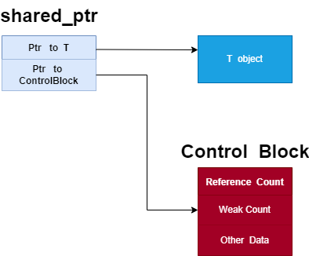

# 智能指针简介与使用

## 智能指针

智能指针是为了解决动态内存分配时带来的内存泄漏以及多次释放同一块内存空间而提出的。

`C++ 11`中提供了智能指针的定义，所有关于智能指针的定义可以参考`<memory>`头文件。

传统的指针在申请完成后，必须要调用`free`或者`delete`来释放指针，否则容易产生内存泄漏的问题；

`smart pointer`遵循 `RAII`原则，当`smart pointer`对象创建时，即为该指针分配了相应的内存，当对象销毁时，析构函数会自动释放内存。

需要注意的是，智能指针不能像普通指针那样支持加减运算。

`RAII`是`Resource Acquisition Is Initialization`（wiki上面翻译成 “资源获取就是初始化”）的简称，是`C++`语言的一种管理资源、避免泄漏的惯用法。利用的就是`C++`构造的对象最终会被销毁的原则。`RAII`的做法是使用一个对象，在其构造时获取对应的资源，在对象生命期内控制对资源的访问，使之始终保持有效，最后在对象析构的时候，释放构造时获取的资源。

同时`smart pointer`重载了`*`和`->`等操作，使用该对象就像`C`语言中的普通指针一样，但是区别于普通指针的它会自动释放所申请的内存资源。以下为智能指针的简单实现：

```cpp
#include <iostream>
using namespace std;

template <class T>
class SmartPtr {
  T* ptr; // Actual pointer
public:
  explicit SmartPtr(T* p = NULL) { ptr = p; }
  ~SmartPtr() { delete (ptr); }
  T& operator*() { return *ptr; }
  T* operator->() { return ptr; }
};

int main()
{
  SmartPtr<int> ptr(new int());
  *ptr = 20;
  cout << *ptr;
  return 0;
}
```

## std::unique_ptr

独享所有权的智能指针，资源只能被一个指针占有，该指针不能拷贝构造和赋值。但可以进行移动构造和移动赋值构造（调用`move()`函数），即一个`unique_ptr`对象赋值给另一个`unique_ptr`对象，可以通过该方法进行赋值。


如图所示，`object`资源只能被`P1`占有，`P2`无法对`object`有所有权，只能通过移动赋值给`P2`。如下代码示例:

```cpp
#include <iostream>
using namespace std;
#include <memory>

class Rectangle {
  int length;
  int breadth;

public:
  Rectangle(int l, int b){
    length = l;
    breadth = b;
  }

  int area(){
    return length * breadth;
  }
};

int main(){
  unique_ptr<Rectangle> P1(new Rectangle(10, 5));
  cout << P1->area() << endl; // This'll print 50

  unique_ptr<Rectangle> P2;
  // unique_ptr<Rectangle> P2(P1); // 无法拷贝构造
  // P2 = P1;   // 无法赋值构造
  P2 = move(P1);

  cout << P2->area() << endl;
  
  // cout<<P1->area()<<endl; // 已经传递，P1 无所有权
  return 0;
}
```

我们可以通过查看源代码看到该函数的拷贝构造函数和赋值构造函数均被禁止，只允许使用移动拷贝构造函数和移动赋值构造函数：

```cpp
// Disable copy from lvalue.不允许复制，体现专属所有权语义
unique_ptr(const unique_ptr&) = delete;
unique_ptr& operator=(const unique_ptr&) = delete;

// Move constructor.体现专属所有权语义和只移型别
// 只允许使用移动拷贝构造函数
// 如果复制一个unique_ptr对象，会将源unique_ptr对象管理的资源release掉
unique_ptr(unique_ptr&& __u) noexcept
: _M_t(__u.release(), std::forward<deleter_type>(__u.get_deleter())) { }

// 这个也是移动拷贝构造函数
// 只是使用的类型是可以隐式转换的其他unique_ptr对象
template<typename _Up, typename _Ep, typename = _Require<
  __safe_conversion_up<_Up, _Ep>,
typename conditional<is_reference<_Dp>::value,
 is_same<_Ep, _Dp>,
 is_convertible<_Ep, _Dp>>::type>>
unique_ptr(unique_ptr<_Up, _Ep>&& __u) noexcept
: _M_t(__u.release(), std::forward<_Ep>(__u.get_deleter()))
{ }

// Assignment，也可以说明是专属所有权语义和只移型别
unique_ptr& operator=(unique_ptr&& __u) noexcept
{
 // __u.release()释放并返回源unique_ptr对象管理的资源
 // reset是将__u.release()返回的资源赋给目标（当前）unique_ptr对象
 reset(__u.release());
 get_deleter() = std::forward<deleter_type>(__u.get_deleter());
 return *this;
}

// 析构函数，调用析构器析构掉管理的资源，并将__ptr指向nullptr
~unique_ptr()
{
 auto& __ptr = _M_t._M_ptr();
 if (__ptr != nullptr)
  get_deleter()(__ptr);
 __ptr = pointer();
}
```

同时我们可以看到 reset 重新给其赋值，在获取资源的同时会释放原有的资源。

```cpp
void reset(pointer __p = pointer()) noexcept
{
    using std::swap;
    swap(_M_t._M_ptr(), __p);
    if (__p != pointer() get_deleter()(__p);
}
```

## std::shared_ptr

与`unique_ptr`不同的是，`shared_ptr`中资源可以被多个指针共享，但是多个指针指向同一个资源不能被释放多次，因此使用计数机制表明资源被几个指针共享。


通过`use_count()`查看资源的所有者的个数，可以通过`unique_ptr`、`weak_ptr`来构造，调用`release()`释放资源的所有权，同时将计数减一，当计数减为`0`时会自动释放内存空间，从而避免了内存泄漏。特别需要注意的是`shared_ptr`并不是线程安全的，但`shared_ptr`的计数是原子操作实现的，利用`atmoic CAS`指令实现。我们可以看到`share_ptr`的内存模型，当引用计数和`weak count`同时为`0`时，`share_ptr`对象才会被最终释放掉。



代码示例如下

```cpp
#include <iostream>
using namespace std;
#include <memory>

class Rectangle {
 int length;
 int breadth;

public:
 Rectangle(int l, int b)
 {
  length = l;
  breadth = b;
 }

 int area()
 {
  return length * breadth;
 }
};
int main()
{

 shared_ptr<Rectangle> P1(new Rectangle(10, 5));
 cout << P1->area() << endl;
 shared_ptr<Rectangle> P2;
 P2 = P1;

 cout << P2->area() << endl; // 50
 cout << P1->area() << endl; // 50
 cout << P1.use_count() << endl; // 2
 return 0;
}
```

我们通过查看`shared_ptr`的源代码可以看到如下，`shared_ptr`实际成员包含两个指针，一个指向对象资源的指针`ptr`，另一个指向管理区域的指针`__cntrl_`，具体`__cntrl_`指向的区域包括`deleter`、`allocator`、`shared_ptr`对象的引用计数、`weak_ptr`的对象的引用计数。

## std::weak_ptr

指向 `share_ptr` 指向的对象，能够解决由 `shared_ptr` 带来的循环引用问题。与 `shared_ptr` 配合使用，将 `weak_ptr` 转换为 `share_ptr` 时，虽然它能访问 `share_ptr` 所指向的资源但却不享有资源的所有权，不影响该资源的引用计数。有可能资源已被释放，但 `weak_ptr` 仍然存在，`share_ptr` 必须等待所有引用的 `weak_ptr` 全部被释放才会进行释放。因此每次访问资源时都需要判断资源是否有效。


`shared_ptr` 通过引用计数的方式来管理对象，当进行拷贝或赋值操作时，每个 `shared_ptr` 都会记录当前对象的引用计数，当引用计数为0时，内存将被自动释放。当对 `shared_ptr` 赋予新值或者被对象被销毁时，引用计数会递减。但特殊情况出现循环引用时，`shared_ptr` 无法正常释放资源。循环引用，即 A 指向 B，B 指向 A，在表示双向关系时，是很可能出现这种情况的。下面的示例代码即为出现了循环引用导致内存无法正常被释放。

```cpp
#include <iostream>
#include <memory>
using namespace std;

class B;

class A {
public:
 shared_ptr<B> b_;
 A() {
  cout << "A constructed!" << endl;
 }
 ~A() {
  cout << "A destructed!" << endl;
 }
};

class B {
public:
 shared_ptr<A> a_;
 B() {
  cout << "B constructed!" << endl;
 }
 ~B() {
  cout << "B destructed!" << endl;
 }
};

int main()
{
 auto classA = make_shared<A>();
 auto classB = make_shared<B>();
 classA->b_ = classB;
 classB->a_ = classA;
 cout << "A: " << classA.use_count() << endl;
 cout << "B: " << classB.use_count() << endl;
 return 0;
}
/*
A constructed!
B constructed!
A: 2
B: 2
*/
```

为了解决上述的循环引用问题，才出现了 `weak_ptr`，我们知道 `shared_ptr` A 被赋值给 `shared_ptr` B 时，A 的引用计数加 1；但是 `shared_ptr` A 被赋值给 `weak_ptr` C 时，A 的引用计数不变。weak_ptr 在使用时是与 `shared_ptr` 绑定的，`weak_ptr` 不影响对象 `shared_ptr` 的引用计数，`weak_ptr` 可以用来跟踪 `shared_ptr` 对象，当 `shared_ptr` 的对象引用计数为 0 时，此时 `shared_ptr` 会释放所占用的对象资源，但 `shared_ptr` 对象本身不会释放，它会等待 `weak_ptr` 引用计数为 0 时，此时才会释放管理区域的内存，而释放 `shared_ptr` 对象本身。上述的循环引用，我们可以将一个对象改为 `weak_ptr` 即可避免循环引用导致的异常。例如下列代码：

```cpp
#include <iostream>
#include <memory>
using namespace std;

class B;

class A {
public:
 shared_ptr<B> b_;
 A() {
  cout << "A constructed!" << endl;
 }
 ~A() {
  cout << "A destructed!" << endl;
 }
};

class B {
public:
 weak_ptr<A> a_;
 B() {
  cout << "B constructed!" << endl;
 }
 ~B() {
  cout << "B destructed!" << endl;
 }
};

int main()
{
 auto classA = make_shared<A>();
 auto classB = make_shared<B>();
 classA->b_ = classB;
 classB->a_ = classA;
 cout << "A: " << classA.use_count() << endl;
 cout << "B: " << classB.use_count() << endl;
 return 0;
}
/*
A constructed!
B constructed!
A: 1
B: 2
A destructed!
B destructed!
*/
```

## 参考资料

- [Smart Pointers in C++ and How to Use Them](https://www.geeksforgeeks.org/smart-pointers-cpp/)
- [std::weak_ptr](https://en.cppreference.com/w/cpp/memory/weak_ptr)
- [std::shared_ptr](https://en.cppreference.com/w/cpp/memory/shared_ptr#Implementation_notes)
- [what-is-a-smart-pointer-and-when-should-i-use-one](https://stackoverflow.com/questions/106508/what-is-a-smart-pointer-and-when-should-i-use-one)
- [当我们谈论shared_ptr的线程安全性时，我们在谈论什么](https://zhuanlan.zhihu.com/p/416289479)
- [循环引用中的shared_ptr和weak_ptr](https://zhuanlan.zhihu.com/p/355812360)
