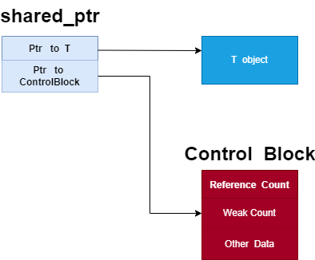
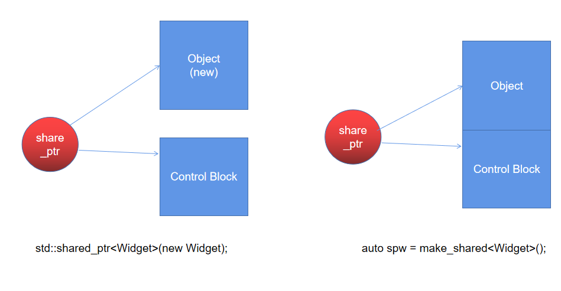

# 智能指针的创建

`make_unique` 在 `C++ 14` 以后才被加入到标准的 `C++` 中，`make_shared` 则是 `C++ 11` 中加入的。在 「​《Effective Modern C++》」 学习笔记之条款二十一：优先选用 `std::make_unique` 和 `std::make_shared`,而非直接 `new`。

## std::make_unique

减少代码量，能够加快编译速度，定义两遍类型时，编译器需要进行类型推导会降低编译速度，某些意外意外情况下可能会导致内存泄漏。但是 `make_unique` 不允许自定析构器，不接受 `std::initializer_list` 对象。

```cpp
auto upw1(std::make_unique<Widget>());
//重复写了两次Widget型别
std::unique_ptr<Widget> upw2(new Widget);
```

## std::make_shared

这个主要是可以减少对堆中申请内存的次数，只需要申请一次即可。

我们知道 `share_ptr` 的内存模型如下:



当我们使用 `new` 时，我们将 `new` 出的资源指针赋给 `share_ptr` 的 `ptr`, 然后 `share_ptr` 本身还需要再次在堆上申请一块单独的内存作为它的管理区，存放引用计数、用户自定的函数等，因此创建 `shared_ptr` 时需要在堆上申请两次。

```cpp
std::shared_ptr<Widget>(new Widget);
```

当我们使用 `make_share` 时，我们只需要申请一块大的内存，一半用来存储资源，另一半作为管理区, 存放引用计数、用户自定的函数等，此时需要在堆上申请一次即可。

```cpp
auto upw1(std::make_unique<Widget>());
```

以下为两种方式的对比:



`make_share` 虽然效率高，但是同样不能自定义析构器，同时 `share_ptr` 的对象资源可能会延迟释放，因为此时对象资源与管理区域在同一块内存中，必须要同时释放。

## 参考资料

- [why using make_unique rather than unique_ptr](https://zhuanlan.zhihu.com/p/528139040)
- [Differences between std::make_unique and std::unique_ptr with new](https://stackoverflow.com/questions/22571202/differences-between-stdmake-unique-and-stdunique-ptr-with-new)
- [which one is better between make_unique and new](https://www.sololearn.com/Discuss/2595135/which-one-is-better-between-make_unique-and-new)
