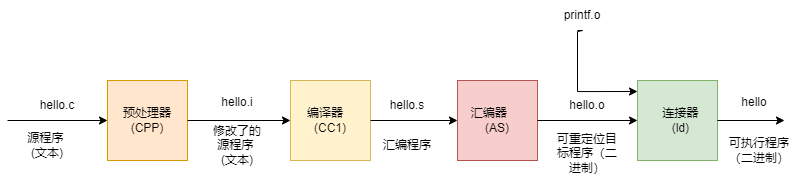

# 编译与链接

## 为什么需要编译

我们常见的 `C/C++` 语言，`CPU` 是无法理解的，这就需要将我们编写好的代码最终翻译为机器可执行的二进制指令，编译的过程本质上也即是翻译的过程，当然中间涉及的细节非常复杂。

## 编译的处理过程

编译器读取源文件 cpp，并将其翻译为可执行文件[ELF](https://baike.baidu.com/item/ELF/7120560?fr=aladdin)，`ELF` 文件可以经过操作系统进行加载执行。常见的编译过程分为四个过程：编译预处理、编译、汇编、链接。



- 编译预处理：在预编译过程中主要处理源代码中的预处理指令，比如引入头文件（`#include`），去除注释，处理所有的条件编译指令（`#ifdef`, `#ifndef`, `#else`, `#elif`, `#endif`），宏的替换（`#define`），添加行号，保留所有的编译器指令；
- 编译：针对预处理后的文件进行词法分析、语法分析、语义分析、符号汇总、汇编代码生成，并针对程序的结构或者特定的 `CPU` 平台进行优化，其中涉及的过程较为复杂。简单来说编译的过程即为将 `.cpp` 源文件翻译成 `.s` 的汇编代码；
- 汇编：将汇编代码 `.s` 翻译成机器指令 `.o` 文件，一个 `.cpp` 文件只会生成一个 `.o` 文件；
- 链接：汇编程序生成的目标文件即为 `.o` 文件，单独的 `.o` 文件可能无法执行。因为一个程序可能由多个源文件组成，此时就存在多个 `.o` 文件。文件 `A` 中的函数引用了另一个文件 `B` 中定义的符号或者调用了某个库文件中的函数，这就需要链接处理。那链接的目的就是将这些文件对应的目标文件连接成一个整体，从而生成一个可被操作系统加载执行的 `ELF` 程序文件。链接的过程较为复杂，如有兴趣可以参考：[Computer Systems: A Programmer's Perspective](http://csapp.cs.cmu.edu/3e/pieces/preface3e.pdf)

## 静态链接

代码在生成可执行文件时，将该程序所需要的全部外部调用函数全部拷贝到最终的可执行程序文件中，在该程序被执行时，该程序运行时所需要的全部代码都会被装入到该进程的虚拟地址空间中。在 `Linux` 系统下，静态链接库一般以 `.a` 文件，我们可以将多个 `.o` 文件链接成一个静态链接库。

静态链接演示如下：

- 定义 `a.cpp` 与 `c.cpp` 如下:

```cpp
// a.cpp
#include <iostream>
#include <vector>

extern int test_dynamic();

int main() {
    test_dynamic();
}

// c.cpp
#include <iostream>
#include <vector>

using namespace std;

int test_dynamic() {
    cout<<"this is test dynamic program!"<<endl;
    return 0;
}
```

- 采用静态链接方式进行编译，并查看编译后的函数:

```shell
g++ a.cpp b.cpp -o test
objdump -d test
```

- 可以看到里面包含 main 函数的调用过程以及 test_static 函数的详细定义：

```asm
00000000000008b5 <main>:
8b5:   55                      push   %rbp
8b6:   48 89 e5                mov    %rsp,%rbp
8b9:   e8 65 00 00 00          callq  923 <_Z11test_staticv>
8be:   b8 00 00 00 00          mov    $0x0,%eax
8c3:   5d                      pop    %rbp
8***:   c3                      retq

0000000000000923 <_Z11test_staticv>:
923:   55                      push   %rbp
924:   48 89 e5                mov    %rsp,%rbp
927:   48 8d 35 18 01 00 00    lea    0x118(%rip),%rsi        # a46 <_ZStL19piecewise_construct+0x1>
92e:   48 8d 3d 0b 07 20 00    lea    0x20070b(%rip),%rdi        # 201040 <_ZSt4cout@@GLIBCXX_3.4>
935:   e8 56 fe ff ff          callq  790 <_ZStlsISt11char_traitsIcEERSt13basic_ostreamIcT_ES5_PKc@plt>
93a:   48 89 c2                mov    %rax,%rdx
93d:   48 8b 05 8c 06 20 00    mov    0x20068c(%rip),%rax        # 200fd0 <_ZSt4endlIcSt11char_traitsIcEERSt13basic_ostreamIT_T0_ES6_@GLIBCXX_3.4>
944:   48 89 c6                mov    %rax,%rsi
947:   48 89 d7                mov    %rdx,%rdi
94a:   e8 51 fe ff ff          callq  7a0 <_ZNSolsEPFRSoS_E@plt>
94f:   b8 00 00 00 00          mov    $0x0,%eax
954:   5d                      pop    %rbp
955:   c3                      retq
```

## 动态链接

代码在生成可执行文件时，该程序所调用的部分程序被放到动态链接库或共享对象的某个目标文件中，链接程序只是在最终的可执行程序中记录了共享对象的名字等一些信息，最终生成的 `ELF` 文件中并不包含这些调用程序二进制指令。在程序执行时，当需要调用这部分程序时，操作系统会从将这些动态链或者共享对象进行加载，并将全部内容会被映射到该进行运行的虚拟地址的空间。在 `Linux` 系统下，动态链接库一般以 `.so` 文件，我们可以将多个 `.o` 文件链接成一个动态链接库。

动态链接演示如下：

- 定义 a.cpp 与 c.cpp 如下:

```cpp
// a.cpp
#include <iostream>
#include <vector>

extern int test_dynamic();

int main() {
    test_dynamic();
}
 
// c.cpp
#include <iostream>
#include <vector>

using namespace std;

int test_dynamic() {
    cout<<"this is test dynamic program!"<<endl;
    return 0;
}
```

- 采用动态态链接方式进行编译，并查看编译后的函数:

```shell
g++ -fPIC -shared -o lib.so c.cpp
g++ -o test a.cpp ./lib.so
objdump -d test
```

- 通过 `-fPIC` 和 `-shared` 可以生成一个动态链接库，再链接到可执行程序就可以正常运行。生成的 `elf` 文件中可以查看 `main` 函数的详细定义，但并未找到 `test_dynamic` 函数的定义：

```asm
0000000000000835 <main>:
835:   55                      push   %rbp
836:   48 89 e5                mov    %rsp,%rbp
839:   e8 e2 fe ff ff          callq  720 <_Z12test_dynamicv@plt>
83e:   b8 00 00 00 00          mov    $0x0,%eax
843:   5d                      pop    %rbp
844:   c3                      retq
```

- 我们查看生成的动态链接库中可以查看到 `test_dynamic` 的详细定义：

```asm
0000000000000865 <_Z12test_dynamicv>:
865:   55                      push   %rbp
866:   48 89 e5                mov    %rsp,%rbp
869:   48 8d 35 96 00 00 00    lea    0x96(%rip),%rsi        # 906 <_ZStL19piecewise_construct+0x1>
870:   48 8b 05 61 07 20 00    mov    0x200761(%rip),%rax        # 200fd8 <_ZSt4cout@GLIBCXX_3.4>
877:   48 89 c7                mov    %rax,%rdi
87a:   e8 f1 fe ff ff          callq  770 <_ZStlsISt11char_traitsIcEERSt13basic_ostreamIcT_ES5_PKc@plt>
87f:   48 89 c2                mov    %rax,%rdx
882:   48 8b 05 47 07 20 00    mov    0x200747(%rip),%rax        # 200fd0 <_ZSt4endlIcSt11char_traitsIcEERSt13basic_ostreamIT_T0_ES6_@GLIBCXX_3.4>
889:   48 89 c6                mov    %rax,%rsi
88c:   48 89 d7                mov    %rdx,%rdi
88f:   e8 ec fe ff ff          callq  780 <_ZNSolsEPFRSoS_E@plt>
894:   b8 00 00 00 00          mov    $0x0,%eax
899:   5d                      pop    %rbp
89a:   c3                      retq
```

实际上使用 `PLT` 延迟绑定技术，当然动态链接中使用的技巧和技术较为复杂，参考资料中会讲述的更加详细和深入。

## 优缺点

- 静态链接浪费空间，每个可执行程序都会有目标文件的一个副本，这样如果目标文件进行了更新操作，就需要重新进行编译链接生成可执行程序（更新困难），优点就是执行的时候运行速度快，因为可执行程序具备了程序运行的所有内容；
- 动态链接节省内存、更新方便，但是动态链接是在程序运行时，每次执行都需要链接，相比静态链接会有一定的性能损失。静态链接是由连接器完成的，动态链接最终是由操作系统来完成链接的功能，动态链接在不同的操作系统下可能由不同的实现原理，比如在 `Linux` 系统下，动态链接库通常以 `.so` 文件存在，在 `windows` 下同下，动态链接库一般以 `.dll` 文件存在。

## 参考资料

- [Computer Systems: A Programmer's Perspective](target=http://csapp.cs.cmu.edu/3e/pieces/preface3e.pdf)
- [Static and Dynamic Linking in Operating System](target=https://www.geeksforgeeks.org/static-and-dynamic-linking-in-operating-systems/)
