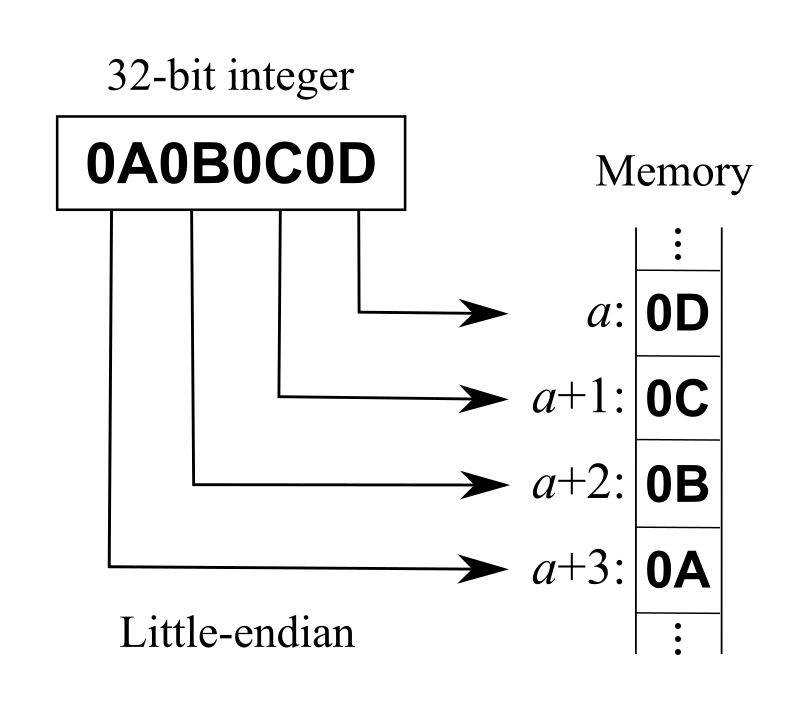
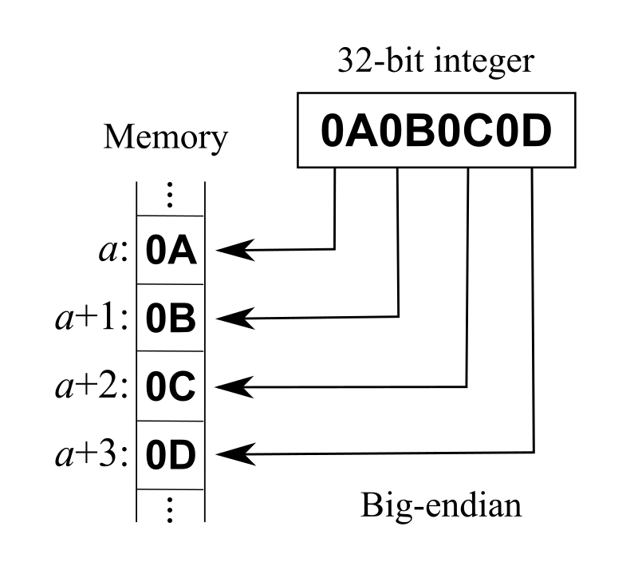

# 大端与小端

## 字节序

字节顺序又称端序或尾序（`Endianness`），在计算机科学领域中，指电脑内存中或在数字通信链路中，组成多字节的字的字节的排列顺序。在几乎所有的机器上，多字节对象都被存储为连续的字节序列。例如在 `C` 语言中，一个类型为 `int` 的变量 `x` 地址为 `0x100`，那么其对应地址表达式 `&x` 的值为 `0x100`，`x` 的四个字节将被存储在电脑内存的 `0x100`，`0x101`，`0x102`，`0x103` 位置。字节的排列方式常见的方式有两种：将一个多位数的低位放在较小的地址处，高位放在较大的地址处，则称小端序（`Little-Endian`）；反之则称大端序（`Big-Endian`）。为什么需要字节序这个规定，主要是因为在网络应用中字节序是一个必须被考虑的因素，对于不同 `CPU` 可能采用不同标准的字节序，所以均按照网络标准转化成相应的字节序。

- 大端：符号位在所表示的内存的低地址，用于快速判断数据的正负和大小
- 小端：CPU做数值运算的时候是从内存中依次从低位到高位取数据进行运算，这样运算效率更高。

我们常用的X86结构是小端模式，而KEIL C51则为大端模式。很多的ARM，DSP都为小端模式。有些ARM处理器还可以由硬件来选择是大端模式还是小端模式。

## Little-Endian

将低序字节存储在起始地址（低位编址），在变量指针转换的时候地址保持不变，比如 `int64*` 转到 `int32*`，对于机器计算来说更友好和自然。



## Big-Endian

将高序字节存储在起始地址（高位编址），内存顺序和数字的书写顺序是一致的，对于人的直观思维比较容易理解，网络字节序统一规定采用 Big-Endian。



## 检测字节序

一般情况下我们直接调用宏定义 `__BYTE_ORDER` 即可（预处理时判断），可以通过引用 <bits/endian.h> 即可。或者我们也可以编写程序来判断当前的字节序。

```cpp
bool byteorder_check() {
    int a = 1;
    return (*(char *)&a); /* 1 为小端机，0 为大端机 */
}
```

## 字节序转换

在程序中字节序转换时，我们将高位与低位依次进行交换即可完成，以下为整数的字节序转换。

```cpp
#define ORDER_TRANS(i) ((i & 0xff000000) >> 24 ) |  ( (i & 0x00ff0000) >> 8 ) | ( (i & 0x0000ff00) << 8 )  | ( (i & 0x000000ff) << 24 )
```

常用的网络字节序转换函数:

```cpp
ntohl(uint32 x)       // uint32 类型 网络序转主机序
htonl(uint32 x)       // uint32 类型 主机序转网络序
ntohs(uint16 x)       // uint16 类型 网络序转主机序
htons(uint16 x)       // uint16 类型 主机序转网络序
```

## 参考资料

- [Endianness](https://en.wikipedia.org/wiki/Endianness#Middle-endian)
- [Understanding Big and Little Endian Byte Order](https://betterexplained.com/articles/understanding-big-and-little-endian-byte-order/)
- [What Is Little-Endian And Big-Endian Byte Ordering?](https://www.section.io/engineering-education/what-is-little-endian-and-big-endian/)
- [Big Endian and Little Endian](https://chortle.ccsu.edu/assemblytutorial/Chapter-15/ass15_3.html)
