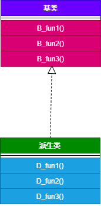

# 单继承和多继承的虚函数表结构

- 编译器将虚函数表的指针放在类的实例对象的内存空间中，该对象调用该类的虚函数时，通过指针找到虚函数表，根据虚函数表中存放的虚函数的地址找到对应的虚函数。
- 如果派生类没有重新定义基类的虚函数 A，则派生类的虚函数表中保存的是基类的虚函数 A 的地址，也就是说基类和派生类的虚函数 A 的地址是一样的。
- 如果派生类重写了基类的某个虚函数 B，则派生的虚函数表中保存的是重写后的虚函数 B 的地址，也就是说虚函数 B 有两个版本，分别存放在基类和派生类的虚函数表中。
- 如果派生类重新定义了新的虚函数 C，派生类的虚函数表保存新的虚函数 C 的地址。

## 单继承无虚函数覆盖的情况

```cpp
#include <iostream>
#include <memory>
using namespace std;
 
 
typedef void (*func)(void);

#include <iostream>
using namespace std;

class Base
{
public:
    virtual void B_fun1() { cout << "Base::B_fun1()" << endl; }
    virtual void B_fun2() { cout << "Base::B_fun2()" << endl; }
    virtual void B_fun3() { cout << "Base::B_fun3()" << endl; }
};

class Derive : public Base
{
public:
    virtual void D_fun1() { cout << "Derive::D_fun1()" << endl; }
    virtual void D_fun2() { cout << "Derive::D_fun2()" << endl; }
    virtual void D_fun3() { cout << "Derive::D_fun3()" << endl; }
};

void printVtable(unsigned long *vptr, int offset) {
    func fn = (func)*((unsigned long*)(*vptr) + offset);
    fn();
}

int main()
{
    Base *p = new Derive();
    p->B_fun1(); // Base::B_fun1()
    unsigned long* vPtr = (unsigned long*)(p);
    printVtable(vPtr, 0);
    printVtable(vPtr, 1);
    printVtable(vPtr, 2);
    printVtable(vPtr, 3);
    printVtable(vPtr, 3);
    printVtable(vPtr, 4);
    cout<<sizeof(Base)<<endl; // 8
    cout<<sizeof(Derive)<<endl; // 8
    return 0;
}
/*
Base::B_fun1()
Base::B_fun1()
Base::B_fun2()
Base::B_fun3()
Derive::D_fun1()
Derive::D_fun2()
Derive::D_fun3()
8
8
*/
```

基类和派生类的继承关系



基类的虚函数表


派生类的虚函数表


- 虚函数按照声明顺序放在虚函数表里面。
- 父类的虚函数在子类的虚函数前面。

## 单继承有虚函数覆盖的情况

```cpp
#include <iostream>
#include <memory>
using namespace std;
 
 
typedef void (*func)(void);

class Base
{
public:
    virtual void fun1() { cout << "Base::fun1()" << endl; }
    virtual void B_fun2() { cout << "Base::B_fun2()" << endl; }
    virtual void B_fun3() { cout << "Base::B_fun3()" << endl; }
};

class Derive : public Base
{
public:
    virtual void fun1() { cout << "Derive::fun1()" << endl; }
    virtual void D_fun2() { cout << "Derive::D_fun2()" << endl; }
    virtual void D_fun3() { cout << "Derive::D_fun3()" << endl; }
};

void printVtable(unsigned long *vptr, int offset) {
 func fn = (func)*((unsigned long*)(*vptr) + offset);
 fn(); 
}

int main()
{
    Base *p = new Derive();
 unsigned long* vPtr = (unsigned long*)(p);
 printVtable(vPtr, 0);
 printVtable(vPtr, 1);
 printVtable(vPtr, 2);
 printVtable(vPtr, 3);
 printVtable(vPtr, 4);
    cout<<sizeof(Base)<<endl; // 8
    cout<<sizeof(Derive)<<endl; // 8
    return 0;
}

/*
Derive::fun1()
Base::B_fun2()
Base::B_fun3()
Derive::D_fun2()
Derive::D_fun3()
8
8
*/
```

派生类的虚函数表


## 多继承无虚函数覆盖的情况

```cpp
#include <iostream>
using namespace std;

class Base1
{
public:
    virtual void B1_fun1() { cout << "Base1::B1_fun1()" << endl; }
    virtual void B1_fun2() { cout << "Base1::B1_fun2()" << endl; }
    virtual void B1_fun3() { cout << "Base1::B1_fun3()" << endl; }
};
class Base2
{
public:
    virtual void B2_fun1() { cout << "Base2::B2_fun1()" << endl; }
    virtual void B2_fun2() { cout << "Base2::B2_fun2()" << endl; }
    virtual void B2_fun3() { cout << "Base2::B2_fun3()" << endl; }
};
class Base3
{
public:
    virtual void B3_fun1() { cout << "Base3::B3_fun1()" << endl; }
    virtual void B3_fun2() { cout << "Base3::B3_fun2()" << endl; }
    virtual void B3_fun3() { cout << "Base3::B3_fun3()" << endl; }
};

class Derive : public Base1, public Base2, public Base3
{
public:
    virtual void D_fun1() { cout << "Derive::D_fun1()" << endl; }
    virtual void D_fun2() { cout << "Derive::D_fun2()" << endl; }
    virtual void D_fun3() { cout << "Derive::D_fun3()" << endl; }
};

typedef void (*func)(void);

void printVtable(unsigned long *vptr, int offset) {
 func fn = (func)*((unsigned long*)(*vptr) + offset);
 fn(); 
}

int main(){
    Base1 *p = new Derive();
    unsigned long* vPtr = (unsigned long*)(p);
 printVtable(vPtr, 0);
 printVtable(vPtr, 1);
 printVtable(vPtr, 2);
 printVtable(vPtr, 3);
 printVtable(vPtr, 4);
 printVtable(vPtr, 5);
 vPtr++;
 printVtable(vPtr, 0);
 printVtable(vPtr, 1);
 printVtable(vPtr, 2);
 vPtr++;
 printVtable(vPtr, 0);
 printVtable(vPtr, 1);
 printVtable(vPtr, 2);
    cout<<sizeof(Base1)<<endl; // 8
 cout<<sizeof(Base2)<<endl; // 8
 cout<<sizeof(Base3)<<endl; // 8
    cout<<sizeof(Derive)<<endl; // 8
    return 0;
}

/*
Base1::B1_fun1()
Base1::B1_fun2()
Base1::B1_fun3()
Derive::D_fun1()
Derive::D_fun2()
Derive::D_fun3()
Base2::B2_fun1()
Base2::B2_fun2()
Base2::B2_fun3()
Base3::B3_fun1()
Base3::B3_fun2()
Base3::B3_fun3()
8
8
8
24
*/
```

派生类的虚函数表：（基类的顺序和声明的顺序一致）


## 多继承有虚函数覆盖的情况

```cpp
#include <iostream>
using namespace std;

class Base1
{
public:
    virtual void fun1() { cout << "Base1::fun1()" << endl; }
    virtual void B1_fun2() { cout << "Base1::B1_fun2()" << endl; }
    virtual void B1_fun3() { cout << "Base1::B1_fun3()" << endl; }
};
class Base2
{
public:
    virtual void fun1() { cout << "Base2::fun1()" << endl; }
    virtual void B2_fun2() { cout << "Base2::B2_fun2()" << endl; }
    virtual void B2_fun3() { cout << "Base2::B2_fun3()" << endl; }
};
class Base3
{
public:
    virtual void fun1() { cout << "Base3::fun1()" << endl; }
    virtual void B3_fun2() { cout << "Base3::B3_fun2()" << endl; }
    virtual void B3_fun3() { cout << "Base3::B3_fun3()" << endl; }
};

class Derive : public Base1, public Base2, public Base3
{
public:
    virtual void fun1() { cout << "Derive::fun1()" << endl; }
    virtual void D_fun2() { cout << "Derive::D_fun2()" << endl; }
    virtual void D_fun3() { cout << "Derive::D_fun3()" << endl; }
};

typedef void (*func)(void);

void printVtable(unsigned long *vptr, int offset) {
 func fn = (func)*((unsigned long*)(*vptr) + offset);
 fn(); 
}

int main(){
    Base1 *p1 = new Derive();
    Base2 *p2 = new Derive();
    Base3 *p3 = new Derive();
    p1->fun1(); // Derive::fun1()
    p2->fun1(); // Derive::fun1()
    p3->fun1(); // Derive::fun1()
    unsigned long* vPtr = (unsigned long*)(p1);
 printVtable(vPtr, 0);
 printVtable(vPtr, 1);
 printVtable(vPtr, 2);
 printVtable(vPtr, 3);
 printVtable(vPtr, 4);
 vPtr++;
 printVtable(vPtr, 0);
 printVtable(vPtr, 1);
 printVtable(vPtr, 2);
 vPtr++;
 printVtable(vPtr, 0);
 printVtable(vPtr, 1);
 printVtable(vPtr, 2);
    cout<<sizeof(Base1)<<endl; // 8
 cout<<sizeof(Base2)<<endl; // 8
 cout<<sizeof(Base3)<<endl; // 8
    cout<<sizeof(Derive)<<endl; // 8
    return 0;
}

/*
Derive::fun1()
Derive::fun1()
Derive::fun1()
Derive::fun1()
Base1::B1_fun2()
Base1::B1_fun3()
Derive::D_fun2()
Derive::D_fun3()
Derive::fun1()
Base2::B2_fun2()
Base2::B2_fun3()
Derive::fun1()
Base3::B3_fun2()
Base3::B3_fun3()
8
8
8
24
*/
```

基类和派生类的关系


派生类的虚函数表


## 参考资料

- [C++虚函数表分析——参考陈皓版](https://blog.csdn.net/weixin_38688399/article/details/108063635)
