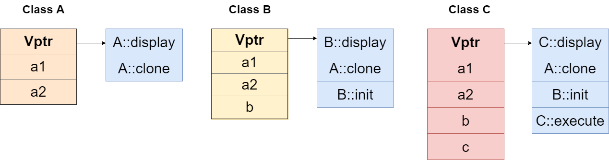

# 静态绑定和动态绑定的实现

## 静态类型和动态类型

- 静态类型：变量在声明时的类型，是在编译阶段确定的。静态类型不能更改。
- 动态类型：目前所指对象的类型，是在运行阶段确定的。动态类型可以更改。

## 静态绑定和动态绑定

- 静态绑定是指程序在编译阶段确定对象的类型（静态类型）。
- 动态绑定是指程序在运行阶段确定对象的类型（动态类型）。

## 静态绑定和动态绑定的区别

- 发生的时期不同：如上。
- 对象的静态类型不能更改，动态类型可以更改。

注：对于类的成员函数，只有虚函数是动态绑定，其他都是静态绑定。

```cpp
#include <iostream>

using namespace std;

class Base
{
public:
 virtual void fun() { cout << "Base::fun()" << endl;
     }
};
class Derive : public Base
{
public:
 void fun() { cout << "Derive::fun()"; 
    }
};


int main()
{
 Base *p = new Derive(); // p 的静态类型是 Base*，动态类型是 Derive*
    p->fun(); // fun 是虚函数，运行阶段进行动态绑定
 return 0;
}
/*
运行结果：
Derive::fun()
*/
```

## 动态绑定的实现原理

```cpp
#include <iostream>
using namespace std;

class A{
private:
 int a1;
 int a2;
public:
 virtual void display(){ cout<<"A::display()"<<endl;}
 virtual void clone(){ cout<<"A::clone()"<<endl;}
};

class B: public A{
private:
    int b;
public:
    virtual void display(){ cout<<"B::display()"<<endl;} override
    virtual void init(){ cout<<"B::init()"<<endl;}
};

class C: public B{
private:
    int c;
public:
    virtual void display(){ cout<<"C::display()"<<endl;} override
    virtual void execute(){ cout<<"C::execute()"<<endl;} 
    virtual void init(){cout<<"C::init()"<<endl;} override
};

int main() {
    A *p1 = new B();
    A *p2 = new C();
    p1->display();
    p2->display();
    return 0;
}
```

我们对上述程序进行编译，并查看这里给出 `A`, `B`, `C` 三个类的虚函数表，如下图所示:

`class C`继承`class B`, 重写了init()虚函数，但是在虚函数表图中，还是`B::init`，这点有错误



可以得出以下结论

- 类的内存占用由成员变量和指向虚函数表的指针组成，同时派生类的成员变量是会把基类的成员变量都继承的
- 同名虚函数在基类和派生类中的虚函数表中，在虚函数表中偏移位置是一致的，图 `A`,`B`,`C` 的 `display` 的偏移位置都为 `0`。同样名称的虚函数，在基类中定义的虚函数与派生类中定义的虚函数，在虚函数表中的偏移量都是一致的，只有这样才能保证动态绑定。
- 如果派生类中定义了与基类同名的虚函数，那么派生类的虚函数表中相应函数的入口地址会被替换成覆盖后的函数的地址。
- 一旦有新的虚函数定义，会加入到当前虚函数表的末端。
- 派生类的成员变量顺序也按照声明的顺序依次在内存中分配。

我们可以分析一下动态绑定的实现

- 当我们用虚函数表指针去查找虚函数表中对应的函数的地址时，此时首先会找到函数地址的在虚函数表中的索引，这里 `display` 索引是 `0`
- 然后编译器会做一个替换，`（*(p->vptr)[0]）`，找到 `p` 指针的函数入口地址。
- 程序运行后会执行这条语句 `*(p->vptr)[0]()`，完成函数的调用，实际即完成了动态绑定。

## 参考资料

- [Virtual Function in C++](https://www.geeksforgeeks.org/virtual-function-cpp/?ref=gcse)
- [Polymorphism in C++](https://www.geeksforgeeks.org/polymorphism-in-c/)
- [C++ 虚函数表](https://blog.csdn.net/nyist_zxp/article/details/80825031)
