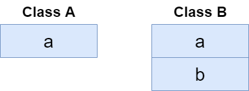
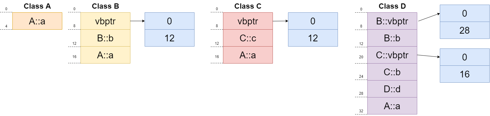

# 类的大小

## 类大小的计算

说明：类的大小是指类的实例化对象的大小，用 `sizeof` 对类型名操作时，结果是该类型的对象的大小。计算原则如下：

- 遵循结构体的成员变量对齐原则。
- 与普通成员变量有关，与成员函数和静态成员无关。即普通成员函数，静态成员函数，静态数据成员，静态常量数据成员均对类的大小无影响。因为静态数据成员被类的对象共享，并不属于哪个具体的对象。
- 虚函数对类的大小有影响，是因为虚函数表指针的影响。
- 虚继承对类的大小有影响，是因为虚基表指针带来的影响。
- 空类的大小是一个特殊情况，空类的大小为 `1`，空类同样可以被实例化，而每个实例在内存中都有一个独一无二的地址，为了达到这个目的，编译器往往会给一个空类隐含的加一个字节，这样空类在实例化后在内存得到了独一无二的地址，所以`sizeof(A)` 的大小为 `1`。

## 简单情况和空类情况

```cpp
/*
说明：程序是在 64 位编译器下测试的
*/
#include <iostream>

using namespace std;

class A
{
private:
    static int s_var; // 不影响类的大小
    const int c_var;  // 4 字节
    int var;          // 8 字节 4 + 4 (int) = 8
    char var1;        // 12 字节 8 + 1 (char) + 3 (填充) = 12
public:
    A(int temp) : c_var(temp) {} // 不影响类的大小
    ~A() {}                    // 不影响类的大小
};

class B
{
};
int main()
{
    A ex1(4);
    B ex2;
    cout << sizeof(ex1) << endl; // 12 字节
    cout << sizeof(ex2) << endl; // 1 字节
    return 0;
}
```

但是，有两种情况值得我们注意，看如下介绍

### 涉及到空类的继承

当派生类继承空类后，派生类如果有自己的数据成员，而空基类的一个字节并不会加到派生类中去。例如

继承空类的派生类，如果派生类也为空类，大小也都为`1`。

```cpp
class Empty {};
struct D : public Empty { int a;};
// sizeof(D)=4
```

### 一个类包含一个空类对象数据成员

```cpp
class Empty {};
class HoldsAnInt {
    int x;
    Empty e;
};

// sizeof(HoldsAnInt)=8
```

因为在这种情况下，空类的`1`字节是会被计算进去的。而又由于字节对齐的原则，所以结果为`4+4=8`。

## 带有虚函数的情况

注意：虚函数的个数并不影响所占内存的大小，因为类对象的内存中只保存了指向虚函数表的指针。由于不同平台、不同编译器厂商所生成的虚表指针在内存中的布局是不同的，有些将虚表指针置于对象内存中的开头处，有些则置于结尾处。在 `X64 GCC` 编译器下，虚指针在类的开头出，我们可以通过偏移量获取。
程序示例，我们通过对象内存的开头处取出 `vptr`，并遍历对象虚函数表。

```cpp
/*
说明：程序是在 64 位编译器下测试的
*/
#include <iostream>

using namespace std;

class A
{
private:
    static int s_var; // 不影响类的大小
    const int c_var;  // 4 字节
    int var;          // 8 字节 4 + 4 (int) = 8
    char var1;        // 12 字节 8 + 1 (char) + 3 (填充) = 12
public:
    A(int temp) : c_var(temp) {} // 不影响类的大小
    ~A() {}                      // 不影响类的大小
    virtual void f() { cout << "A::f" << endl; }

    virtual void g() { cout << "A::g" << endl; }

    virtual void h() { cout << "A::h" << endl; } // 24 字节 12 + 4 (填充) + 8 (指向虚函数的指针) = 24
};

typedef void (*func)(void);

void printVtable(unsigned long *vptr, int offset) {
    func fn = (func)*((unsigned long*)(*vptr) + offset);
    fn(); 
}

int main()
{
    A ex1(4);
    A *p;
    cout << sizeof(p) << endl;   // 8 字节 注意：指针所占的空间和指针指向的数据类型无关
    cout << sizeof(ex1) << endl; // 24 字节
    unsigned long* vPtr = (unsigned long*)(&ex1);
    printVtable(vPtr, 0);
    printVtable(vPtr, 1);
    printVtable(vPtr, 2);
    return 0;
}
/*
8
24
A::f
A::g
A::h
*/
```

## 多重继承的情况

有虚函数时会包含虚表指针

- 每个基类都有自己的虚表。
- 派生类的成员函数被放到了第一个基类的表中。（所谓的第一个基类是按照声明顺序来判断的，准确的说是第一个包含虚函数的基类）

由于每个基类都需要一个指针来指向其虚函数表，因此`Derive`的`sizeof`等于`Derive`的数据成员加上三个指针的大小。

## 含有虚继承的情况

不包含虚继承的情况，派生类直接继承了基类的成员变量，内存分布如下



```cpp
#include <iostream>
using namespace std;

class A
{
public:
     int a;
};

class B : public A
{
public:
    int b;
    void bPrintf() {
    std::cout << "This is class B" << "\n";
    }
};

int main(){
    A a;
    B b;
    cout<<sizeof(a)<<endl;
    cout<<sizeof(b)<<endl;
    return 0;
}
/*
4
8
*/
```

如果加入虚继承，此时对象中多了一个指向虚基类表的指针，对象 `B` 与对象 `C` 均多了一个指针变量 `vbptr`。

```cpp
#include <iostream>
using namespace std; // 采用 4 字节对齐

#pragma pack(4)
class A
{
public:
     int a;
};

class B : virtual public A
{
public:
    int b;
    void bPrintf() {
    std::cout << "This is class B" << "\n";}
};

class C : virtual public A
{
public:
    int c;
    void cPrintf() {
    std::cout << "This is class C" << "\n";}
};

class D : public B, public C
{
public:
    int d;
    void dPrintf() {
    std::cout << "This is class D" << "\n";}
};

int main(){
    A a;
    B b;
    C c;
    D d;
    cout<<sizeof(a)<<endl;
    cout<<sizeof(b)<<endl;
    cout<<sizeof(c)<<endl;
    cout<<sizeof(d)<<endl;
    return 0;
}
/*
4
16
16
32
*/
```

我们可以看到:
实际的内存布局如下:



虚基类表的填充内容如下:

- 第一项表示派生类对象指针相对于虚基类表指针 `vbptr` 的偏移，在图中我们可以看到在 `B` 中，`B` 的起始地址相对于 `vptr` 的偏移量为 `12`；
- 从第二项开始表示各个基类的地址相对于虚基类表指针 `vbptr` 的偏移，在图中我们可以看到在 `B` 中，`A` 的起始地址相对于 `vptr` 的偏移量为 `12`；

虚继承的情况就比较复杂，虚继承需要额外加上一个指向虚基类表的指针。虚继承的基础上如果再加上虚函数，还需要额外加上虚函数表的指针占用的空间。

## 参考资料

- [C++ 虚继承实现原理（虚基类表指针与虚基类表）](https://www.cnblogs.com/zhjblogs/p/14274188.html)
- [虚继承中，虚基类在派生类中的内存分布是如何？](https://www.zhihu.com/question/24858417?sort=created)
- [【c++内存分布系列】虚基类表）](https://www.cnblogs.com/budapeng/p/3305790.html)
