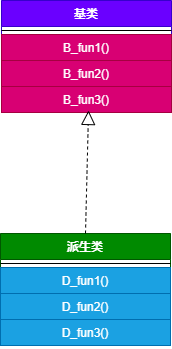
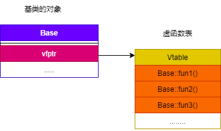

# 虚函数的实现机制

## 虚函数的实现原理

虚函数通过虚函数表来实现。虚函数的地址保存在虚函数表中，在类的对象所在的内存空间中，保存了指向虚函数表的指针（称为“虚表指针”），通过虚表指针可以找到类对应的虚函数表。虚函数表解决了基类和派生类的继承问题和类中成员函数的覆盖问题，当用基类的指针来操作一个派生类的时候，这张虚函数表就指明了实际应该调用的函数。

- 每个使用虚函数的类（或者从使用虚函数的类派生）都有自己的虚函数表。该表是编译器在编译时设置的静态数组，一般我们称为 `vtable`。虚函数表包含可由该类调用的虚函数，此表中的每个条目是一个函数指针，指向该类可访问的虚函数。
- 每个对象在创建时，编译器会为对象生成一个指向该类的虚函数表的指针，我们称之为 `vptr`。`vptr` 在创建类实例时自动设置，以便指向该类的虚拟表。如果对象（或者父类）中含有虚函数，则编译器一定会为其分配一个 `vptr`；如果对象不包含（父类也不含有），此时编译器则不会为其分配 `vptr`。与 `this` 指针不同，`this` 指针实际上是编译器用来解析自引用的函数参数，`vptr` 是一个真正的指针。

## 虚函数表相关知识点

- 虚函数表存放的内容：类的虚函数的地址。
- 虚函数表建立的时间：编译阶段，即程序的编译过程中会将虚函数的地址放在虚函数表中。
- 虚表指针保存的位置：虚表指针存放在对象的内存空间中最前面的位置，这是为了保证正确取到虚函数的偏移量。
- 虚函数表和类绑定，虚表指针和对象绑定。即类的不同的对象的虚函数表是一样的，但是每个对象在创建时都有自己的虚表指针 `vptr`，来指向类的虚函数表 `vtable`。

## 实例

### 无虚函数覆盖的情况

```cpp
#include <iostream>
using namespace std;

class Base
{
public:
    virtual void B_fun1() { cout << "Base::B_fun1()" << endl; }
    virtual void B_fun2() { cout << "Base::B_fun2()" << endl; }
    virtual void B_fun3() { cout << "Base::B_fun3()" << endl; }
};

class Derive : public Base
{
public:
    virtual void D_fun1() { cout << "Derive::D_fun1()" << endl; }
    virtual void D_fun2() { cout << "Derive::D_fun2()" << endl; }
    virtual void D_fun3() { cout << "Derive::D_fun3()" << endl; }
};
int main()
{
    Base *p = new Derive();
    p->B_fun1(); // Base::B_fun1()
    return 0;
}
```

基类和派生类的继承关系



基类的虚函数表



派生类的虚函数表


主函数中基类的指针 `p` 指向了派生类的对象，当调用函数 `B_fun1()` 时，通过派生类的虚函数表找到该函数的地址，从而完成调用。

### 虚拟函数表指针 vptr

带有虚函数的类，通过该类所隐含的虚函数表来实现多态机制，该类的每个对象均具有一个指向本类虚函数表的指针，这一点并非 `C++` 标准所要求的，而是编译器所采用的内部处理方式。实际应用场景下，不同平台、不同编译器厂商所生成的虚表指针在内存中的布局是不同的，有些将虚表指针置于对象内存中的开头处，有些则置于结尾处。如果涉及多重继承和虚继承，情况还将更加复杂。因此永远不要使用 `C` 语言的方式调用 `memcpy()` 之类的函数复制对象，而应该使用初始化（构造和拷构）或赋值的方式来复制对象。
程序示例，我们通过对象内存的开头处取出 `vptr`，并遍历对象虚函数表。

```cpp
#include <cstdint>
#include <iostream>
#include <memory>

using namespace std;

class Base;

typedef void (*func)(Base*);
typedef void (*IntFunc)(Base*, int);

class A {
 public:
  void f() { cout << this << " A::f" << endl; }
  void g() { cout << this << " A::g" << endl; }
  void h() { cout << this << " A::h" << endl; }
};

class Base {
 public:
  virtual void f(int a) { cout << this << " Base::f: " << a << endl; }
  virtual void g() { cout << this << " Base::g" << endl; }
  virtual void h() { cout << this << " Base::h" << endl; }
};

class Derive : public Base {
 public:
  void f(int a) { cout << this << " Derive::f: " << a << endl; }
  void g() { cout << this << " Derive::g" << endl; }
  void h() { cout << this << " Derive::h" << endl; }
};

int main() {
  Base base;
  Derive derive;

  printf("base: %p\n", &base);
  printf("derive: %p\n", &derive);
  //获取vptr的地址，运行在gcc  x64环境下，所以将指针按uint64_t大小处理
  //另外基于C++的编译器应该是保证虚函数表的指针存在于对象实例中最前面的位置
  uint64_t* vPtr = (uint64_t*)(&base);
  //获取vTable 首个函数的地址
  IntFunc vTable_f = (IntFunc) * (uint64_t*)(*vPtr);
  //获取vTable 第二个函数的地址
  func vTable_g = (func) * ((uint64_t*)(*vPtr) + 1);  //加1 ，按步进计算
  func vTable_h = (func) * ((uint64_t*)(*vPtr) + 2);  //同上
  vTable_f(&base, 1);
  vTable_g(&base);
  vTable_h(&base);
  vPtr = (uint64_t*)(&derive);
  //获取vTable 首个函数的地址
  vTable_f = (IntFunc) * (uint64_t*)(*vPtr);
  //获取vTable 第二个函数的地址
  vTable_g = (func) * ((uint64_t*)(*vPtr) + 1);  //加1 ，按步进计算
  vTable_h = (func) * ((uint64_t*)(*vPtr) + 2);  //同上
  vTable_f(&derive, 1);
  vTable_g(&derive);
  vTable_h(&derive);
  cout << sizeof(A) << endl;
  cout << sizeof(base) << endl;
  cout << sizeof(derive) << endl;
  return 0;
}
/*
base: 0x16f02ef30
derive: 0x16f02ef28
0x16f02ef30 Base::f: 1
0x16f02ef30 Base::g
0x16f02ef30 Base::h
0x16f02ef28 Derive::f: 1
0x16f02ef28 Derive::g
0x16f02ef28 Derive::h
1
8
8
*/
```

我们可以看到同样的函数实现，对象在分配空间时，编译器会为对象多分配一个 vptr 指针的空间。

调用成员函数时，第一个参数是对象的地址，也就是this指针

## 虚函数的使用场景

- 构造函数不能为虚函数：构造函数不能定义为虚函数。构造函数是在实例化对象的时候进行调用，如果此时将构造函数定义成虚函数，需要通过访问该对象所在的内存空间才能进行虚函数的调用（因为需要通过指向虚函数表的指针调用虚函数表，虽然虚函数表在编译时就有了，但是没有虚函数的指针，虚函数的指针只有在创建了对象才有），但是此时该对象还未创建，便无法进行虚函数的调用。所以构造函数不能定义成虚函数。
- 析构函数为虚函数：一般建议析构函数定义成虚函数，这样做可以有效是防止内存泄漏，实际应用时当基类的指针或者引用指向或绑定到派生类的对象时，如果未将基类的析构函数定义成虚函数，当我们对基类指针执行 `delete` 操作时，此时只会调用基类的析构函数，将基类的成员所占的空间释放掉，而派生类中特有的资源就会无法释放而导致内存泄漏。
- `static` 函数不能定义为虚函数。

## 参考资料

- [c++ vptr和vptr_table](https://www.jianshu.com/p/3cccced44b58)
- [C++基础——虚指针（vptr）与虚基表（vtable）](https://blog.csdn.net/qq_25065595/article/details/107372446)
- [C++对象模型3——vptr的位置、手动调用虚函数、从汇编代码看普通调用和多态调用](https://blog.csdn.net/Master_Cui/article/details/114983811)
- [C++:对象模型：关于vptr（虚指针）和vtbl](https://blog.csdn.net/weixin_43589450/article/details/107393198)
- [Virtual Function in C++](https://www.***.org/virtual-function-cpp/?ref=gcse)
- [Polymorphism in C++](https://www.***.org/polymorphism-in-c/)
- [C++ 虚函数和纯虚函数的区别](https://www.runoob.com/w3cnote/cpp-virtual-functions.html)
