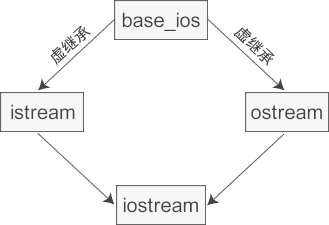

# 多重继承的常见问题及避免方法

多重继承（多继承）：是指从多个直接基类中产生派生类。多重继承容易出现命名冲突和数据冗余问题。

程序示例如下:

```cpp
#include <iostream>
using namespace std;

// 间接基类
class Base1
{
public:
    int var1;
};

// 直接基类
class Base2 : public Base1
{
public:
    int var2;
};

// 直接基类
class Base3 : public Base1
{
public:
    int var3;
};

// 派生类
class Derive : public Base2, public Base3
{
public:
    void set_var1(int tmp) { var1 = tmp; } // error: reference to 'var1' is ambiguous. 命名冲突
    void set_var2(int tmp) { var2 = tmp; }
    void set_var3(int tmp) { var3 = tmp; }
    void set_var4(int tmp) { var4 = tmp; }

private:
    int var4;
};

int main()
{
    Derive d;
    return 0;
}
```

上述程序的继承关系如下：（菱形继承）


上述代码中存的问题：

对于派生类 `Derive` 上述代码中存在直接继承关系和间接继承关系。

- 直接继承：`Base2` 、`Base3`
- 间接继承：`Base1`

对于派生类中继承的的成员变量 `var1` ，从继承关系来看，实际上保存了两份，一份是来自基类 `Base2`，一份来自基类 `Base3`。因此，出现了命名冲突。

## 解决方法：显式声明出现冲突的成员变量来源于哪个类

```cpp
#include <iostream>
using namespace std;

// 间接基类
class Base1
{
public:
    int var1;
};

// 直接基类
class Base2 : public Base1
{
public:
    int var2;
};

// 直接基类
class Base3 : public Base1
{
public:
    int var3;
};

// 派生类 
class Derive : public Base2, public Base3
{
public:
    void set_var1(int tmp) { Base2::var1 = tmp; } // 这里声明成员变量来源于类 Base2，当然也可以声明来源于类 Base3
    void set_var2(int tmp) { var2 = tmp; }
    void set_var3(int tmp) { var3 = tmp; }
    void set_var4(int tmp) { var4 = tmp; }

private:
    int var4;
};

int main()
{
    Derive d;
    return 0;
}
```

## 解决方法： 虚继承

```cpp
#include <iostream>
using namespace std;

// 间接基类，即虚基类
class Base1
{
public:
    int var1;
};

// 直接基类 
class Base2 : virtual public Base1 // 虚继承
{
public:
    int var2;
};

// 直接基类 
class Base3 : virtual public Base1 // 虚继承
{
public:
    int var3;
};

// 派生类
class Derive : public Base2, public Base3
{
public:
    void set_var1(int tmp) { var1 = tmp; } 
    void set_var2(int tmp) { var2 = tmp; }
    void set_var3(int tmp) { var3 = tmp; }
    void set_var4(int tmp) { var4 = tmp; }

private:
    int var4;
};

int main()
{
    Derive d;
    return 0;
}
```

类之间的继承关系：


由于使用多重继承很容易出现二义性的问题，将使得程序调试和维护工作变得非常复杂，`C++` 之后的很多面向对象的编程语言，例如 `Java`、`C#`、`PHP` 等，都不支持多继承。

## 虚继承详解

为了解决多继承时的命名冲突和冗余数据问题，`C++` 提出了虚继承，使得在派生类中只保留一份间接基类的成员。

在继承方式前面加上 `virtual` 关键字就是虚继承，请看上面的例子

这样在派生类`Derive`中就只保留了一份成员变量`var1`，直接访问就不会再有歧义了

虚继承的目的是让某个类做出声明，承诺愿意共享它的基类。其中，这个被共享的基类就称为虚基类（`Virtual Base Class`），本例中的 `Base1` 就是一个虚基类。在这种机制下，不论虚基类在继承体系中出现了多少次，在派生类中都只包含一份虚基类的成员。

观察这个新的继承体系，我们会发现虚继承的一个不太直观的特征：必须在虚派生的真实需求出现前就已经完成虚派生的操作。在上图中，当定义 `Derive` 类时才出现了对虚派生的需求，但是如果 `Base2` 类和 `Base3` 类不是从 `Base1` 类虚派生得到的，那么 `Derive` 类还是会保留 `Base1` 类的两份成员。

换个角度讲，虚派生只影响从指定了虚基类的派生类中进一步派生出来的类，它不会影响派生类本身。

在实际开发中，位于中间层次的基类将其继承声明为虚继承一般不会带来什么问题。通常情况下，使用虚继承的类层次是由一个人或者一个项目组一次性设计完成的。对于一个独立开发的类来说，很少需要基类中的某一个类是虚基类，况且新类的开发者也无法改变已经存在的类体系。

`C++`标准库中的 `iostream` 类就是一个虚继承的实际应用案例。`iostream` 从 `istream` 和 `ostream` 直接继承而来，而 `istream` 和 `ostream` 又都继承自一个共同的名为 `base_ios` 的类，是典型的菱形继承。此时 `istream` 和 `ostream` 必须采用虚继承，否则将导致 `iostream` 类中保留两份 `base_ios` 类的成员。



### 虚基类成员的可见性

因为在虚继承的最终派生类中只保留了一份虚基类的成员，所以该成员可以被直接访问，不会产生二义性。此外，如果虚基类的成员只被一条派生路径覆盖，那么仍然可以直接访问这个被覆盖的成员。但是如果该成员被两条或多条路径覆盖了，那就不能直接访问了，此时必须指明该成员属于哪个类。

以上述的菱形继承为例，假设 `Base1` 定义了一个名为 `x` 的成员变量，当我们在 `Derive` 中直接访问 `x` 时，会有三种可能性：
如果 `B` 和 `C` 中都没有 `x` 的定义，那么 `x` 将被解析为 `A` 的成员，此时不存在二义性。
如果 `B` 或 `C` 其中的一个类定义了 `x`，也不会有二义性，派生类的 `x` 比虚基类的 `x` 优先级更高。
如果 `B` 和 `C` 中都定义了 `x`，那么直接访问 `x` 将产生二义性问题。

可以看到，使用多继承经常会出现二义性问题，必须十分小心。上面的例子是简单的，如果继承的层次再多一些，关系更复杂一些，程序员就很容易陷人迷魂阵，程序的编写、调试和维护工作都会变得更加困难，**因此我不提倡在程序中使用多继承，只有在比较简单和不易出现二义性的情况或实在必要时才使用多继承，能用单一继承解决的问题就不要使用多继承。**也正是由于这个原因，C++ 之后的很多面向对象的编程语言，例如 Java、C#、PHP 等，都不支持多继承。

## 虚继承时的构造函数

在虚继承中，虚基类是由最终的派生类初始化的，换句话说，最终派生类的构造函数必须要调用虚基类的构造函数。对最终的派生类来说，虚基类是间接基类，而不是直接基类。这跟普通继承不同，在普通继承中，派生类构造函数中只能调用直接基类的构造函数，不能调用间接基类的。

下面我们以菱形继承为例来演示构造函数的调用：

```cpp
#include <iostream>
using namespace std;

//虚基类A
class A{
public:
    A(int a);
protected:
    int m_a;
};
A::A(int a): m_a(a){ }

//直接派生类B
class B: virtual public A{
public:
    B(int a, int b);
public:
    void display();
protected:
    int m_b;
};
B::B(int a, int b): A(a), m_b(b){ }
void B::display(){
    cout<<"m_a="<<m_a<<", m_b="<<m_b<<endl;
}

//直接派生类C
class C: virtual public A{
public:
    C(int a, int c);
public:
    void display();
protected:
    int m_c;
};
C::C(int a, int c): A(a), m_c(c){ }
void C::display(){
    cout<<"m_a="<<m_a<<", m_c="<<m_c<<endl;
}

//间接派生类D
class D: public B, public C{
public:
    D(int a, int b, int c, int d);
public:
    void display();
private:
    int m_d;
};
D::D(int a, int b, int c, int d): A(a), B(90, b), C(100, c), m_d(d){ }
void D::display(){
    cout<<"m_a="<<m_a<<", m_b="<<m_b<<", m_c="<<m_c<<", m_d="<<m_d<<endl;
}

int main(){
    B b(10, 20);
    b.display();
   
    C c(30, 40);
    c.display();

    D d(50, 60, 70, 80);
    d.display();
    return 0;
}
/*
m_a=10, m_b=20
m_a=30, m_c=40
m_a=50, m_b=60, m_c=70, m_d=80
*/
```

请注意第 `50` 行代码，在最终派生类 `D` 的构造函数中，除了调用 `B` 和 `C` 的构造函数，还调用了 `A` 的构造函数，这说明 `D` 不但要负责初始化直接基类 `B` 和 `C`，还要负责初始化间接基类 `A`。而在以往的普通继承中，派生类的构造函数只负责初始化它的直接基类，再由直接基类的构造函数初始化间接基类，用户尝试调用间接基类的构造函数将导致错误。

现在采用了虚继承，虚基类 `A` 在最终派生类 `D` 中只保留了一份成员变量 `m_a`，如果由 `B` 和 `C` 初始化 `m_a`，那么 `B` 和 `C` 在调用 `A` 的构造函数时很有可能给出不同的实参，这个时候编译器就会犯迷糊，不知道使用哪个实参初始化 `m_a`。

为了避免出现这种矛盾的情况，`C++` 干脆规定必须由最终的派生类 `D` 来初始化虚基类 `A`，直接派生类 `B` 和 `C` 对 `A` 的构造函数的调用是无效的。在第 `50` 行代码中，调用 `B` 的构造函数时试图将 `m_a` 初始化为 `90`，调用 `C` 的构造函数时试图将 `m_a` 初始化为 `100`，但是输出结果有力地证明了这些都是无效的，`m_a` 最终被初始化为 `50`，这正是在 `D` 中直接调用 `A` 的构造函数的结果。

另外需要关注的是构造函数的执行顺序。虚继承时构造函数的执行顺序与普通继承时不同：在最终派生类的构造函数调用列表中，不管各个构造函数出现的顺序如何，编译器总是先调用虚基类的构造函数，再按照出现的顺序调用其他的构造函数；而对于普通继承，就是按照构造函数出现的顺序依次调用的。

修改本例中第 `50` 行代码，改变构造函数出现的顺序：

```cpp
D::D(int a, int b, int c, int d): B(90, b), C(100, c), A(a), m_d(d){ }
```

虽然我们将 `A()` 放在了最后，但是编译器仍然会先调用 `A()`，然后再调用 `B()`、`C()`，因为 `A()` 是虚基类的构造函数，比其他构造函数优先级高。如果没有使用虚继承的话，那么编译器将按照出现的顺序依次调用 `B()`、`C()`、`A()`。

## 参考资料

- [C++虚继承和虚基类详解](http://c.biancheng.net/view/2280.html)
- [C++虚继承详解](https://blog.csdn.net/youaremyalllove/article/details/124324115)
- [C++ Multiple, Multilevel and Hierarchical Inheritance](https://www.programiz.com/cpp-programming/multilevel-multiple-inheritance)
- [Multiple Inheritance in C++](https://www.javatpoint.com/multiple-inheritance-in-cpp)
- [Multiple Inheritance in C++](https://www.geeksforgeeks.org/multiple-inheritance-in-c/)
