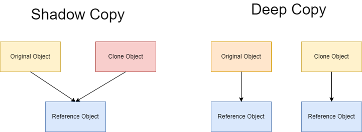

# 深拷贝和浅拷贝的区别

如果一个类拥有资源，该类的对象进行复制时，如果资源重新分配，就是深拷贝，否则就是浅拷贝。

- 深拷贝：该对象和原对象占用不同的内存空间，既拷贝存储在栈空间中的内容，又拷贝存储在堆空间中的内容。
- 浅拷贝：该对象和原对象占用同一块内存空间，仅拷贝类中位于栈空间中的内容。



当类的成员变量中有指针变量时，最好使用深拷贝。因为当两个对象指向同一块内存空间，如果使用浅拷贝，当其中一个对象的删除后，该块内存空间就会被释放，另外一个对象指向的就是垃圾内存。

## 浅拷贝实例

```cpp
#include <iostream>

using namespace std;

class Test
{
private:
    int *p;

public:
    Test(int tmp)
    {
        this->p = new int(tmp);
        cout << "Test(int tmp)" << endl;
    }
    ~Test()
    {
        if (p != NULL)
        {
            delete p;
        }
        cout << "~Test()" << endl;
    }
};

int main()
{
    Test ex1(10); 
    Test ex2 = ex1; 
    return 0;
}
/*
运行结果：
Test(int tmp)
~Test()
*/
```

说明：上述代码中，类对象 `ex1`、`ex2` 实际上是指向同一块内存空间，对象析构时，`ex2` 先将内存释放了一次，之后析构对象 `ex1` 时又将这块已经被释放过的内存再释放一次。对同一块内存空间释放了两次，会导致程序崩溃。

## 深拷贝实例

```cpp
#include <iostream>

using namespace std;

class Test
{
private:
 int *p;

public:
 Test(int tmp)
 {
  p = new int(tmp);
  cout << "Test(int tmp)" << endl;
 }
 ~Test()
 {
  if (p != NULL)
  {
   delete p;
  }
  cout << "~Test()" << endl;
 }
 Test(const Test &tmp) // 定义拷贝构造函数
 {
  p = new int(*tmp.p);
  cout << "Test(const Test &tmp)" << endl;
 }

};

int main()
{
 Test ex1(10); 
 Test ex2 = ex1; 
 return 0;
}
/*
Test(int tmp)
Test(const Test &tmp)
~Test()
~Test()
*/
```

编译器生成的默认拷贝函数均大部分都是浅拷贝，所有在特定场景下需要禁止编译器生成默认拷贝构造函数。在遇到需要使用堆内存的构造函数中，我们需要特别注意浅拷贝和深拷贝的使用方式，防止两个不同的对象指向同一块内存区域。

## 参考资料

- [Shallow Copy and Deep Copy in C++](https://www.geeksforgeeks.org/shallow-copy-and-deep-copy-in-c/)
- [What is the difference between a deep copy and a shallow copy?](https://stackoverflow.com/questions/184710/what-is-the-difference-between-a-deep-copy-and-a-shallow-copy)
- [Deep Copy C++](https://linuxhint.com/deep-copy-cpp/)
