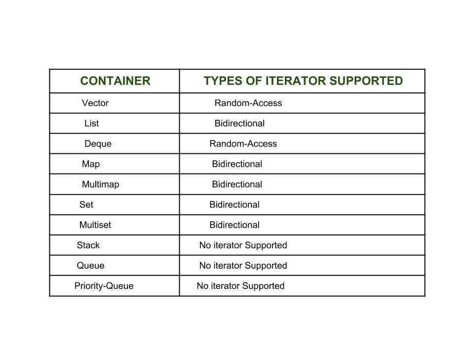

# 迭代器的作用

迭代器：一种抽象的设计概念，在设计模式中有迭代器模式，即提供一种方法，使之能够依序寻访某个容器所含的各个元素，而无需暴露该容器的内部表述方式。迭代器只是一种概念上的抽象，具有迭代器通用功能和方法的对象都可以叫做迭代器。迭代器有很多不同的能力，可以把抽象容器和通用算法有机的统一起来。迭代器基本分为五种，输入输出迭代器，前向逆向迭代器，双向迭代器和随机迭代器。

- 输入迭代器(Input Iterator)：只能向前单步迭代元素，不允许修改由该迭代器所引用的元素；
- 输出迭代器(Output Iterator)：只能向前单步迭代元素，对由该迭代器所引用的元素只有写权限；
- 向前迭代器(Forward Iterator)：该迭代器可以在一个区间中进行读写操作，它拥有输入迭代器的所有特性和输出迭代器的部分特性，以及向前单步迭代元素的能力；
- 双向迭代器(Bidirectional Iterator)：在向前迭代器的基础上增加了向后单步迭代元素的能力；
- 随机访问迭代器(Random Access Iterator)：不仅综合以后 4 种迭代器的所有功能，还可以像指针那样进行算术计算；

`C++ 17` 引入了连续迭代器（Contiguous Iterator）概念，要求逻辑相邻元素在内存中物理上也相邻；`C++ 20`引入了相应的迭代器类别`contiguous_iterator_tag`

在 `C++ STL` 中，容器 `vector`、`deque` 提供随机访问迭代器，`list` 提供双向迭代器，`set` 和 `map` 提供双向迭代器。基于红黑树数据结构的有序`map`，`set`是双向迭代器；而基于`hashmap`的`unordered_map`，`unordered_set`是前向迭代器；



## 使用迭代器的优点

- 代码编写方便：迭代器提供了通用接口来遍历元素，不用担心容器的大小，使用迭代器我们可以简单地使用成员函数 `end()` 来判断容器的结尾，遍历内容方便而简洁；
- 代码可重用性高：：迭代器提供了一组通用的 `api` 访问和遍历容器中的元素。迭代器支持代码的可重用性，它们可以被使用访问任何容器的元素。
- 容器可以动态处理：迭代器能够在需要时方便地从容器中动态添加或删除元素。

需要注意的是

- `end()` 迭代器指向并不是最后一个元素，而是最后一个元素的下一个位置的迭代器；
- 同理，`rend()` 迭代器也不是指向第一个元素，而是指向第一个元素前一个的逆向迭代器

```cpp
#include <iostream>
#include <vector>
using namespace std;

int main()
{
    vector<int> arr = {1, 2, 3, 4, 5, 6, 7, 8, 9, 0};
    vector<int>::iterator iter = arr.begin(); // 定义迭代器
    for (; iter != arr.end(); ++iter)
    {
        cout << *iter << " ";
    }
    return 0;
}
/*
运行结果：
1 2 3 4 5 6 7 8 9 0
*/
```

## 参考资料

- [Introduction to Iterators in C++](https://www.geeksforgeeks.org/introduction-iterators-c/)
- [iterator](https://cplusplus.com/reference/iterator/)
- [Iterators in C++ STL](https://www.geeksforgeeks.org/iterators-c-stl/)
- [std::iterator](https://en.cppreference.com/w/cpp/iterator/iterator)
- [C++ Iterators](https://users.cs.northwestern.edu/~riesbeck/programming/c++/stl-iterators.html)
