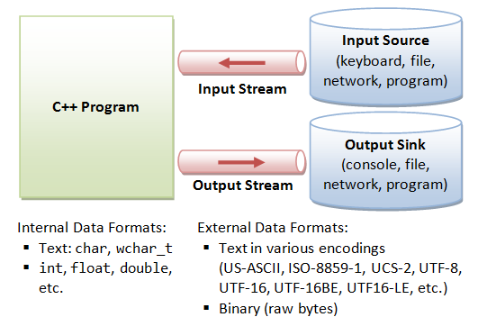
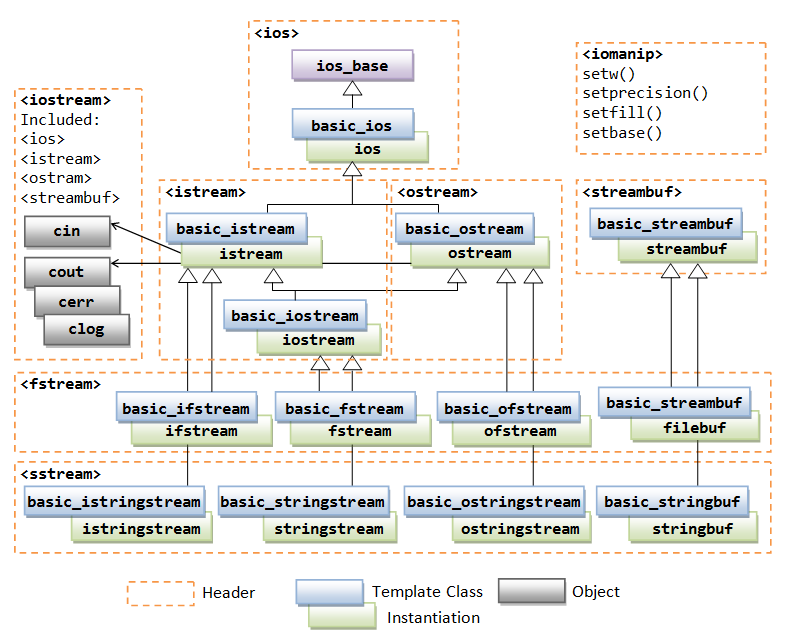

# C++ IO 操作

`C++` 保持与 `C` 兼容，因此也保留支持 `printf` 和 `scanf` 进行输出和输人的方法。`c++` 具有面向对象的特性，引入了新的输入输出。`C++` 通过 `I/O` 类库来实现丰富的 `I/O` 功能。在 `C++` 中，输入和输出以字节序列或更通常称为 `stream` 的形式执行。

- 输入流（inputstream）：如果字节流的方向是从设备（例如键盘）到主存，那么这个过程称为输入。
- 输出流（outputstream）：如果字节流的方向相反，即从主存到设备（显示屏），那么这个过程称为输出。



`C++` 采用了面向对象的思想对所有涉及 `I/O` 的操作进行了统一的封装，涉及到 `I/O` 操作的主要由 `<iostream>`,`<iomanip>`,`<fstream>` 三个头文件组成，`stream` 是其行为由类定义的对象，其中主要的类的继承关系如下图所示:



`C++` 中的 `Streams` 对象主要分为三种类型：

`istream` ：这种类型的流对象只能从流中执行输入操作；
`ostream` ：这些对象只能用于输出操作；
`iostream` ：可用于输入和输出操作；

## 标准输入输出

标准输出流（cout）：通常标准输出设备是显示器。`C++ cout` 语句是 `ostream` 类的实例。它用于在标准输出设备上产生输出。需要在屏幕上显示的数据使用插入运算符（<<） 插入到标准输出流（cout）中。
标准输入流（cin）：通常计算机中的输入设备是键盘。`C++ cin` 语句是 `istream` 类的实例，用于从标准输入设备（通常是键盘）读取输入。 提取运算符 （>>） 与对象 `cin` 一起用于读取输入。提取运算符从使用键盘输入的对象 `cin` 中提取数据。

## I/O 重定向

所有流对象都有一个关联的数据成员类 `streambuf`。简单地说，`streambuf` 对象就是流的缓冲区。当我们从流中读取数据时，我们不会直接从源中读取数据，而是从链接到源的缓冲区中读取数据。同样，输出操作首先在缓冲区上执行，然后在需要时刷新缓冲区（写入物理设备）。
`C++` 允许我们为任何流设置流缓冲区，因此重定向流的任务简单地减少为更改与流关联的流缓冲区。因此，要将流 `A` 重定向到流 `B`，我们需要执行以下操作：

- 获取 `A` 的流缓冲区并将其存储在某处；
- 将 `A` 的流缓冲区设置为 `B` 的流缓冲区；
- 如果需要将 `A` 的流缓冲区重置为其先前的流缓冲区；

我们可以使用函数 `ios::rdbuf()` 来执行以下两个操作:

```cpp
stream_object.rdbuf()：//获取返回指向stream_object的流缓冲区的指针
stream_object.rdbuf(streambuf * p)：//将流缓冲区设置为p指向的
```

```cpp
// Cpp program to redirect cout to a file
#include <fstream>
#include <iostream>
#include <string>

using namespace std;

int main()
{
    fstream file;
    file.open("cout.txt", ios::out);
    string line;

    // 保存 cin 和 cout 的缓冲区 buffer
    streambuf* stream_buffer_cout = cout.rdbuf();
    streambuf* stream_buffer_cin = cin.rdbuf();

    // 获取文件 file 的缓冲区 buffer
    streambuf* stream_buffer_file = file.rdbuf();

    // cout 重定向文件
    cout.rdbuf(stream_buffer_file);
    cout << "This line written to file" << endl;

    // cout 恢复重定
    cout.rdbuf(stream_buffer_cout);
    cout << "This line is written to screen" << endl;

    file.close();
    return 0;
}
```

## 在 C/C++ 如何中清除输入缓冲区

所有标准输入和输出设备都包含一个输入和输出缓冲区。在标准 `C/C++` 中，流被缓冲。例如在标准输入的情况下，当我们按下键盘上的键时，它不会发送到您的程序，而是由操作系统发送到缓冲区，直到进程调度时才将其分配给该程序。

在各种情况下，可能需要清除不需要的缓冲区，以便在所需的程序中立即获取下一个输入，而不是在前一个变量的缓冲区中。比如 `C` 遇到 `scanf()` 后，需要输入字符数组或字符，`C++` 遇到 `cin` 语句后，需要输入字符数组或字符。当我们从键盘获取一个字符串时，我们需要清除输入缓冲区，否则所需的输入被前一个变量的缓冲区占用。

```cpp
#include<iostream>
#include<vector>
using namespace std;

int main()
{
    int a;
    char ch[80];
    cin >> a;
    cin.getline(ch,80);
    cout << a << endl;
    cout << ch << endl;
    return 0;
}
/*
4
4

*/
```

上述代码没有正确打印出字符串 `ch` 的值，原因是缓冲区被占用。`\n` 字符保留在缓冲区中，并作为下一个输入读取。因此我们在需要在输入 `ch` 之前，将缓冲区进行清除。

### 使用cin.ignore

使用 `cin.ignore(numeric_limits::max(),'\n');`，在 `cin` 语句之后丢弃输入流中的所有内容，包括换行符。

```cpp
#include<iostream>
#include<ios> //used to get stream size
#include<limits> //used to get numeric limits
using namespace std;

int main()
{
    int a;
    char ch[80];
    cin >> a;
    cin.ignore(numeric_limits<streamsize>::max(),'\n');
    cin.getline(ch,80);
    cout << a << endl;
    cout << ch << endl;
    return 0;
}
/*
4 
C++
*/
```

### 使用 cin>>ws

在 `cin` 语句之后输入 `cin>>ws` 告诉编译器忽略缓冲区并丢弃字符串或字符数组实际内容之前的所有空格。

```cpp
#include<iostream>
#include<ios> //used to get stream size
#include<limits> //used to get numeric limits
using namespace std;

int main()
{
    int a;
    char ch[80];
    cin >> a;
    cin >> ws;
    cin.getline(ch,80);
    cout << a << endl;
    cout << ch << endl;
    return 0;
}
/*
4 
C++
*/
```

## 参考资料

- [C++中的IO操作](https://blog.csdn.net/a1912157861/article/details/122324514)
- [Clearing The Input Buffer In C/C++](https://www.geeksforgeeks.org/clearing-the-input-buffer-in-cc/)
- [Basic Input / Output in C++](https://www.geeksforgeeks.org/basic-input-output-c/)
- [C++ Basic Input/Output](https://www.tutorialspoint.com/cplusplus/cpp_basic_input_output.htm)
- [Input/output library](https://en.cppreference.com/w/cpp/io)
- [C++ Programming Language Stream IO and File IO](https://www3.ntu.edu.sg/home/ehchua/programming/cpp/cp10_io.html)
