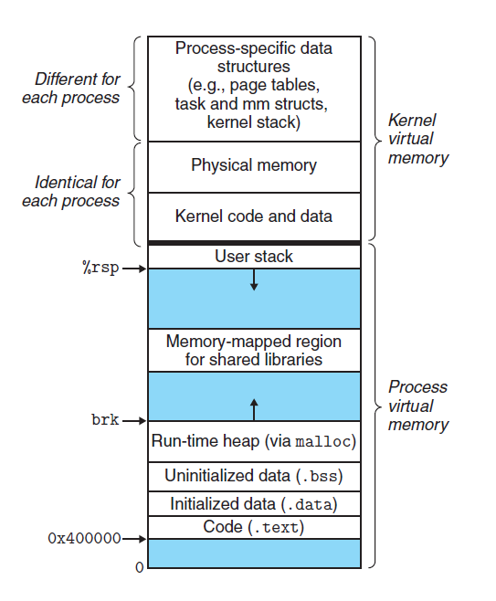

# 变量定义与生存周期

`C/C++`变量有两个非常重要的属性：作用域与生命周期，这两个属性代表从时间和空间两个不同的维度来描述一个变量。

## 作用域

作用域即一个变量可以被引用的范围，常见的作用域可分为 6 种：全局作用域，局部作用域，语句作用域，类作用域，命名空间作用域和文件作用域。

- 全局变量：具有全局作用域。全局变量只需在一个源文件中定义，就可以作用于所有的源文件。其他不包含全局变量定义的源文件需要用`extern`关键字再次声明这个全局变量。
- 静态全局变量：具有文件作用域。它与全局变量的区别在于如果程序包含多个文件的话，它作用于定义它的文件里，不能作用到其它文件里，即被`static`关键字修饰过的变量具有文件作用域。这样即使两个不同的源文件都定义了相同名字的静态全局变量，它们也是不同的变量。
- 局部变量：具有局部作用域。它是自动对象（auto），在程序运行期间不是一直存在，而是只在函数执行期间存在，函数的一次调用执行结束后，变量被撤销，其所占用的内存也被收回，局部变量对于函数外部的程序来说是不可见的。当然内部实际更复杂，实际是以 {} 为作用域的。
- 静态局部变量：具有局部作用域。它只被初始化一次，自从第一次被初始化直到程序运行结束都一直存在，它和全局变量的区别在于全局变量对所有的函数都是可见的，而静态局部变量只对定义自己的函数体始终可见, 只有定义该变量的函数内部可以使用访问和修改该变量。

### 程序实例

以下为详细的程序实例`a.cpp`, `b.cpp`，分别对应的变量定义。

a.cpp

```cpp
#include <iostream>
using namespace std;
int g_var = 0; // 全局变量
static char *gs_var;  // 静态全局变量

int main()
{
    int var;                    // 局部变量
    static int s_var = 0;       // 静态局部变量
    return 0;
}
```

b.cpp

```cpp
#include <iostream>
using namespace std;
extern int g_var; // 访问全局变量
// extern static char *gs_var;  无法访问静态全局变量

int test()
{
    g_var = 1;
}
```

## 生命周期

生命周期即该变量可以被引用的时间段（生存期表示变量存在的时间）。

- 全局变量: 全局变量在整个程序运行期间都会一直存在，都可以随时访问，当程序结束时，对应的变量则会自动销毁，内存会被系统回收。
- 局部变量: 局部变量的生命周期仅限于函数被调用期间，当函数调用结束时，该变量会自动销毁。
- 静态局部变量：实际上静态局部变量的作用域仅限于函数内部，它的作用域与局部变量相同，但实际上该变量在程序运行期间是一直存在的，生命周期贯穿于整个程序运行期间。局部静态变量只能被初始化一次。

## 分配的内存空间

不同生命周期的变量，在程序内存中的分布位置是不一样的。。我们知道程序的内存分为代码区（.text）、全局数据区（.data，.bss，.rodata）、堆区（heap）、栈区（stack），不同的内存区域，对应不同的生命周期。



- 静态变量一般存储在数据段，包括`data`段、`bss`段、`rodata`段，其中 `data`存储已经已经初始化的静态变量和全局变量，`bss`存储未初始化的静态变量与全局变量。这里静态变量包括全局变量，静态全局变量，静态局部变量。
- 局部变量一般存储在栈区或者堆区。

## 注意事项

- 静态变量和栈变量（存储在栈中的变量）、堆变量（存储在堆中的变量）的区别：静态变量会被放在程序的静态数据存储区（`.data`段，`bss`段，`rodata`段）中（静态变量会自动初始化），这样可以在下一次调用的时候还可以保持原来的赋值。而栈变量或堆变量不能保证在下一次调用的时候依然保持原来的值。
  - 静态变量会自动初始化指编译器会进行初始化
  - `bss`存储未初始化的静态变量与全局变量，这里未初始化大概是指未被用户显示初始化的变量
- 静态变量和全局变量的区别：静态变量仅在变量的作用范围内可见，实际是依靠编译器来控制作用域。全局变量在整个程序范围内都可可见，只需声明该全局变量，即可使用。
- 全局变量定义在不要在头文件中定义：如果在头文件中定义全局变量，当该头文件被多个文件`include`时，该头文件中的全局变量就会被定义多次，编译时会因为重复定义而报错，因此不能再头文件中定义全局变量。一般情况下我们将变量的定义放在`.cpp`文件中，一般在`.h`文件使用`extern`对变量进行声明。

## 参考资料

- [Static Keyword in C++](https://www.geeksforgeeks.org/static-keyword-cpp/)
- [Static data members in C++](https://www.geeksforgeeks.org/static-data-members-c/)
- [Static Variables in C](https://www.geeksforgeeks.org/static-variables-in-c/)
- [Storage Classes in C](https://www.geeksforgeeks.org/storage-classes-in-c/)
- [Memory Layout of C Programs](https://www.geeksforgeeks.org/memory-layout-of-c-program/)
- [.bss](https://en.wikipedia.org/wiki/.bss)
- [Data segment](https://en.wikipedia.org/wiki/Data_segment)
- [6.9 — Sharing global constants across multiple files (using inline variables)](https://www.learncpp.com/cpp-tutorial/sharing-global-constants-across-multiple-files-using-inline-variables/)
