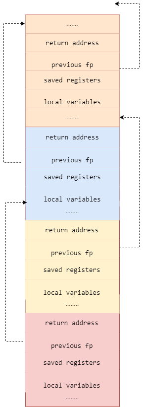

# 堆与栈

## 栈

首先需要详细了解计算机系统中的[Stack machine](https://leetcode.cn/link/?target=https://www.cp.eng.chula.ac.th/~prabhas//teaching/ca/stack.htm)的基本概念，了解程序中函数的调用过程。

每次在调用函数时，会按照从右向左的顺序依次将函数调用参数压入到栈中，并在栈中压入返回地址与当前的栈帧，然后跳转到调用函数内部，pc 跳转函数内部执行该函数的指令，在此不再展开叙述，可以详细参考许多关于栈模型的资料。



### 程序示例

我们可以在`gdb`下查看分配的栈的空间以及当前栈上分配的元素。

我们编写如下程序

```cpp
#include <iostream>
using namespace std;
/*
说明：C++ 中不再区分初始化和未初始化的全局变量、静态变量的存储区，如果非要区分下述程序标注在了括号中
*/
int g_var = 0; // g_var 在全局区（.data 段）
char *gp_var;  // gp_var 在全局区（.bss 段）

int main()
{
    int var;                    // var 在栈区
    char *p_var;                // p_var 在栈区
    char arr[] = "abc";         // arr 为数组变量，存储在栈区；"abc"为字符串常量，存储在常量区
    char *p_var1 = "123456";    // p_var1 在栈区；"123456"为字符串常量，存储在常量区
    static int s_var = 0;       // s_var 为静态变量，存在静态存储区（.data 段）
    p_var = (char *)malloc(10); // 分配得来的 10 个字节的区域在堆区
    free(p_var);
    return 0;
}
```

我们使用调试工具[GDB](https://leetcode.cn/link/?target=https://sourceware.org/gdb/download/onlinedocs/gdb.pdf)查看程序的堆栈信息，以及当前堆中的变量信息如下：

```text
$ gdb d
(gdb) b main
Breakpoint 1 at 0x81d: file d.cpp, line 10.
(gdb) r
Starting program: /mnt/c/work/leetcode/d

Breakpoint 1, main () at d.cpp:10
10      {
(gdb) bt full
#0  main () at d.cpp:10
        var = <optimized out>
        p_var = 0x8000730 <_start> "1\355I\211\321^H\211\342H\203\344\360PTL\215\005\n\002"
        arr = "\377\177\000"
        p_var1 = 0x80008e0 <__libc_csu_init> "AWAVI\211\327AUATL\215%\206\004 "
        s_var = 0
(gdb) info reg
rax            0x8000815        134219797
rbx            0x0      0
rcx            0x100    256
rdx            0x7ffffffedd28   140737488280872
rsi            0x7ffffffedd18   140737488280856
rdi            0x1      1
rbp            0x7ffffffedc30   0x7ffffffedc30
rsp            0x7ffffffedc10   0x7ffffffedc10
r8             0x7ffffefdcd80   140737471434112
r9             0x0      0
r10            0x6      6
r11            0x7fffff1316d0   140737472829136
r12            0x8000730        134219568
r13            0x7ffffffedd10   140737488280848
r14            0x0      0
r15            0x0      0
rip            0x800081d        0x800081d <main()+8>
eflags         0x202    [ IF ]
cs             0x33     51
ss             0x2b     43
ds             0x0      0
es             0x0      0
fs             0x0      0
gs             0x0      0
(gdb)
```

我们知道`rsp`寄存器存放的地址即为当前的栈顶，`rbp`寄存器存放的地址即为当前的栈帧，与`rbp`寄存器相邻的位置存放的数据即为函数的返回地址与调用函数的栈帧，通过以上信息我们即可获取函数的调用关系。

### 栈溢出

一般情况操作系统为每个进程会固定栈空间的大小

```text
$ ulimit -s 
8192
```

当然实际情况，我们可以根据自己的需要来分配每个进程的栈空间。在实际编写程序时，如果出现两个函数互相调用或者递归无退出条件时，此时栈空间的就会无限增长。
当然实际的栈的分配与应用较为复杂，需要详细阅读操作系统的相关材料，栈一般还分为内核栈与用户栈，在栈顶会有一个特殊的内存页`guard`，当栈一旦越界访问该特殊的`guard`页时，则会出现栈溢出的错误。

## 堆

当程序在运行时，需要动态申请额外的内存来存放相应的数据和变量，此时就需要用到堆。堆的内存空间一般由操作系统或者专门内存程序来管理的。在 C/C++ 一般用 malloc 或者 new 来从堆中申请内存，使用 free 或者 delete 来释放空间，空间释放后会有操作系统进行回收。当然在实际的程序运行中动态内存管理非常复杂，会有许多非常复杂的技巧来处理。

## 堆与栈的优缺点

- 申请方式
  - 栈中存放的变量在编译时由编译器为其在栈上分配了空间，即程序编译后该变量在栈中使用的内存即确定，释放时也由于函数调用的返回，栈的空间会自动进行回收
  - 堆中存放的变量由程序运行时决定的，会有操作系统或者内存管理模块来进行分配的。
- 申请后系统响应
  - 分配栈空间时如果剩余空间大于申请空间则分配成功，否则分配失败栈溢出，绝大多数情况下，栈的空间较小，一般栈上分配的变量不会占用太大的空间，且当函数返回时，当前栈帧中的变量生存周期会结束；
  - 申请堆空间，堆在内存中呈现的方式类似于链表（记录空闲地址空间的链表），在链表上寻找第一个大于申请空间的节点分配给程序，将该节点从链表中删除，大多数系统中该块空间的首地址存放的是本次分配空间的大小，便于释放，将该块空间上的剩余空间再次连接在空闲链表上，堆上可以分配较大的空间，如果不对申请的内存进行释放，则堆上存储的变量生存周期一直存在，直到当前进程退出。
  - 栈在内存中是连续的一块空间（向低地址扩展）最大容量是系统预定好的，且只能被当前的线程访问；
  - 堆在内存中的空间（向高地址扩展）是不连续的，中间允许有间隔，堆中的内存并不是线程安全的，同一进程的线程都都可访问。
- 申请效率
  - 栈是有系统自动分配，申请效率高，但程序员无法控制
  - 堆是由程序员主动申请，效率低，使用起来方便但是容易产生碎片。
- 存放的内容
  - 栈中存放的是局部变量，函数的参数
  - 堆中存放的内容由程序员控制。

## 实际的内存管理

实际的内存管理可能更为复杂，一般分为两级内存管理。

- 操作系统按照段页式来管理内存，当需要创建新的进程或者线程时，操作系统会为新创建的进程分配物理页，当运行的进程需要更多的内存时，操作系统也会为其分配新的物理页并将其映射到该进程的虚拟地址空间中。
- 程序运行时，每个程序都含有一个内存管理的子程序，专门负责程序中的内存申请和释放，其中的技巧可能非常复杂，并且涉及许多内存分配的算法。

## 参考资料

- [Stack machine](https://www.cp.eng.chula.ac.th/~prabhas//teaching/ca/stack.htm)
- [Memory Management: Stack And Heap](https://icarus.cs.weber.edu/~dab/cs1410/textbook/4.Pointers/memory.html)
- [Stack vs Heap Memory Allocation](https://www.geeksforgeeks.org/stack-vs-heap-memory-allocation/)
- [GDB](https://sourceware.org/gdb/download/onlinedocs/gdb.pdf)
- [Dynamic Memory Allocation and Fragmentation in C and C++](https://www.design-reuse.com/articles/25090/dynamic-memory-allocation-fragmentation-c.html)
- [从操作系统内存管理来说，malloc申请一块内存的背后原理是什么？](https://www.zhihu.com/question/33979489)
