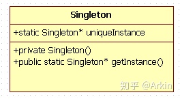

# 单例模式

单例模式(Singleton Pattern，也称为单件模式)，使用最广泛的设计模式之一。其意图是保证一个类仅有一个实例，并提供一个访问它的全局访问点，该实例被所有程序模块共享。

定义一个单例类：

- 私有化它的构造函数，以防止外界创建单例类的对象；
- 使用类的私有静态指针变量指向类的唯一实例；
- 使用一个公有的静态方法获取该实例。



## 懒汉版（Lazy Singleton）

教学版，即懒汉版（Lazy Singleton）：单例实例在第一次被使用时才进行初始化，这叫做延迟初始化。

```cpp
#include <cstdio>

// version 1.0
class Singleton {
 private:
 public:
  static Singleton* GetInstance() {
    if (instance_ == nullptr) {
      instance_ = new Singleton();
    }
    return instance_;
  }

 private:
  Singleton(){};
  ~Singleton(){};
  Singleton(const Singleton&) = delete;
  Singleton& operator=(const Singleton&) = delete;

  static Singleton* instance_;
};

// init static member
Singleton* Singleton::instance_ = nullptr;

int main(int argc, char* argv[]) {
  Singleton* instance1 = Singleton::GetInstance();
  Singleton* instance2 = Singleton::GetInstance();
  printf("instance %p, %p\n", instance1, instance2);
  return 0;
}
```

这里的内存泄漏一般也不会有问题，因为单例一般要在程序运行结束时才可以释放，程序运行结束，所有的内存都会释放

问题1：Lazy Singleton存在内存泄露的问题，有两种解决方法：

1. 使用智能指针
2. 使用静态的嵌套类对象

对于第二种解决方法，代码如下：

```cpp
#include <cstdio>

// version 1.1
class Singleton {
 private:
 public:
  static Singleton* GetInstance() {
    if (instance_ == nullptr) {
      instance_ = new Singleton();
    }
    return instance_;
  }

 private:
  Singleton(){};
  ~Singleton(){};
  Singleton(const Singleton&) = delete;
  Singleton& operator=(const Singleton&) = delete;

  class Deletor {
   public:
    ~Deletor() {
      printf("Deletor %p deleted\n", Singleton::instance_);
      delete Singleton::instance_;
    }
  };

  static Deletor deleter_;
  static Singleton* instance_;
};

// init static member
Singleton* Singleton::instance_ = nullptr;
Singleton::Deletor Singleton::deleter_;

int main(int argc, char* argv[]) {
  Singleton* instance1 = Singleton::GetInstance();
  Singleton* instance2 = Singleton::GetInstance();
  printf("instance %p, %p\n", instance1, instance2);
  return 0;
}
```

在程序运行结束时, 系统会调用静态成员deletor的析构函数, 该析构函数会删除单例的唯一实例。使用这种方法释放单例对象有以下特征：

- 在单例类内部定义专有的嵌套类。
- 在单例类内定义私有的专门用于释放的静态成员。
- 利用程序在结束时析构全局变量的特性，选择最终的释放时机。
- 在单例类内再定义一个嵌套类，总是感觉很麻烦。

问题2：这个代码在单线程环境下是正确无误的，但是当拿到多线程环境下时这份代码就会出现race condition，注意version 1.0与version 1.1都不是线程安全的。要使其线程安全，能在多线程环境下实现单例模式，我们首先想到的是利用同步机制来正确的保护我们的shared data。

可以使用双检测锁模式（DCL: Double-Checked Locking Pattern）：

```cpp
static Singleton* GetInstance() {
  if(instance_ == nullptr) {
    Lock lock;  // 基于作用域的加锁，超出作用域，自动调用析构函数解锁
    if(instance_ == nullptr) {
      instance_ = new Singleton();
    }
  }
  return instance_;
}
```

注意，线程安全问题仅出现在第一次初始化（new）过程中，而在后面获取该实例的时候并不会遇到，也就没有必要再使用lock。

双检测锁很好地解决了这个问题，它通过加锁前检测是否已经初始化，避免了每次获取实例时都要首先获取锁资源。

加入DCL后，其实还是有问题的，关于memory model。

在某些内存模型中（虽然不常见）或者是由于编译器的优化以及运行时优化等等原因，使得instance虽然已经不是nullptr但是其所指对象还没有完成构造，这种情况下，另一个线程如果调用GetInstance()就有可能使用到一个不完全初始化的对象。

换句话说，就是代码中第2行：`if(instance_ == nullptr)`和第六行`instance_ = new Singleton();`没有正确的同步，在某种情况下会出现new返回了地址赋值给`instance_`变量而`Singleton`此时还没有构造完全，当另一个线程随后运行到第`2`行时将不会进入`if`从而返回了不完全的实例对象给用户使用，造成了严重的错误。

在`C++11`没有出来的时候，只能靠插入两个`memory barrier`（内存屏障）来解决这个错误，但是`C++11`引进了`memory model`，提供了`Atomic`实现内存的同步访问，即不同线程总是获取对象修改前或修改后的值，无法在对象修改期间获得该对象。

因此，在有了`C++11`后就可以正确的跨平台的实现`DCL`模式了，利用`atomic`，代码如下：

```cpp
std::atomic<Singleton*> Singleton::instance_{ nullptr };
Singleton* Singleton::GetInstance() {
  if (instance_ == nullptr) {
    lock_guard<mutex> lock{ mutW };
    if (instance_ == nullptr) {
      instance_ = new Singleton();
    }
  }
  return instance_;
}
```

`C++11`中的`atomic`类的默认`memory_order_seq_cst`保证了3、6行代码的正确同步，由于上面的`atomic`需要一些性能上的损失，因此我们可以写一个优化的版本：

```cpp
atomic<Singleton*> Singleton::instance_{ nullptr };
Singleton* Singleton::GetInstance() {
  Singleton* p = instance_;
  if (p == nullptr) {
    lock_guard<mutex> lock{ mutW };
    if ((p = instance_) == nullptr) {
      instance_ = p = new Singleton();
    }
  }
  return p;
}
```

### Best of All

`C++11`规定了`local static`在多线程条件下的初始化行为，要求编译器保证了内部静态变量的线程安全性。在`C++11`标准下，《Effective C++》提出了一种更优雅的单例模式实现，使用函数内的 `local static` 对象。这样，只有当第一次访问`GetInstance()`方法时才创建实例。这种方法也被称为`Meyers' Singleton`。`C++0x`之后该实现是线程安全的，`C++0x`之前仍需加锁。

```cpp
#include <cstdio>

// version 1.2
class Singleton {
 private:
 public:
  static Singleton* GetInstance() {
    static Singleton instance;
    return &instance;
  }

 private:
  Singleton(){};
  ~Singleton(){};
  Singleton(const Singleton&) = delete;
  Singleton& operator=(const Singleton&) = delete;
};

int main(int argc, char* argv[]) {
  Singleton* instance1 = Singleton::GetInstance();
  Singleton* instance2 = Singleton::GetInstance();
  printf("instance %p, %p\n", instance1, instance2);
  return 0;
}
```

## 饿汉版（Eager Singleton）

饿汉版（Eager Singleton）：指单例实例在程序运行时被立即执行初始化

```cpp
#include <cstdio>

// version 1.3
class Singleton {
 private:
 public:
  static Singleton instance_;
  static Singleton* GetInstance() { return &instance_; }

 private:
  Singleton(){};
  ~Singleton(){};
  Singleton(const Singleton&) = delete;
  Singleton& operator=(const Singleton&) = delete;
};

// initialize defaultly
Singleton Singleton::instance_;

int main(int argc, char* argv[]) {
  Singleton* instance1 = Singleton::GetInstance();
  Singleton* instance2 = Singleton::GetInstance();
  printf("instance %p, %p\n", instance1, instance2);
  return 0;
}
```

由于在main函数之前初始化，所以没有线程安全的问题。
但是潜在问题在于`no-local static`对象（函数外的static对象）在不同编译单元中的初始化顺序是未定义的。
也即，static Singleton instance;和static Singleton& getInstance()二者的初始化顺序不确定，如果在初始化完成之前调用 getInstance() 方法会返回一个未定义的实例。

总结：

- Eager Singleton 虽然是线程安全的，但存在潜在问题；
- Lazy Singleton通常需要加锁来保证线程安全，但局部静态变量版本在C++11后是线程安全的；
- 局部静态变量版本（Meyers Singleton）最优雅。

## 何时使用单例模式？

### Use a Singleton if

- If you need to have one and only one object of a type in system

### Do not use a Singleton if

- If you want to save memory
- If you want to try something new
- If you want to show off how much you know
- Because everyone else is doing it (See cargo cult programmer in wikipedia)
- In user interface widgets
- It is supposed to be a cache
- In strings
- In Sessions
- I can go all day long

### How to create the best singleton

- The smaller, the better. I am a minimalist
- Make sure it is thread safe
- Make sure it is never null
- Make sure it is created only once
- Lazy or system initialization? Up to your requirements
- Sometimes the OS or the JVM creates singletons for you (e.g. in Java every class definition is a singleton)
- Provide a destructor or somehow figure out how to dispose resources
- Use little memory

## C++中static对象的初始化

### non-local static对象（函数外）

C++规定，non-local static 对象的初始化发生在main函数执行之前，也即main函数之前的单线程启动阶段，所以不存在线程安全问题。但C++没有规定多个non-local static 对象的初始化顺序，尤其是来自多个编译单元的non-local static对象，他们的初始化顺序是随机的。

### local static 对象（函数内）

对于local static 对象，其初始化发生在控制流第一次执行到该对象的初始化语句时。多个线程的控制流可能同时到达其初始化语句。

在C++11之前，在多线程环境下local static对象的初始化并不是线程安全的。具体表现就是：如果一个线程正在执行local static对象的初始化语句但还没有完成初始化，此时若其它线程也执行到该语句，那么这个线程会认为自己是第一次执行该语句并进入该local static对象的构造函数中。这会造成这个local static对象的重复构造，进而产生内存泄露问题。所以，local static对象在多线程环境下的重复构造问题是需要解决的。

而C++11则在语言规范中解决了这个问题。C++11规定，在一个线程开始local static 对象的初始化后到完成初始化前，其他线程执行到这个local static对象的初始化语句就会等待，直到该local static 对象初始化完成。

## 参考

- [C++单例模式](https://zhuanlan.zhihu.com/p/37469260)
- [创建型 - 单例模式](https://pdai.tech/md/dev-spec/pattern/2_singleton.html)
