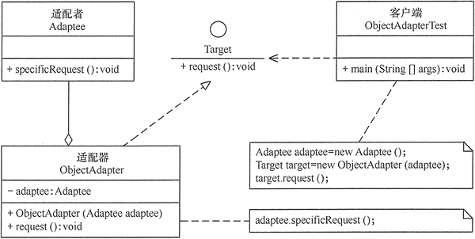

# 结构型-适配器

在阎宏博士的《JAVA与模式》一书中开头是这样描述适配器（Adapter）模式的：

> 适配器模式把一个类的接口变换成客户端所期待的另一种接口，从而使原本因接口不匹配而无法在一起工作的两个类能够在一起工作。

## 适配器模式的用途

用电器做例子，笔记本电脑的插头一般都是三相的，即除了阳极、阴极外，还有一个地极。而有些地方的电源插座却只有两极，没有地极。电源插座与笔记本电脑的电源插头不匹配使得笔记本电脑无法使用。这时候一个三相到两相的转换器（适配器）就能解决此问题，而这正像是本模式所做的事情。

## 适配器模式的结构

适配器模式有类的适配器模式和对象的适配器模式两种不同的形式。

## 适配器的实现

适配器模式（Adapter）包含以下主要角色。

- 目标（Target）接口：当前系统业务所期待的接口，它可以是抽象类或接口。
- 适配者（Adaptee）类：它是被访问和适配的现存组件库中的组件接口。
- 适配器（Adapter）类：它是一个转换器，通过继承或引用适配者的对象，把适配者接口转换成目标接口，让客户按目标接口的格式访问适配者。

## 类适配器实现

类适配器模式可采用多重继承方式实现，如 C++ 可定义一个适配器类来同时继承当前系统的业务接口和现有组件库中已经存在的组件接口。

Java不支持多继承，但可以定义一个适配器类来实现当前系统的业务接口，同时又继承现有组件库中已经存在的组件。

## 对象适配器实现

对象适配器可以通过委派的方式来实现
对象适配器模式可釆用将现有组件库中已经实现的组件引入适配器类中，该类同时实现当前系统的业务接口

## 类适配器和对象适配器的权衡

- 类适配器使用对象继承的方式，是静态的定义方式；而对象适配器使用对象组合的方式，是动态组合的方式。
- 对于类适配器，由于适配器直接继承了Adaptee，使得适配器不能和Adaptee的子类一起工作，因为继承是静态的关系，当适配器继承了Adaptee后，就不可能再去处理  Adaptee的子类了。
- 对于对象适配器，一个适配器可以把多种不同的源适配到同一个目标。换言之，同一个适配器可以把源类和它的子类都适配到目标接口。因为对象适配器采用的是对象组合的关系，只要对象类型正确，是不是子类都无所谓。
- 对于类适配器，适配器可以重定义Adaptee的部分行为，相当于子类覆盖父类的部分实现方法。
- 对于对象适配器，要重定义Adaptee的行为比较困难，这种情况下，需要定义Adaptee的子类来实现重定义，然后让适配器组合子类。虽然重定义Adaptee的行为比较困难，但是想要增加一些新的行为则方便的很，而且新增加的行为可同时适用于所有的源。
- 对于类适配器，仅仅引入了一个对象，并不需要额外的引用来间接得到Adaptee。
- 对于对象适配器，需要额外的引用来间接得到Adaptee。

建议尽量使用对象适配器的实现方式，多用合成/聚合、少用继承。当然，具体问题具体分析，根据需要来选用实现方式，最适合的才是最好的。

## 适配器模式的优点

- 更好的复用性
  - 系统需要使用现有的类，而此类的接口不符合系统的需要。那么通过适配器模式就可以让这些功能得到更好的复用。
- 更好的扩展性
  - 在实现适配器功能的时候，可以调用自己开发的功能，从而自然地扩展系统的功能。

## 适配器模式的缺点

过多的使用适配器，会让系统非常零乱，不易整体进行把握。

比如，明明看到调用的是A接口，其实内部被适配成了B接口的实现，一个系统如果太多出现这种情况，无异于一场灾难。因此如果不是很有必要，可以不使用适配器，而是直接对系统进行重构。

## 参考

- [《JAVA与模式》之适配器模式](https://www.cnblogs.com/java-my-life/archive/2012/04/13/2442795.html)
- [适配器模式](https://github.com/gwq5210/gtl/blob/main/docs/adapter.md)
