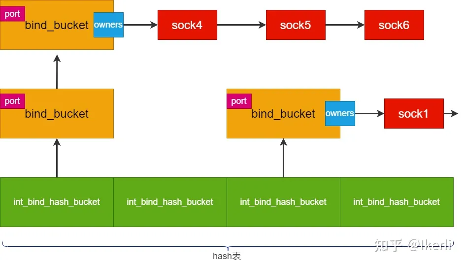

# REUSEADDR 与 REUSEPORT 到底做了什么？

在 `linux` 下的服务器开发中，`REUSEADDR` 与 `REUSEPORT` 是我们经常会用到的两个套接字选项。但很多时候只是简单的使用，而没有深究其原理。甚至有些搞不懂两者之间的区别和联系。网上关于这两个的文章一大堆，但是看上去好像都没有说透，甚至有些是错误的理解。

`Stackoverflow` 上有一篇关于这个的高赞回答写得很好，有兴趣的读者可以自行查询[how-do-so-reuseaddr-and-so-reuseport-differ](https://stackoverflow.com/questions/14388706/how-do-so-reuseaddr-and-so-reuseport-differ)

本文试图通过阅读 `linux` 内核的部分源码来分析这两者的本质，文中观点并不一定完全正确，仅供各位参考了。本文只分析 `TCP` 的 `bind` 过程，不涉及 `UDP` 或其他。

## Man文档描述

首先抬出那个男人（Man文档），看看是怎么描述的这两个套接字选项的:

```text
SO_REUSEADDR: Indicates that the rules used in validating addresses supplied in a bind(2) call should allow reuse of local addresses. For AF_INET sockets this means that a socket may bind, except when there is an active listening socket bound to the address. When the listening socket is bound to INADDR_ANY with a specific port then it is not possible to bind to this port for any local address. Argument is an integer boolean flag。
```

简单翻译一下：`SO_REUSEADDR` 提供了一套复用地址的规则。对于 `AF_INET` 套接字，这意味着一个套接字可以绑定，除非有一个活动的监听套接字绑定到该地址。当监听套接字使用特定端口绑定到 `INADDR_ANY` 时，就不可能为任何本地地址重新绑定到该端口。

```text
SO_REUSEPORT:
Permits multiple AF_INET or AF_INET6 sockets to be bound to an identical socket address. This option must be set on each socket (including the first socket) prior to calling bind(2) on the socket. To prevent port hijacking, all of the processes binding to the same address must have the same effective UID. This option can be employed with both TCP and UDP sockets.

For TCP sockets, this option allows accept(2) load distribution in a multi-threaded server to be improved by using a distinct listener socket for each thread. This provides improved load distribution as compared to traditional techniques such using a single accept(2)ing thread that distributes connections, or having multiple threads that compete to accept(2) from the same socket.

For UDP sockets, the use of this option can provide better distribution of incoming datagrams to multiple processes (or threads) as compared to the traditional technique of having multiple processes compete to receive datagrams on the same socket.
```

此选项允许多个 `AF_INET` 或者 `AF_INET6` 的套接字绑定到同一个 `socket` 地址上。必须每一个调用 `bind` 函数的 `socket` 套接字都要设置这个选项(包括第一个)才能生效。为了防止端口劫持，所有绑定到相同地址的进程必须是同一个 `UID`。 这个选项适用于 `TCP` 和 `UDP` 套接字。

对于 `TCP` 套接字而言，这个选项通过每个监听线程使用不同的 `listen fd` 来改进 `accpet` 的负载分配。相对于传统的做法如只有一个 `accept` 线程在处理连接，或者是多个线程使用同一个 `listen fd` 进行 `accept`，`REUSEPORT` 有助于负载均衡的改进。

对于 `UDP` 而言，相比如以前多个进程(或线程)都在同一个 `socket` 上接收数据报的情况的传统做法, 此选项能够提供一种更好的负载均衡能力。

## 几个简单的 bind 测试

首先做几个测试，我的测试虚拟机是 `centos8`，基于 `Linux version 4.18.0-305.3.1.el8.x86_64` 版本。

两个简单地测试用例如下，有兴趣的同学可以自行测试一遍

[reuse_addr_test.cc](https://github.com/gwq5210/gtl/blob/main/examples/net/reuse_addr_test.cc)

### 测试1

不开启 `REUSEADDR`，也不调用 `listen` 函数，两个使用相同的 `ip:port` 进行 `bind`，结果如下

很遗憾，第二次试图 `bind` 时候得到了错误

```text
./reuse_addr_test --server_address1="127.0.0.1:9999" --server_address2="127.0.0.1:9999" --reuse_addr=false --listen_first=false --reuse_port=false

[2023-03-07 20:15:46.767] [info] [reuse_addr_test.cc:12] first BindAndListen 127.0.0.1:9999 started
[2023-03-07 20:15:46.767] [info] [reuse_addr_test.cc:21] bind server address 127.0.0.1:9999 sucessfully
[2023-03-07 20:15:46.767] [info] [reuse_addr_test.cc:12] second BindAndListen 127.0.0.1:9999 started
[2023-03-07 20:15:46.767] [error] [socket.cc:114] bind address(127.0.0.1:9999) failed! errno:98, errmsg:Address already in use
```

### 测试2

开启 `REUSEADDR`，不进行 `listen`，两个使用相同 `ip:port` 进行 `bind`

可以看到，开启 `REUSEADDR` 并且没有 `listen` 的情况下，两次 `bind` 都成功了。

```text
./reuse_addr_test --server_address1="127.0.0.1:9999" --server_address2="127.0.0.1:9999" --reuse_addr=true --listen_first=false --reuse_port=false

[2023-03-07 20:16:41.511] [info] [reuse_addr_test.cc:12] first BindAndListen 127.0.0.1:9999 started
[2023-03-07 20:16:41.511] [info] [reuse_addr_test.cc:21] bind server address 127.0.0.1:9999 sucessfully
[2023-03-07 20:16:41.511] [info] [reuse_addr_test.cc:12] second BindAndListen 127.0.0.1:9999 started
[2023-03-07 20:16:41.511] [info] [reuse_addr_test.cc:21] bind server address 127.0.0.1:9999 sucessfully
```

### 测试3

开启 `REUSEADDR`，并且调用 `listen` 使套接字称为监听状态，两个使用相同 `ip:port` 进行`bind`，结果如下：

可以看到，尽管开启了 `REUSEADDR` ，但是由于套接字调用了 `listen` 函数，变为了 `TCP_LISTEN` 状态，第二次 `bind` 就会失败。

```text
./reuse_addr_test --server_address1="127.0.0.1:9999" --server_address2="127.0.0.1:9999" --reuse_addr=true --listen_first=true --reuse_port=false

[2023-03-07 20:17:50.022] [info] [reuse_addr_test.cc:12] first BindAndListen 127.0.0.1:9999 started
[2023-03-07 20:17:50.022] [info] [reuse_addr_test.cc:21] bind server address 127.0.0.1:9999 sucessfully
[2023-03-07 20:17:50.022] [info] [reuse_addr_test.cc:28] listen server address 127.0.0.1:9999 sucessfully
[2023-03-07 20:17:50.022] [info] [reuse_addr_test.cc:12] second BindAndListen 127.0.0.1:9999 started
[2023-03-07 20:17:50.022] [error] [socket.cc:114] bind address(127.0.0.1:9999) failed! errno:98, errmsg:Address already in use
```

### 测试4

与测试3相同，只是不开启 `REUSEADDR`，开启 `REUSEPORT`。

可以看到，虽然没开启 `REUSEADDR` ，但是开启了 `REUSEPORT`。套接字调用了 `listen` 函数，变为了 `TCP_LISTEN` 状态，但是第二次 `bind` 还是成功的，并且调用 `listen` 也成功了

并且可以看到两个进程在监听同一个地址和端口

```text
./reuse_addr_test --server_address1="127.0.0.1:9999" --server_address2="127.0.0.1:9999" --reuse_addr=false --listen_first=true --reuse_port=true

[2023-03-07 20:39:56.490] [info] [reuse_addr_test.cc:13] first BindAndListen 127.0.0.1:9999 started
[2023-03-07 20:39:56.490] [info] [reuse_addr_test.cc:29] bind server address 127.0.0.1:9999 sucessfully
[2023-03-07 20:39:56.490] [info] [reuse_addr_test.cc:36] listen server address 127.0.0.1:9999 sucessfully
[2023-03-07 20:39:56.490] [info] [reuse_addr_test.cc:13] second BindAndListen 127.0.0.1:9999 started
[2023-03-07 20:39:56.490] [info] [reuse_addr_test.cc:29] bind server address 127.0.0.1:9999 sucessfully
[2023-03-07 20:39:56.490] [info] [reuse_addr_test.cc:36] listen server address 127.0.0.1:9999 sucessfully
```

### 测试5

不开启 `REUSEADDR`，不开启 `REUSEPORT`。启动 `server1` 并监听。 使用 `telnet` 模拟客户端，当客户端连接上来后，此时 `conn_sock` 连接处于 `ESTABLISHED` 状态，而 `listen_sock` 还是处于 `TCP_LISTEN` 状态。

使用 `ss` 观察如下：

```text
ss -napt | grep 9999
LISTEN     1      4096       127.0.0.1:9999       0.0.0.0:*     users:(("reuse_addr_test",pid=457911,fd=3))
ESTAB      0      0          127.0.0.1:9999     127.0.0.1:32796
ESTAB      0      0          127.0.0.1:32796    127.0.0.1:9999  users:(("telnet",pid=458298,fd=3))
```

然后我们让服务端主动断开 `TCP` 连接，然后退出程序。根据 `TCP` 四次挥手的过程，此时 `conn_sock` 最终预期会进入 `TCP_TIMEWAIT` 状态。而 `listen_sock` 由于程序退出，所以 `ss` 看不到了。

```text
ss -napt | grep 9999
TIME-WAIT  0      0          127.0.0.1:9999      127.0.0.1:33744
```

与此同时，在 `TCP_TIMEWAIT` 状态下赶紧启动 `server2` 试图绑定同一个 `ip:port`，观察是否能正常 `bind`，很遗憾，`bind` 失败了。

```text
./tcp_server --reuse_addr=false --server_address="127.0.0.1:9999"
[2023-03-08 11:08:23.374] [error] [socket.cc:114] bind address(127.0.0.1:9999) failed! errno:98, errmsg:Address already in use
```

`linux` 下 `TCP_TIMEWAIT` 大约维持 `60s` 左右，等到 `TCP_TIMEWAIT` 状态结束后，再启动 `server2`，发现是能正常绑定的。
也就是说，不开启 `REUSEADDR`，不开启 `REUSEPORT`。当存在处于 `TCP_TIMEWAIT` 的连接时 时，我们不能马上对这个地址重新 `bind`。

### 测试6

与测试5 完全相同，唯一区别是 `server1` 和 `server2` 均开启了 `REUSEADDR`，不开启 `REUSEPORT`。
实验结果：`server2` 能在 `server1` 的 `TCP_TIMEWAIT` 状态下成功绑定这个地址。

### 测试7

与测试5完全相同，唯一区别是 `server1` 和 `server2` 均开启了 `REUSEPORT`, 不开启 `REUSEADDR`。
实验结果：`server2` 同样能在 `server1` 的 `TCP_TIMEWAIT` 状态下成功绑定这个地址。

这几个测试很简单，读者如果有兴趣可能自行尝试下，也顺便帮我验证下是否正确了。
注：以上测试结果只针对 `LINUX` 系统（内核版本至少要大于 `3.9`），在其他系统如 `BSD` 等测试结果可能会有所偏差。

## 内核究竟怎么进行 bind 的？

很难用简单的言语去描述 `REUSEADDR` 和 `REUSEPORT` 到底有什么区别。毕竟再多华丽的描述也不及代码有说服力。我们去 `linux` 源代码看看这两者到底怎么实现的。
`SO_REUSEPORT` 最早是在 `LINUX` 内核 `3.9` 版本引入的，在 `GitHub` 上找了一下翻到了当时的 [commit](https://github.com/torvalds/linux/commit/da5e36308d9f7151845018369148201a5d28b46d?diff=split)，有兴趣的同学可以看下当时做了哪些修改。

这里我直接拉取的比较新的内核代码，版本是 `LINUX 5.15.7`，有兴趣的可以从 `LINUX` 官方网站 下载历史 `LINUX` 内核版本。

先不考虑如何从 `GLIBC` 的接口调用到内核系统调用的，这不是本文重点。我们直接找到 `setsockopt` 的实现。

```cpp
int sock_setsockopt(struct socket *sock, int level, int optname,
		    sockptr_t optval, unsigned int optlen)
{
	struct so_timestamping timestamping;
	struct sock_txtime sk_txtime;
	struct sock *sk = sock->sk;
	int val;
	int valbool;

	if (copy_from_sockptr(&val, optval, sizeof(val)))
		return -EFAULT;

	valbool = val ? 1 : 0;

	lock_sock(sk);

	switch (optname) {
	// .......
	case SO_REUSEADDR:
		sk->sk_reuse = (valbool ? SK_CAN_REUSE : SK_NO_REUSE);
		break;
	case SO_REUSEPORT:
		sk->sk_reuseport = valbool;
		break;
	// .......
	}
}
```

`struct socket` 是内核对 `socket` 结构体的封装，这里只需要知道他与我们用户代码中拿到的 `socket_fd` 是一一对应的就行了。

这里其实实现很简单，仅仅是把 `sock` 结构体的成员值就行了：

例如设置了 `SO_REUSEADDR`，则 `sk->sk_reuse` 设为 `SK_CAN_REUSE`
如设置了 `SO_REUSEPORT`，则设置 `sk->re_reuseport`。

然后这两个值在哪里起作用的？ 当然是在 `bind` 函数里面。
我们考虑下，为什么 `bind` 函数里面要判断是否地址冲突？通常一个网络连接可以由一个五元组来唯一标识:

```text
(protocal + src_ip + src_port + peer_ip + peer_port)
```

这个五元组的任一元素不同，都表示一个新的网络连接。其中 `protocal` 协议在 调用 `socket` 函数的时候就已经确定了(`TCP` 对应 `SOCK_STREAM` 参数)。 `peer_ip` 和 `peer_port` 是在调用 `connect`(客户端)或者 `accept`(服务端)时确定的，那 `src_ip` 和 `src_port` 呢，其实是在bind函数中确定的。

如果不判断地址冲突，想一下。假设有两个进程，各自有一个 `socket` 都同时绑定在 `IP1:PORT1` 上，并且同时都调用了 `listen` 函数进入监听，当某个客户端试图连接 `IP1:PORT1` 的时候，内核如何区分这个连接该给哪个进程？当然，`REUSEPORT` 就是为了解决这个问题，但这是后话了。
但我们又不能一棒子打死，一对 `ip:port` 只能绑定在一个 `sock` 上，端口号毕竟是有限的，能尽量复用就复用。
所以，`bind` 函数其实就是一套规则，它告诉我们什么时候能复用地址，什么时候不能复用。

`glibc` 的 `bind` 最终会调用到内核的 `__inet_bind` 函数。内核维持了一个绑定端口的哈希表，由于判断端口冲突。在内核中 `bind` 实际上底层是依靠这个 `hash` 表实现的，这个 `hash` 表的示意结构如下(图中的结构体名称只是示意，实际的结构体详见内核源码)：



`bind_hash` 表其实就是一个以 `inet_bind_hashbucket` 为元素的数组，而 `hash_key` 是一个根据端口号 `port、net` 等算出来的一个值。利用 `hase_key` 找到一个 `inet_bind_hashbucket` 元素。而 `inet_bind_hashbucket` 持有一个 `inet_bind_bucket` 结构体组成的链表。每个 `inet_bind_bucket` 结构体又持有一个 `sock` 结构体组成的链表 `owners`，这条 `sock` 链表的所有 `sock` 的 `port` 端口一定是一样的。当我们调用 `bind` 函数时，其实就是去对应的 `sock` 链表上，添加新的 `sock`。

`__inet_bind` 函数调用 `get_port` 这个函数指针成员去 `bind` 端口号。`get_port` 其实就是 `inet_csk_get_port` 函数。如果 `inet_csk_get_port` 无法绑定端口号，就会报错 `EINADDRUSE`，也就是我们经常遇到的哪个错误码了。这个错误的原因其实就是因为我们新插入的 `sock` 与原来的 `sock` 链表中的某个 `sock` 产生冲突了。

```cpp
int __inet_bind(struct sock *sk, struct sockaddr *uaddr, int addr_len,
		u32 flags) {
	// ........
	/* Make sure we are allowed to bind here. */
	if (snum || !(inet->bind_address_no_port ||
		      (flags & BIND_FORCE_ADDRESS_NO_PORT))) {
		if (sk->sk_prot->get_port(sk, snum)) {
			inet->inet_saddr = inet->inet_rcv_saddr = 0;
			err = -EADDRINUSE;
			goto out_release_sock;
		}
		if (!(flags & BIND_FROM_BPF)) {
			err = BPF_CGROUP_RUN_PROG_INET4_POST_BIND(sk);
			if (err) {
				inet->inet_saddr = inet->inet_rcv_saddr = 0;
				goto out_release_sock;
			}
		}
	}

	// ........
}
```

在 `inet_csk_get_port` 函数中：

```cpp
// 绑定端口号snum 到 sk上
int inet_csk_get_port(struct sock *sk, unsigned short snum)
{
	// 当前待绑定的 sock 是否具有 reuse条件：
	// 具体要求为该 sock 开启了 reuseaddr 并且 该 sock 状态不是 TCP_LISTEN
	bool reuse = sk->sk_reuse && sk->sk_state != TCP_LISTEN;

	// 拿到 bind_hash 表
	struct inet_hashinfo *hinfo = sk->sk_prot->h.hashinfo;
	int ret = 1, port = snum;
	struct inet_bind_hashbucket *head;
	struct net *net = sock_net(sk);
	struct inet_bind_bucket *tb = NULL;
	int l3mdev;

	l3mdev = inet_sk_bound_l3mdev(sk);
	// 若 port 为0则内核去选择一个可用端口
	// 内核自己选的端口无需判断冲突，直接 goto success
	if (!port) {
		head = inet_csk_find_open_port(sk, &tb, &port);
		if (!head)
			return ret;
		if (!tb)
			goto tb_not_found;
		goto success;
	}
	// 使用inet_bhashfn 函数与端口号计算出hash索引，然后从哈希表中取出该索引上的 inet_bind_hashbucket 结构体
	// inet_bind_hashbucket 持有一个链表，这个链表是由 多个 inet_bind_bucket 组成的
	head = &hinfo->bhash[inet_bhashfn(net, port,
					  hinfo->bhash_size)];
	spin_lock_bh(&head->lock);
	// 遍历 inet_bind_hashbucket 持有的链表上的每一个 inet_bind_bucket
	// 找到 port一致、网络命名空间一致、l3mdev一致的 inet_bind_bucket 结构体
	// inet_bind_bucket 这个结构体有一个 owners 成员, owners 是一个 以 sock 为元素组成的链表。
	// 这个链表上每个 sock 的 port 都是一样的，网络命名空间也是一致的。 但是 ip 不一定一样
	inet_bind_bucket_for_each(tb, &head->chain)
		if (net_eq(ib_net(tb), net) && tb->l3mdev == l3mdev &&
		    tb->port == port)
			goto tb_found;
tb_not_found:
	// 如果找不到 inet_bind_bucket 就重新创建一个
	tb = inet_bind_bucket_create(hinfo->bind_bucket_cachep,
				     net, head, port, l3mdev);
	if (!tb)
		goto fail_unlock;
tb_found:
	if (!hlist_empty(&tb->owners)) {
		// 如果 sk 强制 reuse_addr，直接绑定，不判断冲突
		// 注意这个跟用户设置 SO_REUSEADDR 无关
		if (sk->sk_reuse == SK_FORCE_REUSE)
			goto success;

		// 使用 inet_bind_bucket 的 fastreuse 等标志快速判断是否复用，尽量避免遍历 sock 链表来判断
		if ((tb->fastreuse > 0 && reuse) ||
		    sk_reuseport_match(tb, sk))
			goto success;
		// 调用 inet_csk_bind_conflict 去遍历 sock 链表判断是否冲突
		if (inet_csk_bind_conflict(sk, tb, true, true))
			goto fail_unlock;
	}
success:
	inet_csk_update_fastreuse(tb, sk);

	if (!inet_csk(sk)->icsk_bind_hash)
		inet_bind_hash(sk, tb, port);
	WARN_ON(inet_csk(sk)->icsk_bind_hash != tb);
	ret = 0;

fail_unlock:
	spin_unlock_bh(&head->lock);
	return ret;
}
```

看这一小段代码:

```cpp
if ((tb->fastreuse > 0 && reuse) || sk_reuseport_match(tb, sk))
	goto success;
```

这里使用了 `inet_bind_bucket` 的 `fastreuse` 成员来判断，`fastreuse` 是一个标志位，它标志着当前是否支持 `REUSEADDR`。每当向 `sock` 结构体里面插入一个 `sock` 之后， `fastreuse` 就会更新标志。实际上，只要当前 `sock` 链表上的所有的 `sock` 都开启了 `SO_REUSEADDR` 并且所有 `sock` 都不是 `TCP_LISTEN` 状态，那么这个 `fastreuse` 就是 `true`。只要一直维持好这个标志位的值，就可以快速判断是否能复用地址，而不需要再去依次遍历 `sock` 链表上的每一个 `sock`。这个优化是很利于效率提升的。

`sk_reuseport_match` 这个函数效果是一样的，其实就是利用 `fastreuseport` 这个标志位，快速判断是否支持 `REUSEPORT`。注意这里有个条件会判断 `uid`。这表示尽管开启了 `REUSERPORT`，但是如不是同一个 `EUID` 的话也会 `bind` 失败。内核这么做的目的这主要是为了防止端口劫持。

```cpp
static inline int sk_reuseport_match(struct inet_bind_bucket *tb,
				     struct sock *sk)
{
	kuid_t uid = sock_i_uid(sk);

	if (tb->fastreuseport <= 0)
		return 0;
	// 新 sock 没开启 SO_REUSEPORT 直接冲突
	if (!sk->sk_reuseport)
		return 0;
	if (rcu_access_pointer(sk->sk_reuseport_cb))
		return 0;
	if (!uid_eq(tb->fastuid, uid))
		return 0;
	if (tb->fastreuseport == FASTREUSEPORT_ANY)
		return 1;
	return ipv4_rcv_saddr_equal(tb->fast_rcv_saddr, sk->sk_rcv_saddr,
				    ipv6_only_sock(sk), true, false);
}
```

如果快速判断没有通过，那么就会进入 `inet_csk_bind_conflict` 函数。`inet_csk_bind_conflict` 函数其实本质就是遍历 `sock` 链表，判断是否有冲突。

```cpp
static int inet_csk_bind_conflict(const struct sock *sk,
				  const struct inet_bind_bucket *tb,
				  bool relax, bool reuseport_ok)
{
	struct sock *sk2;
	bool reuseport_cb_ok;
	// reuse 代表当前待绑定的 sock 是否开启 REUSEADDR
	bool reuse = sk->sk_reuse;
	// reuseport 代表当前待绑定的 sock 是否开启 REUSEPORT
	bool reuseport = !!sk->sk_reuseport;
	struct sock_reuseport *reuseport_cb;
	kuid_t uid = sock_i_uid((struct sock *)sk);

	rcu_read_lock();
	reuseport_cb = rcu_dereference(sk->sk_reuseport_cb);
	/* paired with WRITE_ONCE() in __reuseport_(add|detach)_closed_sock */
	reuseport_cb_ok = !reuseport_cb || READ_ONCE(reuseport_cb->num_closed_socks);
	rcu_read_unlock();
	/*
	 * Unlike other sk lookup places we do not check
	 * for sk_net here, since _all_ the socks listed
	 * in tb->owners list belong to the same net - the
	 * one this bucket belongs to.
	 */
	// 遍历 sock 链表上每一个 sock
	// 一旦提前 break 退出，那就说明有冲突，此时无法 bind
	// 如果没有提前退出，最后 sk2 == NULL, 此时说明不存在冲突，可以 bind
	sk_for_each_bound(sk2, &tb->owners) {
		if (sk != sk2 && (!sk->sk_bound_dev_if || !sk2->sk_bound_dev_if | sk->sk_bound_dev_if == sk2->sk_bound_dev_if)) {
			if (reuse && sk2->sk_reuse && sk2->sk_state != TCP_LISTEN) {
				if ((!relax || 
				(!reuseport_ok && reuseport && sk2->sk_reuseport & reuseport_cb_ok && (sk2->sk_state == TCP_TIME_WAIT || uid_eq(uid, sock_i_uid(sk2)))
				)) &&
 inet_rcv_saddr_equal(sk, sk2, true))
					break;
			} else if (!reuseport_ok ||
				   !reuseport || !sk2->sk_reuseport ||
				   !reuseport_cb_ok ||
				   (sk2->sk_state != TCP_TIME_WAIT &&
				    !uid_eq(uid, sock_i_uid(sk2)))) {
				if (inet_rcv_saddr_equal(sk, sk2, true))
					break;
			}
		}
	}
	return sk2 != NULL;
}
```

先不管 `relax` 和 `reuseport_ok` 这两个参数，`bind` 时这两个参数都是 `true`。这里判断条件比较复杂，我把条件重新整理了以下如下代码:

```cpp
if (reuse && sk2->sk_reuse && sk2->sk_state != TCP_LISTEN) {
	// 分支 1--
  // 如果开启了 SO_REUSEADDR，并且不是 LISTEN 状态，这种情况一定能复用，不会冲突。
  // if (
	// 	// bind的时候 relax 和 reuseport_ok 这两个参数 都是 true, 这个 if 不用看了，我直接注释掉
	// 	(!relax ||
	// 			(!reuseport_ok &&
	// 			reuseport && sk2->sk_reuseport &&
	// 			reuseport_cb_ok &&
	// 			(sk2->sk_state == TCP_TIME_WAIT ||
	// 				uid_eq(uid, sock_i_uid(sk2)))))
	// 				&&
	// 		inet_rcv_saddr_equal(sk, sk2, true))
	// 	break;

} else {
	// 分支 2--
  // 这个条件其实就是无法 REUSEPORT
  // 可能是用户没有主动设置 SO_REUSEPORT，也可能是其他原因
  if (!reuseport_ok || !reuseport || !sk2->sk_reuseport || !reuseport_cb_ok) {
		// 分支 2.a --
		// 当然冲突的前提还有一个 ip 地址是一样的
    if (inet_rcv_saddr_equal(sk, sk2, true))
      break;
  }
  // 这里说明就算是开启了 REUSEPORT
  // 还是有一种情况还是会冲突： 就是当前存在一个 非 TCP_TIME_WAIT 状态的 sock 绑定在此端口上，并且 euid 不同
  if (sk2->sk_state != TCP_TIME_WAIT && !uid_eq(uid, sock_i_uid(sk2))) {
		// 分支 2.b --
		// 当然冲突的前提还有一个 ip 地址是一样的
		if (inet_rcv_saddr_equal(sk, sk2, true))
			break;
	}

	// 分支 2.c --
}
```

我们来捋一下上面的冲突条件，结果如下：

- 开启 `REUSRADDR`，并且所有 `sock` 都不是 `TCP_LISTEN` 状态。这种情况下无论是否支持 `REUSEPORT` 都不会产生冲突。
- 未开启 `REUSEADDR` 或者有存在 `TCP_LISTEN` 状态的 `sock` 情况下，这时候分为三种情况：
  - 未开启 `REUSEPORT`， 直接冲突
  - 开启 `REUSEPORT`, 但是存在某个 `sock` 状态不是 `TCP_TIME_WAIT`，并且 `euid` 不同。冲突
  - 其他情况不冲突

注意这里有个条件，不是 `TCP_TIME_WAIT` 并且 `euid` 不同才会冲突。

当然以上发生冲突的情况还有一个前提是 `ip` 地址也是一样的，如果 `ip` 不一样是永远不可能发生冲突的。

结合下上面的几个测试，来分析下测试结果。

首先是测试1：`server2` 在 `bind` 时，由于都没开启 `REUSEADDR`，因此不满足分支 `1`， 走向了分支`2`。在 分支 `2` 里面，由于没开启 `REUSEPORT`，进入分支 `2.a`，直接报冲突。

测试2：`server2` 和 `server1` 都开启 `REUSEADDR`，直接走分支 `1` 了，不冲突。
其他测试结果都能跟这个条件一一对应上，就不一一分析了。

## 参考

- [REUSEADDR 与 REUSEPORT 到底做了什么？](https://zhuanlan.zhihu.com/p/492644204)
