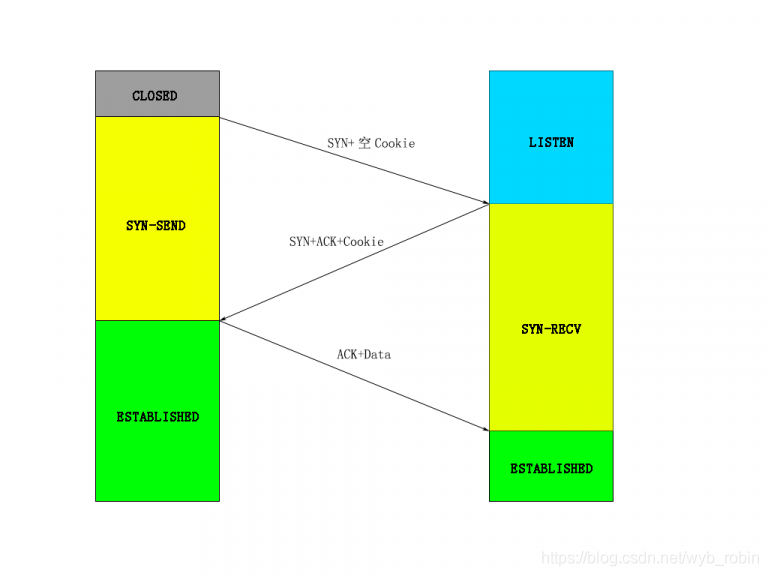

# TCP Fast Open原理和使用

TCP建立连接需要三次握手，这个大家都知道。但是三次握手会导致传输效率下降，尤其是HTTP这种短连接的协议，虽然HTTP有keep-alive来让一些请求频繁的HTTP提高性能，避免了一些三次握手的次数，但是还是希望能绕过三次握手提高效率，或者说在三次握手的同时就把数据传输的事情给做了，这就是我们这次要说的TCP Fast Open，简称TFO。

首先我们回顾一下三次握手的过程：


这里客户端在最后ACK的时候，完全可以把想要发送的第一条数据也一起带过去，所以这是TFO做的其中一个优化方案。然后还参考了HTTP登录态的流程，采用Cookie的方案，让服务端知道某个客户端之前已经“登录”过了，那么它发过来的数据就可以直接接收了，不必要一开始必须三次握手后再发数据。

当客户端第一次连接服务端时，是没有Cookie的，所以会发送一个空的Cookie，意味着要请求Cookie，如下图：



这样服务端就会将Cookie通过SYN+ACK的路径返回给客户端，客户端保存后，将发送的数据三次握手的最后一步ACK同时发送给服务端。
当客户端断开连接，下一次请求同一个服务端的时候，会带上之前存储的Cookie和要发送的数据，在SYN的路径上一起发送给服务端，如下图：


这样之后每次握手的时候还同时发送了数据信息，将数据传输提前了。服务端只要验证了Cookie，就会将发送的数据接收，否则会丢弃并且再通过SYN+ACK路径返回一个新的Cookie，这种情况一般是Cookie过期导致的。

TFO是需要开启的，开启参数在：

```text
/proc/sys/net/ipv4/tcp_fastopen
0：关闭
1：作为客户端使用Fast Open功能，默认值
2：作为服务端使用Fast Open功能
3：无论是客户端还是服务端都使用Fast Open功能
```

并且如果之前的代码没有做这方面的处理，也是不能使用的，从上面的流程图就能看到，客户端是在连接的过程就发送数据，但是之前客户端都是先调用connect成功后，才用send发送数据的。

服务端需要对listen的socket设置如下选项：

```cpp
//需要的头文件
#include <netinet/tcp.h>

......

int qlen = 5;  //fast open 队列
setsockopt(m_listen_socket, IPPROTO_TCP, TCP_FASTOPEN, &qlen, sizeof(qlen));
```

客户端则直接使用 `sendto` 方法进行连接和发送数据，示例代码如下：

```cpp
#include <sys/socket.h>
#include <netinet/in.h>
#include <netdb.h> 
#include <errno.h>
#include <string.h>
#include <stdio.h>
#include <unistd.h>

int main(){
 struct sockaddr_in serv_addr;
 struct hostent *server;
 
 const char *data = "Hello, tcp fast open";
 int data_len = strlen(data);    
 
 int sfd = socket(AF_INET, SOCK_STREAM, 0);
 server = gethostbyname("10.104.1.149");
 
 bzero((char *) &serv_addr, sizeof(serv_addr));
 serv_addr.sin_family = AF_INET;
 bcopy((char *)server->h_addr, 
   (char *)&serv_addr.sin_addr.s_addr,
   server->h_length);
 serv_addr.sin_port = htons(5556);

 int len = sendto(sfd, data, data_len, MSG_FASTOPEN/*MSG_FASTOPEN*/, 
    (struct sockaddr *) &serv_addr, sizeof(serv_addr));
 if(errno != 0){
  printf("error: %s\n", strerror(errno));
 }
 
 char buf[100] = {0};
 
 recv(sfd, buf, 100, 0);
 printf("%s\n", buf);
 
 close(sfd);

}
```

经过试验，客户端存储的 `Cookie` 是跟服务端的 `IP` 绑定的，而不是跟进程或端口绑定。当客户端程序发送到同一个 `IP` 但是不同端口的进程时，使用的是同一个 `Cookie`，而且服务端也认证成功。

## 参考

- [TCP Fast Open原理和使用](https://blog.csdn.net/wyb_robin/article/details/107129338)
