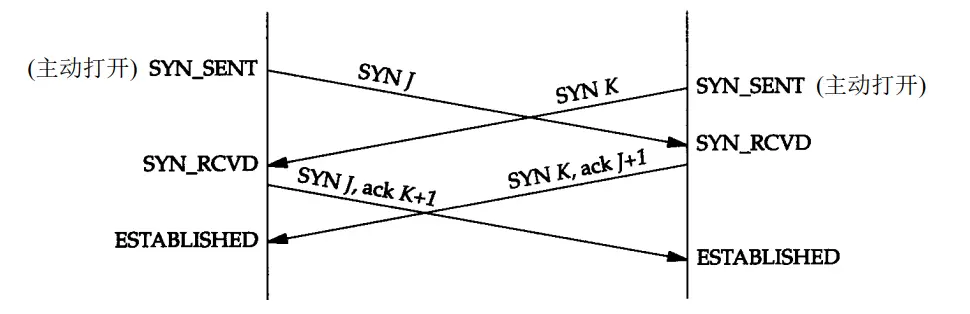
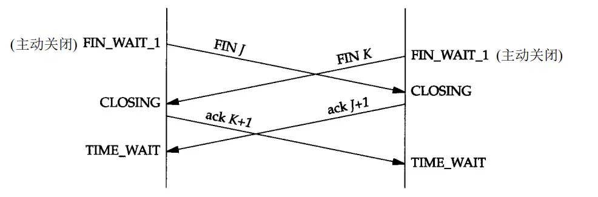

# TCP同时打开和同时关闭

## 同时打开

两个应用程序同时彼此执行主动打开的情况是可能的，但是发生的可能性极小。每一方必须发送一个 `SYN`，且这些 `SYN` 必须传递给对方。这需要每一方使用一个对方熟知的端口作为本地端口。这又称为同时打开（simultaneous open）。两端必须几乎在同时启动，以便收到彼此的 `SYN`。只要两端有较长的往返时间就能保证这一点。

`TCP` 是特意设计为了可以处理同时打开，对于同时打开它仅建立一条连接而不是两条连接（其他的协议族，最突出的是 `OSI` 运输层，在这种情况下将建立两条连接而不是一条连接）出现同时打开的情况时，两端几乎在同时发送 `SYN`，并进入 `SYN_SENT` 状态。当每一端收到 `SYN` 时，状态变为 `SYN_RCVD`，同时它们都再发 `SYN` 并对收到的 `SYN` 进行确认。当双方都收到 `SYN` 及相应的 `ACK` 时，状态都变迁为 `ESTABLISHED`。

个同时打开的连接需要交换4个报文段，比正常的三次握手多一个。此外，要注意的是我们没有将任何一端称为客户或服务器，因为每一端既是客户又是服务器。

## 同时关闭

我们在以前讨论过一方（通常但不总是客户方）发送第一个 `FIN` 执行主动关闭。双方都执行主动关闭也是可能的，`TCP` 协议也允许这样的同时关闭（ simultaneous close）。

当应用层发出关闭命令时，两端均从 `ESTABLISHED` 变为 `FIN_WAIT_1`。
这将导致双方各发送一个 `FIN`，两个 `FIN` 经过网络传送后分别到达另一端。收到 `FIN` 后，状态由 `FIN_WAIT_1` 变迁到 `CLOSING`，并发送最后的 `ACK`。当收到最后的 `ACK` 时，状态变化为 `TIME_WAIT`。

同时关闭与正常关闭使用的段交换数目相同。

## 自连接

### 不使用 `listen`，可以建立 `TCP` 连接吗？

答案，**是可以的，客户端是可以自己连自己的形成连接（TCP自连接），也可以两个客户端同时向对方发出请求建立连接（TCP同时打开），这两个情况都有个共同点，就是没有服务端参与，也就是没有listen，就能建立连接。**

### 那没有listen，为什么还能建立连接？

我们知道执行 `listen` 方法时，会创建半连接队列和全连接队列。

三次握手的过程中会在这两个队列中暂存连接信息。

所以形成连接，前提是你得有个地方存放着，方便握手的时候能根据 `IP + 端口`等信息找到对应的 `socket`。

### 那么客户端会有半连接队列吗？

显然没有，因为客户端没有执行 `listen`，因为半连接队列和全连接队列都是在执行 `listen` 方法时，内核自动创建的。

但内核还有个全局 `hash` 表，可以用于存放 `sock` 连接的信息。

这个全局 `hash` 表其实还细分为 `ehash`，`bhash` 和 `listen_hash` 等，但因为过于细节，大家理解成有一个全局 `hash` 就够了，

在 `TCP` 自连接的情况中，客户端在 `connect` 方法时，最后会将自己的连接信息放入到这个全局 `hash` 表中，然后将信息发出，消息在经过回环地址重新回到 `TCP` 传输层的时候，就会根据 `IP + 端口`信息，再一次从这个全局 `hash` 中取出信息。于是握手包一来一回，最后成功建立连接。

`TCP` 同时打开的情况也类似，只不过从一个客户端变成了两个客户端而已。

### 实验代码

客户端自连接的代码，`TCP socket` 可以 `connect` 它本身 `bind` 的地址和端口

参见：[self_connect.cc](https://github.com/gwq5210/gtl/blob/main/examples/net/self_connect.cc)

通过 `netstat` 命令命令客户端自连接的 `TCP` 连接，可以看到 `TCP socket` 成功的“连接”了自己，并发送和接收了数据包，`netstat` 的输出更证明了 `TCP` 的两端地址和端口是完全相同的。

## 参考

- [TCP同时打开和同时关闭](https://www.jianshu.com/p/aea9ae5c8a3c)
- [服务端没有 listen，客户端发起连接建立，会发生什么？](https://xiaolincoding.com/network/3_tcp/tcp_no_listen.html)
