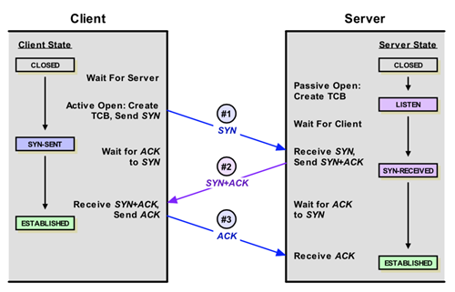
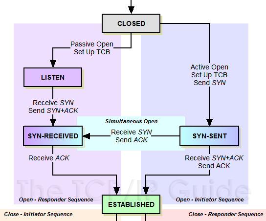
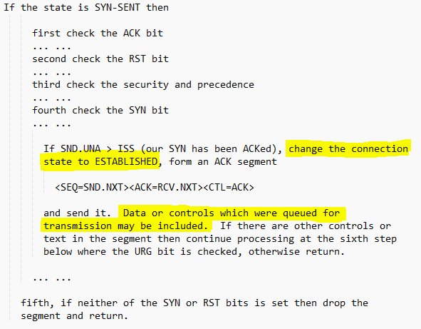

# TCP连接建立的三次握手过程可以携带数据吗

前几天实验室的群里扔出了这样一个问题：`TCP` 连接建立的三次握手过程可以携带数据吗？突然发现自己还真不清楚这个问题，平日里用 `tcpdump` 或者 `Wireshark` 抓包时，从来没留意过第三次握手的 `ACK` 包有没有数据。于是赶紧用 `nc` 配合 `tcpdump` 抓了几次包想检验一下。但是经过了多次实验，确实都发现第三次握手的包没有其它数据（后文解释）。后来的探究中发现这个过程有问题，遂整理探究过程和结论汇成本文，以供后来者参考。

先来张三次握手的图（下面这张图来自网络，若侵犯了作者权利，请联系我删除）：



`RFC793` 文档里带有 `SYN` 标志的过程包是不可以携带数据的，也就是说三次握手的前两次是不可以携带数据的（逻辑上看，连接还没建立，携带数据好像也有点说不过去）。重点就是第三次握手可不可以携带数据。

先说结论：`TCP` 协议建立连接的三次握手过程中的第三次握手允许携带数据。



对照着上边的 `TCP` 状态变化图的连接建立部分，我们看下 `RFC793` 文档的说法。`RFC793` 文档给出的说法如下（省略不重要的部分）：



重点是这句 “Data or controls which were queued for transmission may be included”，也就是说标准表示，第三次握手的 `ACK` 包是可以携带数据。那么 `Linux` 的内核协议栈是怎么做的呢？侯捷先生说过，“源码面前，了无秘密”。最近恰逢 `Kernel 4.0` 正式版发布，那就追查下这个版本的内核协议栈的源码吧。

在探索源码前，我们假定读者对 `Linux` 的基本 `socket` 编程很熟悉，起码对连接的流程比较熟悉（可以参考这篇文章[《浅谈服务端编程》](https://www.0xffffff.org/2014/11/20/33-servie-program/?spm=a2c6h.12873639.article-detail.6.685b219bsnDUGk)最前边的 `socket` 连接过程图）。至于 `socket` 接口和协议栈的挂接，可以参阅《`socket` 接口与内核协议栈的挂接》 。

首先， 第三次握手的包是由连接发起方（以下简称客户端）发给端口监听方（以下简称服务端）的，所以只需要找到内核协议栈在一个连接处于 `SYN-RECV`（图中的`SYN_RECEIVED`）状态时收到包之后的处理过程即可。经过一番搜索后找到了，位于 `net\ipv4` 目录下 `tcp_input.c` 文件中的 `tcp_rcv_state_process` 函数处理这个过程。

```cpp
/*
 *	This function implements the receiving procedure of RFC 793 for
 *	all states except ESTABLISHED and TIME_WAIT.
 *	It's called from both tcp_v4_rcv and tcp_v6_rcv and should be
 *	address independent.
 */

int tcp_rcv_state_process(struct sock *sk, struct sk_buff *skb,
      const struct tcphdr *th, unsigned int len)
```

这个函数实际上是个 `TCP` 状态机，用于处理 `TCP` 连接处于各个状态时收到数据包的处理工作。这里有几个并列的 `switch` 语句，因为函数很长，所以比较容易看错层次关系。下边是精简了无需关注的代码之后 `SYN-RECV` 状态的处理过程：

```cpp
switch (sk->sk_state) {
case TCP_SYN_RECV:
  ... ...
  tcp_set_state(sk, TCP_ESTABLISHED);
  ... ...
}

/* step 7: process the segment text */
switch (sk->sk_state) {
case TCP_ESTABLISHED:
  tcp_data_queue(sk, skb);
  queued = 1;
  break;
}
```

一定要注意这两个 `switch` 语句是并列的。所以当 `TCP_SYN_RECV` 状态收到合法规范的二次握手包之后，就会立即把 `socket` 状态设置为 `TCP_ESTABLISHED` 状态，执行到下面的 `TCP_ESTABLISHED` 状态的 `case` 时，会继续处理其包含的数据（如果有）。

上面表明了，当客户端发过来的第三次握手的 `ACK` 包含有数据时，服务端是可以正常处理的。那么客户端那边呢？那看看客户端处于 `SYN-SEND` 状态时，怎么发送第三次 `ACK` 包吧。如下：

```cpp
case TCP_SYN_SENT:
  queued = tcp_rcv_synsent_state_process(sk, skb, th, len);
  if (queued >= 0)
    return queued;
```

`tcp_rcv_synsent_state_process` 函数的实现比较长，这里直接贴出最后的关键点：

```cpp
if (sk->sk_write_pending ||
    icsk->icsk_accept_queue.rskq_defer_accept ||
    icsk->icsk_ack.pingpong) {
  /* Save one ACK. Data will be ready after
    * several ticks, if write_pending is set.
    *
    * It may be deleted, but with this feature tcpdumps
    * look so _wonderfully_ clever, that I was not able
    * to stand against the temptation 8)     --ANK
    */
  inet_csk_schedule_ack(sk);
  icsk->icsk_ack.lrcvtime = tcp_time_stamp;
  tcp_enter_quickack_mode(sk);
  inet_csk_reset_xmit_timer(sk, ICSK_TIME_DACK,
          TCP_DELACK_MAX, TCP_RTO_MAX);

discard:
  __kfree_skb(skb);
  return 0;
} else {
  tcp_send_ack(sk);
}
return -1;
```

一目了然吧？`if` 条件不满足直接回复单独的 `ACK` 包，如果任意条件满足的话则使用 `inet_csk_reset_xmit_timer` 函数设置定时器等待短暂的时间。这段时间如果有数据，随着数据发送 `ACK`，没有数据回复 `ACK`。

之前的疑问算是解决了。

但是，那三个条件是什么？什么情况会导致第三次握手包可能携带数据呢？或者说，想抓到一个第三次握手带有数据的包，需要怎么做？别急，本博客向来喜欢刨根问底，且听下文一一道来。

条件1：`sk->sk_write_pending != 0`

这个值默认是 `0` 的，那什么情况会导致不为 `0` 呢？答案是协议栈发送数据的函数遇到 `socket` 状态不是 `ESTABLISHED` 的时候，会对这个变量做 `++` 操作，并等待一小会时间尝试发送数据。

```cpp
/* Wait for a connection to finish. One exception is TCP Fast Open
  * (passive side) where data is allowed to be sent before a connection
  * is fully established.
  */
if (((1 << sk->sk_state) & ~(TCPF_ESTABLISHED | TCPF_CLOSE_WAIT)) &&
    !tcp_passive_fastopen(sk)) {
  if ((err = sk_stream_wait_connect(sk, &timeo)) != 0)
    goto out_err;
}
```

`net/core/stream.c` 里的 `sk_stream_wait_connect` 函数做了如下操作：

```cpp
prepare_to_wait(sk_sleep(sk), &wait, TASK_INTERRUPTIBLE);
sk->sk_write_pending++;
done = sk_wait_event(sk, timeo_p,
          !sk->sk_err &&
          !((1 << sk->sk_state) &
            ~(TCPF_ESTABLISHED | TCPF_CLOSE_WAIT)));
```

`sk->sk_write_pending` 递增，并且等待 `socket` 连接到达 `ESTABLISHED` 状态后发出数据。这就解释清楚了。

`Linux socket` 的默认工作方式是阻塞的，也就是说，客户端的 `connect` 调用在默认情况下会阻塞，等待三次握手过程结束之后或者遇到错误才会返回。那么 `nc` 这种完全用阻塞套接字实现的且没有对默认 `socket` 参数进行修改的命令行小程序会乖乖等待 `connect` 返回成功或者失败才会发送数据的，这就是我们抓不到第三次握手的包带有数据的原因。

那么设置非阻塞套接字，`connect` 后立即 `send` 数据，连接过程不是瞬间连接成功的话，也许有机会看到第三次握手包带数据。不过开源的网络库即便是非阻塞 `socket`，也是监听该套接字的可写事件，再次确认连接成功才会写数据。为了节省这点几乎可以忽略不计的性能，真的不如安全可靠的代码更有价值。

条件2：`icsk->icsk_accept_queue.rskq_defer_accept != 0`

这个条件好奇怪，`defer_accept` 是个 `socket` 选项，用于推迟 `accept`，实际上是当接收到第一个数据之后，才会创建连接。`tcp_defer_accept` 这个选项一般是在服务端用的，会影响 `socket` 的 `SYN` 和 `ACCEPT` 队列。默认不设置的话，三次握手完成，`socket` 就进入 `accept` 队列，应用层就感知到并 `ACCEPT` 相关的连接。当 `tcp_defer_accept` 设置后，三次握手完成了，`socket` 也不进入 `ACCEPT` 队列，而是直接留在 `SYN` 队列（有长度限制，超过内核就拒绝新连接），直到数据真的发过来再放到 `ACCEPT` 队列。设置了这个参数的服务端可以 `accept` 之后直接 `read`，必然有数据，也节省一次系统调用。

`SYN` 队列保存 `SYN_RECV` 状态的 `socket`，长度由 `net.ipv4.tcp_max_syn_backlog` 参数控制，`accept` 队列在 `listen` 调用时，`backlog` 参数设置，内核硬限制由 `net.core.somaxconn` 限制，即实际的值由 `min(backlog,somaxconn)` 来决定。

有意思的是如果客户端先 `bind` 到一个端口和 `IP`，然后 `setsockopt(TCP_DEFER_ACCEPT)`，然后 `connect` 服务器，这个时候就会出现 `rskq_defer_accept=1` 的情况，这时候内核会设置定时器等待数据一起在回复 `ACK` 包。我个人从未这么做过，难道只是为了减少一次 `ACK` 的空包发送来提高性能？哪位同学知道烦请告知，谢谢。

条件3：`icsk->icsk_ack.pingpong != 0`

`pingpong` 这个属性实际上也是一个套接字选项，用来表明当前链接是否为交互数据流，如其值为 `1`，则表明为交互数据流，会使用延迟确认机制。

好了，本文到此就应该结束了，上面各个函数出现的比较没有条理。具体的调用链可以参考这篇文章[《TCP内核源码分析笔记》](https://www.cnblogs.com/mosp/p/3891783.html)，不过因为内核版本的不同，可能会有些许差异。毕竟我没研究过协议栈，就不敢再说什么了。

## 参考

- [TCP连接建立的三次握手过程可以携带数据吗](https://developer.aliyun.com/article/15118)