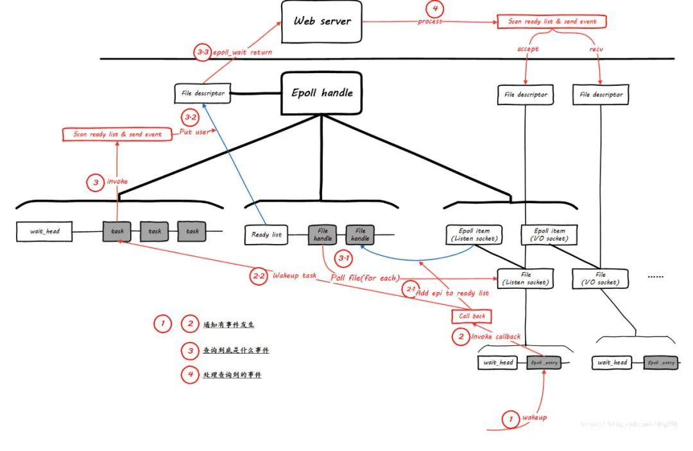

# 深入浅出 Linux 惊群：现象、原因和解决方案

> "惊群"简单地来讲，就是多个进程(线程)阻塞睡眠在某个系统调用上，在等待某个 fd(socket)的事件的到来。当这个 fd(socket)的事件发生的时候，这些睡眠的进程(线程)就会被同时唤醒，多个进程(线程)从阻塞的系统调用上返回，这就是"惊群"现象。"惊群"被人诟病的是效率低下，大量的 CPU 时间浪费在被唤醒发现无事可做，然后又继续睡眠的反复切换上。本文谈谈 linux socket 中的一些"惊群"现象、原因以及解决方案。

## Accept"惊群"现象

我们知道，在网络分组通信中，网络数据包的接收是异步进行的，因为你不知道什么时候会有数据包到来。因此，网络收包大体分为两个过程：

1. 数据包到来后的事件通知
2. 收到事件通知的Task执行流，响应事件并从队列中取出数据包

数据包到来的通知分为两部分：

1. 网卡通知数据包到来，中断协议栈收包；
2. 协议栈将数据包填充 socket 的接收队列，通知应用程序有数据可读，这里仅讨论数据到达协议栈之后的事情。

应用程序是通过 `socket` 和协议栈交互的，`socket` 隔离了应用程序和协议栈，`socket` 是两者之间的接口，对于应用程序，它代表协议栈；而对于协议栈，它又代表应用程序，当数据包到达协议栈的时候，发生下面两个过程：

1. 协议栈将数据包放入socket的接收缓冲区队列，并通知持有该socket的应用程序；
2. 持有该socket的应用程序响应通知事件，将数据包从socket的接收缓冲区队列中取出


对于高性能的服务器而言，为了利用多 CPU 核的优势，大多采用多个进程(线程)同时在一个 listen socket 上进行 accept 请求。多个进程阻塞在 Accept 调用上，那么在协议栈将 Client 的请求 socket 放入 listen socket 的 accept 队列的时候，是要唤醒一个进程还是全部进程来处理呢？

linux 内核通过睡眠队列来组织所有等待某个事件的 task，而 wakeup 机制则可以异步唤醒整个睡眠队列上的 task，wakeup 逻辑在唤醒睡眠队列时，会遍历该队列链表上的每一个节点，调用每一个节点的 callback，从而唤醒睡眠队列上的每个 task。这样，在一个 connect 到达这个 lisent socket 的时候，内核会唤醒所有睡眠在 accept 队列上的 task。N 个 task 进程(线程)同时从 accept 返回，但是，只有一个 task 返回这个 connect 的 fd，其他 task 都返回-1(EAGAIN)。这是典型的 accept"惊群"现象。

这个是 linux 上困扰了大家很长时间的一个经典问题，在 linux2.6(似乎在 2.4.1 以后就已经解决，有兴趣的同学可以去验证一下)以后的内核中得到彻底的解决，通过添加了一个 WQ_FLAG_EXCLUSIVE 标记告诉内核进行排他性的唤醒，即唤醒一个进程后即退出唤醒的过程，具体如下：

```text
/*
 * The core wakeup function. Non-exclusive wakeups (nr_exclusive == 0) just
 * wake everything up. If it's an exclusive wakeup (nr_exclusive == small +ve
 * number) then we wake all the non-exclusive tasks and one exclusive task.
 *
 * There are circumstances in which we can try to wake a task which has already
 * started to run but is not in state TASK_RUNNING. try_to_wake_up() returns
 * zero in this (rare) case, and we handle it by continuing to scan the queue.
 */
static void __wake_up_common(wait_queue_head_t *q, unsigned int mode,
            int nr_exclusive, int wake_flags, void *key)
{
    wait_queue_t *curr, *next;

    list_for_each_entry_safe(curr, next, &q->task_list, task_list) {
        unsigned flags = curr->flags;

        if (curr->func(curr, mode, wake_flags, key) &&
                (flags & WQ_FLAG_EXCLUSIVE) && !--nr_exclusive)
            break;
    }
}
```

这样，在 linux 2.6 以后的内核，用户进程 task 对 listen socket 进行 accept 操作，如果这个时候如果没有新的 connect 请求过来，用户进程 task 会阻塞睡眠在 listent fd 的睡眠队列上。这个时候，用户进程 Task 会被设置 WQ_FLAG_EXCLUSIVE 标志位，并加入到 listen socket 的睡眠队列尾部(这里要确保所有不带 WQ_FLAG_EXCLUSIVE 标志位的 non-exclusive waiters 排在带 WQ_FLAG_EXCLUSIVE 标志位的 exclusive waiters 前面)。根据前面的唤醒逻辑，一个新的 connect 到来，内核只会唤醒一个用户进程 task 就会退出唤醒过程，从而不存在了"惊群"现象。

## select/poll/Epoll "惊群"现象

尽管 accept 系统调用已经不再存在"惊群"现象，但是我们的"惊群"场景还没结束。通常一个 server 有很多其他网络 IO 事件要处理，我们并不希望 server 阻塞在 accept 调用上，为提高服务器的并发处理能力，我们一般会使用 select/poll/epoll I/O 多路复用技术，同时为了充分利用多核 CPU，服务器上会起多个进程(线程)同时提供服务。

于是，在某一时刻多个进程(线程)阻塞在 select/poll/epoll_wait 系统调用上，当一个请求上来的时候，多个进程都会被 select/poll/epoll_wait 唤醒去 accept，然而只有一个进程(线程 accept 成功，其他进程(线程 accept 失败，然后重新阻塞在 select/poll/epoll_wait 系统调用上。可见，尽管 accept 不存在"惊群"，但是我们还是没能摆脱"惊群"的命运。难道真的没办法了么？我只让一个进程去监听 listen socket 的可读事件，这样不就可以避免"惊群"了么？

没错，就是这个思路，我们来看看 Nginx 是怎么避免由于 listen fd 可读造成的 epoll_wait"惊群"。这里简单说下具体流程，不进行具体的源码分析。

### Nginx 的 epoll"惊群"避免

Nginx 中有个标志 ngx_use_accept_mutex，当 ngx_use_accept_mutex 为 1 的时候（当 nginx worker 进程数>1 时且配置文件中打开 accept_mutex 时，这个标志置为 1），表示要进行 listen fdt"惊群"避免。

Nginx 的 worker 进程在进行 event 模块的初始化的时候，在 core event 模块的 process_init 函数中(ngx_event_process_init)将 listen fd 加入到 epoll 中并监听其 READ 事件。Nginx 在进行相关初始化完成后，进入事件循环(ngx_process_events_and_timers 函数)，在 ngx_process_events_and_timers 中判断，如果 ngx_use_accept_mutex 为 0，那就直接进入 ngx_process_events(ngx_epoll_process_events)，在 ngx_epoll_process_events 将调用 epoll_wait 等待相关事件到来或超时，epoll_wait 返回的时候该干嘛就干嘛。这里不讲 ngx_use_accept_mutex 为 0 的流程，下面讲下 ngx_use_accept_mutex 为 1 的流程。

1. 进入ngx_trylock_accept_mutex，加锁抢夺accept权限（ngx_shmtx_trylock(&ngx_accept_mutex)），加锁成功，则调用ngx_enable_accept_events(cycle) 来将一个或多个listen fd加入epoll监听READ事件(设置事件的回调函数ngx_event_accept)，并设置ngx_accept_mutex_held = 1;标识自己持有锁。
2. 如果ngx_shmtx_trylock(&ngx_accept_mutex)失败，则调用ngx_disable_accept_events(cycle, 0)来将listen fd从epoll中delete掉。
3. 如果ngx_accept_mutex_held = 1(也就是抢到accept权)，则设置延迟处理事件标志位flags |= NGX_POST_EVENTS; 如果ngx_accept_mutex_held = 0(没抢到accept权)，则调整一下自己的epoll_wait超时，让自己下次能早点去抢夺accept权。
4. 进入ngx_process_events(ngx_epoll_process_events)，在ngx_epoll_process_events将调用epoll_wait等待相关事件到来或超时。
5. epoll_wait返回，循环遍历返回的事件，如果标志位flags被设置了NGX_POST_EVENTS，则将事件挂载到相应的队列中(Nginx有两个延迟处理队列，(1)ngx_posted_accept_events：listen fd返回的事件被挂载到的队列。(2)ngx_posted_events：其他socket fd返回的事件挂载到的队列)，延迟处理事件，否则直接调用事件的回调函数。
6. ngx_epoll_process_events返回后，则开始处理ngx_posted_accept_events队列上的事件，于是进入的回调函数是ngx_event_accept，在ngx_event_accept中accept客户端的请求，进行一些初始化工作，将accept到的socket fd放入epoll中。
7. ngx_epoll_process_events处理完成后，如果本进程持有accept锁ngx_accept_mutex_held = 1，那么就将锁释放。
8. 接着开始处理ngx_posted_events队列上的事件。

Nginx 通过一次仅允许一个进程将 listen fd 放入自己的 epoll 来监听其 READ 事件的方式来达到 listen fd"惊群"避免。然而做好这一点并不容易，作为一个高性能 web 服务器，需要尽量避免阻塞，并且要很好平衡各个工作 worker 的请求，避免饿死情况，下面有几个点需要大家留意：

- 避免新请求不能及时得到处理的饿死现象
  - 工作worker在抢夺到accept权限，加锁成功的时候，要将事件的处理delay到释放锁后在处理(为什么ngx_posted_accept_events队列上的事件处理不需要延迟呢？ 因为ngx_posted_accept_events上的事件就是listen fd的可读事件，本来就是我抢到的accept权限，我还没accept就释放锁，这个时候被别人抢走了怎么办呢？)。否则，获得锁的工作worker由于在处理一个耗时事件，这个时候大量请求过来，其他工作worker空闲，然而没有处理权限在干着急。
- 避免总是某个worker进程抢到锁，大量请求被同一个进程抢到，而其他worker进程却很清闲。
  - Nginx有个简单的负载均衡，ngx_accept_disabled表示此时满负荷程度，没必要再处理新连接了，我们在nginx.conf曾经配置了每一个nginx worker进程能够处理的最大连接数，当达到最大数的7/8时，ngx_accept_disabled为正，说明本nginx worker进程非常繁忙，将不再去处理新连接。每次要进行抢夺accept权限的时候，如果ngx_accept_disabled大于0，则递减1，不进行抢夺逻辑。

Nginx 采用在同一时刻仅允许一个 worker 进程监听 listen fd 的可读事件的方式，来避免 listen fd 的"惊群"现象。然而这种方式编程实现起来比较难，难道不能像 accept 一样解决 epoll 的"惊群"问题么？答案是可以的。要说明 epoll 的"惊群"问题以及解决方案，不能不从 epoll 的两种触发模式说起。

## Epoll"惊群"之 LT(水平触发模式)、ET(边沿触发模式)

我们先来看下 LT、ET 的语意：

- LT 水平触发模式
  - 只要仍然有未处理的事件，epoll就会通知你，调用epoll_wait就会立即返回。
- ET 边沿触发模式
  - 只有事件列表发生变化了，epoll才会通知你。也就是，epoll_wait返回通知你去处理事件，如果没处理完，epoll不会再通知你了，调用epoll_wait会睡眠等待，直到下一个事件到来或者超时。

LT(水平触发模式)、ET(边沿触发模式)在"惊群"问题上，有什么不一样的表现么？要说明这个，就不能不来谈谈 Linux 内核的 sleep/wakeup 机制以及 epoll 的实现核心机制了。

### epoll 的核心机制

在了解 epoll 的核心机制前，先了解一下内核 sleep/wakeup 机制的几个核心概念：

1. 等待队列 waitqueue
   - 队列头(wait_queue_head_t)往往是资源生产者
   - 队列成员(wait_queue_t)往往是资源消费者
   - 当头的资源ready后, 会逐个执行每个成员指定的回调函数，来通知它们资源已经ready了
2. 内核的poll机制
   - 被Poll的fd, 必须在实现上支持内核的Poll技术，比如fd是某个字符设备,或者是个socket, 它必须实现file_operations中的poll操作, 给自己分配有一个等待队列头wait_queue_head_t，主动poll fd的某个进程task必须分配一个等待队列成员, 添加到fd的等待队列里面去, 并指定资源ready时的回调函数，用socket做例子, 它必须有实现一个poll操作, 这个Poll是发起轮询的代码必须主动调用的, 该函数中必须调用poll_wait(),poll_wait会将发起者作为等待队列成员加入到socket的等待队列中去，这样socket发生事件时可以通过队列头逐个通知所有关心它的进程。
3. epollfd本身也是个fd, 所以它本身也可以被epoll

epoll 作为中间层，为多个进程 task，监听多个 fd 的多个事件提供了一个便利的高效机制，我们来看下 epoll 的机制图：



从图中，可以看到 epoll 可以监控多个 fd 的事件，它通过一颗红黑树来组织所有被 epoll_ctl 加入到 epoll 监听列表中的 fd，每个被监听的 fd 在 epoll 用一个 epoll item(epi)来标识。

根据内核的 poll 机制，epoll 需要为每个监听的 fd 构造一个 epoll entry(设置关心的事件以及注册回调函数)作为等待队列成员睡眠在每个 fd 的等待队列，以便 fd 上的事件 ready 了，可以通过 epoll 注册的回调函数通知到 epoll。

epoll 作为进程 task 的中间层，它需要有一个等待队列 wq 给 task 在没事件来 epoll_wait 的时候来睡眠等待(epoll fd 本身也是一个 fd，它和其他 fd 一样还有另外一个等待队列 poll_wait，作为 poll 机制被 poll 的时候睡眠等待的地方)。

epoll 可能同时监听成千上万的 fd，这样在少量 fd 有事件 ready 的时候，它需要一个 ready list 队列来组织所有已经 ready 的就绪 fd，以便能够高效通知给进程 task，而不需要遍历所有监听的 fd。图中的一个 epoll 的 sleep/wakeup 流程如下：

无事件的时候，多个进程task调用epoll_wait睡眠在epoll的wq睡眠队列上。

1. 这个时候一个请求RQ_1上来，listen fd这个时候ready了，开始唤醒其睡眠队列上的epoll entry，并执行之前epoll注册的回调函数ep_poll_callback。
2. ep_poll_callback主要做两件事情，(1)发生的event事件是epoll entry关心的，则将epi挂载到epoll的就绪队列ready list并进入(2)，否则结束。(2)如果当前wq不为空，则唤醒睡眠在epoll等待队列上睡眠的task(这里唤醒一个还是多个，是区分epoll的ET模式还是LT模式，下面在细讲)。
3. epoll_wait被唤醒继续前行，在ep_poll中调用ep_send_events将fd相关的event事件和数据copy到用户空间，这个时候就需要遍历epoll的ready list以便收集task需要监控的多个fd的event事件和数据上报给用户进程task，这个在ep_scan_ready_list中完成，这里会将ready list清空。

通过上图的 epoll 事件通知机制，epoll 的 LT 模式、ET 模式在事件通知行为上的差别，也只能是在[2]上 task 唤醒逻辑上的差别了。我们先来看下，在 epoll_wait 中调用的导致用户进程 task 睡眠的 ep_poll 函数的核心逻辑：

```cpp
static int ep_poll(struct eventpoll *ep, struct epoll_event __user *events, int maxevents, long timeout)
{
int res = 0, eavail, timed_out = 0;
bool waiter = false;
...
eavail = ep_events_available(ep);//是否有fd就绪
if (eavail)
goto send_events;//有fd就绪，则直接跳过去上报事件给用户

if (!waiter) {
          waiter = true;
          init_waitqueue_entry(&wait, current);//为当前进程task构造一个睡眠entry

          spin_lock_irq(&ep->wq.lock);
          //插入到epoll的wq后面，注意这里是排他插入的，就是带WQ_FLAG_EXCLUSIVE flag
          __add_wait_queue_exclusive(&ep->wq, &wait);
          spin_unlock_irq(&ep->wq.lock);
    }

for (;;) {
  //将当前进程设置位睡眠, 但是可以被信号唤醒的状态, 注意这个设置是"将来时", 我们此刻还没睡
  set_current_state(TASK_INTERRUPTIBLE);
  // 检查是否真的要睡了
  if (fatal_signal_pending(current)) {
              res = -EINTR;
              break;
          }

          eavail = ep_events_available(ep);
          if (eavail)
              break;
          if (signal_pending(current)) {
              res = -EINTR;
              break;
          }
          // 检查是否真的要睡了 end

  //使得当前进程休眠指定的时间范围，
  if (!schedule_hrtimeout_range(to, slack, HRTIMER_MODE_ABS)) {
  timed_out = 1;
  break;
  }
}

__set_current_state(TASK_RUNNING);

send_events:
      /*
       * Try to transfer events to user space. In case we get 0 events and
       * there's still timeout left over, we go trying again in search of
       * more luck.
       */
      // ep_send_events往用户态上报事件，即那些epoll_wait返回后能获取的事件
      if (!res && eavail &&
          !(res = ep_send_events(ep, events, maxevents)) && !timed_out)
          goto fetch_events;

      if (waiter) {
          spin_lock_irq(&ep->wq.lock);
          __remove_wait_queue(&ep->wq, &wait);
          spin_unlock_irq(&ep->wq.lock);
      }

   return res;
}
```

接着，我们看下监控的 fd 有事件发生的回调函数 ep_poll_callback 的核心逻辑：

```cpp
#define wake_up(x)__wake_up(x, TASK_NORMAL, 1, NULL)

static int ep_poll_callback(wait_queue_entry_t *wait, unsigned mode, int sync, void *key)
{
      int pwake = 0;
      struct epitem *epi = ep_item_from_wait(wait);
      struct eventpoll *ep = epi->ep;
      __poll_t pollflags = key_to_poll(key);
      unsigned long flags;
      int ewake = 0;
  ....

  //判断是否有我们关心的event
      if (pollflags && !(pollflags & epi->event.events))
          goto out_unlock;
  //将当前的epitem放入epoll的ready list
      if (!ep_is_linked(epi) &&
          list_add_tail_lockless(&epi->rdllink, &ep->rdllist)) {
          ep_pm_stay_awake_rcu(epi);
      }
      //如果有task睡眠在epoll的等待队列，唤醒它
  if (waitqueue_active(&ep->wq)) {
  ....
  wake_up(&ep->wq);//
  }
  ....
}
```

wake_up 函数最终会调用到 wake_up_common，通过前面的 wake_up_common 我们知道，唤醒过程在唤醒一个带 WQ_FLAG_EXCLUSIVE 标记的 task 后，即退出唤醒过程。通过上面的 ep_poll，task 是排他(带 WQ_FLAG_EXCLUSIVE 标记)加入到 epoll 的等待队列 wq 的。也就是，在 ep_poll_callback 回调中，只会唤醒一个 task。这就有问题，根据 LT 的语义：只要仍然有未处理的事件，epoll 就会通知你。例如有两个进程 A、B 睡眠在 epoll 的睡眠队列，fd 的可读事件到来唤醒进程 A，但是 A 可能很久才会去处理 fd 的事件，或者它根本就不去处理。根据 LT 的语义，应该要唤醒进程 B 的。

我们来看下 epoll 怎么在 ep_send_events 中实现满足 LT 语义的：

```cpp
  static int ep_send_events(struct eventpoll *ep,
                struct epoll_event __user *events, int maxevents)
  {
      struct ep_send_events_data esed;

      esed.maxevents = maxevents;
      esed.events = events;

      ep_scan_ready_list(ep, ep_send_events_proc, &esed, 0, false);
      return esed.res;
  }

  static __poll_t ep_scan_ready_list(struct eventpoll *ep,
                    __poll_t (*sproc)(struct eventpoll *,
                         struct list_head *, void *),
                    void *priv, int depth, bool ep_locked)
  {
  ...
  // 所有的epitem都转移到了txlist上, 而rdllist被清空了
      list_splice_init(&ep->rdllist, &txlist);
      ...
      //sproc 就是 ep_send_events_proc
      res = (*sproc)(ep, &txlist, priv);
      ...
      //没有处理完的epitem, 重新插入到ready list
      list_splice(&txlist, &ep->rdllist);

  /* ready list不为空, 直接唤醒... */ // 保证(2)
      if (!list_empty(&ep->rdllist)) {
          if (waitqueue_active(&ep->wq))
              wake_up(&ep->wq);
  ...
      }
  }

    static __poll_t ep_send_events_proc(struct eventpoll *ep, struct list_head *head,
                     void *priv)
  {
    ...
    //遍历就绪fd列表
        list_for_each_entry_safe(epi, tmp, head, rdllink) {
        ...
        //然后从链表里面移除当前就绪的epi
        list_del_init(&epi->rdllink);
        //读取当前epi的事件
            revents = ep_item_poll(epi, &pt, 1);
            if (!revents)
              continue;
        //将当前的事件和用户传入的数据都copy给用户空间
            if (__put_user(revents, &uevent->events) ||
              __put_user(epi->event.data, &uevent->data)) {
              //如果发生错误了， 则终止遍历过程，将当前epi重新返回就绪队列，剩下的也会在ep_scan_ready_list中重新放回就绪队列
              list_add(&epi->rdllink, head);
              ep_pm_stay_awake(epi);
              if (!esed->res)
                  esed->res = -EFAULT;
              return 0;
           }
        }
          if (epi->event.events & EPOLLONESHOT)
              epi->event.events &= EP_PRIVATE_BITS;
          else if (!(epi->event.events & EPOLLET)) { // 保证(1)
          //如果是非ET模式(即LT模式)，当前epi会被重新放到epoll的ready list。
              list_add_tail(&epi->rdllink, &ep->rdllist);
              ep_pm_stay_awake(epi);
          }
  }
```

上面处理逻辑的核心流程就 2 点：

1. 遍历并清空epoll的ready list，遍历过程中，对于每个epi收集其返回的events，如果没收集到event，则continue去处理其他epi，否则将当前epi的事件和用户传入的数据都copy给用户空间，并判断，如果是在LT模式下，则将当前epi重新放回epoll的ready list
2. 遍历epoll的ready list完成后，如果ready list不为空，则继续唤醒epoll睡眠队列wq上的其他task B。task B从epoll_wait醒来继续前行，重复上面的流程，继续唤醒wq上的其他task C，这样链式唤醒下去。

通过上面的流程，在一个 epoll 上睡眠的多个 task，如果在一个 LT 模式下的 fd 的事件上来，会唤醒 epoll 睡眠队列上的所有 task，而 ET 模式下，仅仅唤醒一个 task，这是 epoll"惊群"的根源。等等，这样在 LT 模式下就必然"惊群"，epoll 在 LT 模式下的"惊群"没办法解决么？

### epoll_create & fork

相信大家在多进程服务中使用 epoll 的时候，都会有这样一个疑问，是先 epoll_create 得到 epoll fd 后在 fork 子进程，还是先 fork 子进程，然后每个子进程在 epoll_create 自己独立的 epoll fd 呢？有什么异同？

#### 先 epoll_create 后 fork

这样，多个进程公用一个 epoll 实例(父子进程的 epoll fd 指向同一个内核 epoll 对象)，上面介绍的 epoll 核心机制流程，都是在同一个 epoll 对象上的，这种情况下，epoll 有以下这些特性：

1. epoll在ET模式下不存在“惊群”现象，LT模式是epoll“惊群”的根源，并且LT模式下的“惊群”没办法避免。
2. LT的“惊群”是链式唤醒的，唤醒过程直到当前epi的事件被处理了，无法获得到新的事件才会终止唤醒过程。
   - 例如有A、B、C、D...等多个进程task睡眠在epoll的睡眠队列上，并且都监控同一个listen fd的可读事件。一个请求上来，会首先唤醒A进程，A在epoll_wait的处理过程中会唤醒进程B，这样进程B在epoll_wait的处理过程中会唤醒C，这个时候A的epoll_wait处理完成返回，进程A调用accept读取了当前这个请求，进程C在自己的epoll_wait处理过程中，从epi中获取不到事件了，于是终止了整个链式唤醒过程。
3. 多个进程的epoll fd由于指向同一个epoll内核对象，他们对epoll fd的相关epoll_ctl操作会相互影响。一不小心可能会出现一些比较诡异的行为。
   - 想象这样一个场景(实际上应该不是这样用)，有一个服务在1234，1235，1236这3个端口上提供服务，于是它epoll_create得到epoll fd后，fork出3个工作的子进程A、B、C，它们分别在这3个端口创建listen fd，然后加入到epoll中监听其可读事件。这个时候端口1234上来一个请求，A、B、C同时被唤醒，A在epoll_wait返回后，在进行accept前由于种种原因卡住了，没能及时accept。B、C在epoll_wait返回后去accept又不能accept到请求，这样B、C重新回到epoll_wait，这个时候又被唤醒，这样只要A没有去处理这个请求之前，B、C就一直被唤醒，然而B、C又无法处理该请求。
4. ET模式下，一个fd上的同事多个事件上来，只会唤醒一个睡眠在epoll上的task，如果该task没有处理完这些事件，在没有新的事件上来前，epoll不会在通知task去处理。

由于 ET 的事件通知模式，通常在 ET 模式下的 epoll_wait 返回，我们会循环 accept 来处理所有未处理的请求，直到 accept 返回 EAGAIN 才退出 accept 流程。否则，没处理遗留下来的请求，这个时候如果没有新的请求过来触发 epoll_wait 返回，这样遗留下来的请求就得不到及时处理。这种处理模式，会带来一种类"惊群"现象。考虑，下面的一个处理过程：

A、B、C三个进程在监听listen fd的EPOLLIN事件，都睡眠在epoll_wait上，都是ET模式。

1. listen fd上一个请求C_1上来，该请求唤醒了A进程，A进程从epoll_wait返回准备去accept该请求来处理。
2. 这个时候，第二个请求C_2上来，由于睡眠队列上是B、C，于是epoll唤醒B进程，B进程从epoll_wait返回准备去accept该请求来处理。
3. A进程在自己的accept循环中，首选accept得到C_1，接着A进程在第二个循环继续accept，继续得到C_2。
4. B进程在自己的accept循环中，调用accept，由于C_2已经被A拿走了，于是B进程accept返回EAGAIN错误，于是B进程退出accept流程重新睡眠在epoll_wait上。
5. A进程继续第三个循环，这个时候已经没有请求了， accept返回EAGAIN错误，于是A进程也退出accept处理流程，进入请求的处理流程。

可以看到，B 进程被唤醒了，但是并没有事情可以做，同时，epoll 的 ET 这样的处理模式，负载容易出现不均衡。

#### 先 fork 后 epoll_create

用法上，通常是在父进程创建了 listen fd 后，fork 多个 worker 子进程来共同处理同一个 listen fd 上的请求。这个时候，A、B、C...等多个子进程分别创建自己独立的 epoll fd，然后将同一个 listen fd 加入到 epoll 中，监听其可读事件。这种情况下，epoll 有以下这些特性：

1. 由于相对同一个listen fd而言， 多个进程之间的epoll是平等的，于是，listen fd上的一个请求上来，会唤醒所有睡眠在listen fd睡眠队列上的epoll，epoll又唤醒对应的进程task，从而唤醒所有的进程(这里不管listen fd是以LT还是ET模式加入到epoll)。
2. 多个进程间的epoll是独立的，对epoll fd的相关epoll_ctl操作相互独立不影响。

可以看出，在使用友好度方面，多进程独立 epoll 实例要比共用 epoll 实例的模式要好很多。独立 epoll 模式要解决 fd 的排他唤醒 epoll 即可。

## EPOLLEXCLUSIVE 排他唤醒 Epoll

linux4.5 以后的内核版本中，增加了 EPOLLEXCLUSIVE， 该选项只能通过 EPOLL_CTL_ADD 对需要监控的 fd(例如 listen fd)设置 EPOLLEXCLUSIVE 标记。这样 epoll entry 是通过排他方式挂载到 listen fd 等待队列的尾部的，睡眠在 listen fd 的等待队列上的 epoll entry 会加上 WQ_FLAG_EXCLUSIVE 标记。根据前面介绍的内核 wake up 机制，listen fd 上的事件上来，在遍历并唤醒等待队列上的 entry 的时候，遇到并唤醒第一个带 WQ_FLAG_EXCLUSIVE 标记的 entry 后，就结束遍历唤醒过程。于是，多进程独立 epoll 的"惊群"问题得到解决。

## "惊群"之 SO_REUSEPORT

"惊群"浪费资源的本质在于很多处理进程在别惊醒后，发现根本无事可做，造成白白被唤醒，做了无用功。但是，简单的避免"惊群"会造成同时并发上来的请求得不到及时处理(降低了效率)，为了避免这种情况，NGINX 允许配置成获得 Accept 权限的进程一次性循环 Accept 所有同时到达的全部请求，但是，这会造成短时间 worker 进程的负载不均衡。为此，我们希望的是均衡唤醒，也就是，假设有 4 个 worker 进程睡眠在 epoll_wait 上，那么此时同时并发过来 3 个请求，我们希望 3 个 worker 进程被唤醒去处理，而不是仅仅唤醒一个进程或全部唤醒。

然而要实现这样不是件容易的事情，其根本原因在于，对于大多采用 MPM 机制(multi processing module)TCP 服务而言，基本上都是多个进程或者线程同时在一个 Listen socket 上进行监听请求。根据前面介绍的 Linux 睡眠队列的唤醒方式，基本睡眠在这个 listen socket 上的 Task 只能要么全部被唤醒，要么被唤醒一个。

于是，基本的解决方案是起多个 listen socket，好在我们有 SO_REUSEPORT(linux 3.9 以上内核支持)，它支持多个进程或线程 bind 相同的 ip 和端口，支持以下特性：

1. 允许多个socket bind/listen在相同的IP，相同的TCP/UDP端口
2. 目的是同一个IP、PORT的请求在多个listen socket间负载均衡
3. 安全上，监听相同IP、PORT的socket只能位于同一个用户下

于是，在一个多核 CPU 的服务器上，我们通过 SO_REUSEPORT 来创建多个监听相同 IP、PORT 的 listen socket，每个进程监听不同的 listen socket。这样，在只有 1 个新请求到达监听的端口的时候，内核只会唤醒一个进程去 accept，而在同时并发多个请求来到的时候，内核会唤醒多个进程去 accept，并且在一定程度上保证唤醒的均衡性。SO_REUSEPORT 在一定程度上解决了"惊群"问题，但是，由于 SO_REUSEPORT 根据数据包的四元组和当前服务器上绑定同一个 IP、PORT 的 listen socket 数量，根据固定的 hash 算法来路由数据包的，其存在如下问题：

1. Listen Socket数量发生变化的时候，会造成握手数据包的前一个数据包路由到A listen socket，而后一个握手数据包路由到B listen socket，这样会造成client的连接请求失败。
2. 短时间内各个listen socket间的负载不均衡

## 惊不"惊群"其实是个问题

很多时候，我们并不是害怕"惊群"，我们怕的"惊群"之后，做了很多无用功。相反在一个异常繁忙，并发请求很多的服务器上，为了能够及时处理到来的请求，我们希望能有多"惊群"就多"惊群"，因为根本做不了无用功，请求多到都来不及处理。于是出现下面的情形：


从上可以看到各个 CPU 都很忙，但是实际有用的 CPU 时间却很少，大部分的 CPU 消耗在_spin_lock 自旋锁上了，并且服务器并发吞吐量并没有随着 CPU 核数增加呈现线性增长，相反出现下降的情况。这是为什么呢？怎么解决？

### 问题原因

我们知道，一般一个 TCP 服务只有一个 listen socket、一个 accept 队列，而一个 TCP 服务一般有多个服务进程(一个核一个)来处理请求。于是并发请求到达 listen socket 处，那么多个服务进程势必存在竞争，竞争一存在，那么就需要用排队来解决竞态问题，于是似乎锁就无法避免了。在这里，有两类竞争主体，一类是内核协议栈(不可睡眠类)、一类是用户进程(可睡眠类)，这两类主体对 listen socket 发生三种类型的竞争：

1. 协议栈内部之间的竞争
2. 用户进程内部之间的竞争
3. 协议栈和用户之间的竞争

由于内核协议栈是不可睡眠的，为此 linux 中采用两层锁定的 lock 结构，一把 listen_socket.lock 自旋锁，一把 listen_socket.own 排他标记锁。其中，listen_socket.lock 用于协议栈内部之间的竞争、协议栈和用户之间的竞争，而 listen_socket.own 用于用户进程内部之间的竞争，listen_socket.lock 作为 listen_socket.own 的排他保护(要获取 listen_socket.own 首先要获取到 listen_socket.lock)。对于处理 TCP 请求而言，一个 SYN 包 syn_skb 到来，这个时候内核 Lock(RCU 锁)住全局的 listeners Table，查找 syn_skb 对应的 listen_socket，没找到则返回错误。否则，就需要进入三次握手处理，首先内核协议栈需要自旋获得 listen_socket.lock 锁，初始化一些数据结构，回复 syn_ack，然后释放 listen_socket.lock 锁。

接着，client 端的 ack 包到来，协议栈这个时候，需要自旋获得 listen_socket.lock 锁，构造 client 端的 socket 等数据结构，如果 accept 队列没有被用户进程占用，那么就将连接排入 accept 队列等待用户进程来 accept，否则就排入 backlog 队列(职责转移，连接排入 accept 队列的事情交给占有 accept 队列的用户进程)。可见，处理一个请求，协议栈需要竞争两次 listen_socket 的自旋锁。由于内核协议栈不能睡眠，于是它只能自旋不断地去尝试获取 listen_socket.lock 自旋锁，直到获取到自旋锁成功为止，中间不能停下来。自旋锁这种暴力、打架的抢锁方式，在一个高并发请求到来的服务器上，就有可能出现上面这种 80%多的 CPU 时间被内核占用，应用程序只能够分配到较少的 CPU 时钟周期的资源的情况。

### 问题的解决

解决这个问题无非两个方向：(1) 多队列化，减少竞争者 (2) listen_socket 无锁化 。

#### 多队列化 - SO_REUSEPORT

通过上面的介绍，在 Linux kernel 3.9 以上，可以通过 SO_REUSEPORT 来创建多个 bind 相同 IP、PORT 的 listen_socket。我们可以每一个 CPU 核创建一个 listen_socket 来监听处理请求，这样就是每个 CPU 一个处理进程、一个 listen_socket、一个 accept 队列，多个进程同时并发处理请求，进程之间不再相互竞争 listen_socket。SO_REUSEPORT 可以做到多个 listen_socket 间的负载均衡，然而其负载均衡效果是取决于 hash 算法，可能会出现短时间内的负载极端不均衡。

SO_REUSEPORT 是在将一对多的问题变成多对多的问题，将 Listen Socket 无序暴力争抢 CPU 的现状变成更为有序的争抢。多队列化的优化必须要面对和解决的四个问题是：队列比 CPU 多，队列与 CPU 相等，队列比 CPU 少，根本就没有队列，于是，他们要解决队列发生变化的情况。

如果仅仅把 TCP 的 Listener 看作一个被协议栈处理的 Socket，它和 Client Socket 一起都在相互拼命抢 CPU 资源，那么就可能出现上面的，短时间大量并发请求过来的时候，大量的 CPU 时间被消耗在自旋锁的争抢上了。我们可以换个角度，如果把 TCP Listener 看作一个基础设施服务呢？Listener 为新来的连接请求提供连接服务，并产生 Client Socket 给用户进程，它可以通过一个或多个两类 Accept 队列提供一个服务窗口给用户进程来 accept Client Socket 来处理。仅仅在 Client Socket 需要排入 Accept 队列的是，细粒度锁住队列即可，多个有多个 Accept 队列(每 CPU 一个，那么连锁队列的操作都可以省了)。这样 Listener 就与用户进程无关了，用户进程的产生、退出、CPU 间跳跃、绑定，解除绑定等等都不会影响 TCP Listener 基础设施服务，受影响的是仅仅他们自己该从那个 Accept 队列获取 Client Socket 来处理。于是一个解决思路是连接处理无锁化。

#### listen socket 无锁化- 旁门左道之 SYN Cookie

SYN Cookie 原理由 D.J. Bernstain 和 Eric Schenk 提出，专门用来防范 SYN Flood 攻击的一种手段。它的原理是，在 TCP 服务器接收到 SYN 包并返回 SYN ACK 包时，不分配一个专门的数据结构(避免浪费服务器资源)，而是根据这个 SYN 包计算出一个 cookie 值。这个 cookie 作为 SYN ACK 包的初始序列号。当客户端返回一个 ACK 包时，根据包头信息计算 cookie，与返回的确认序列号(初始序列号 + 1)进行对比，如果相同，则是一个正常连接，然后，分配资源，创建 Client Socket 排入 Accept 队列等等用户进程取出处理。于是，整个 TCP 连接处理过程实现了无状态的三次握手。SYN Cookie 机制实现了一定程度上的 listen socket 无锁化，但是它有以下几个缺点。

1. 丢失 TCP 选项信息在建立连接的过程中，不在服务器端保存任何信息，它会丢失很多选项协商信息，这些信息对 TCP 的性能至关重要，比如超时重传等。但是，如果使用时间戳选项，则会把 TCP 选项信息保存在 SYN ACK 段中 tsval 的低 6 位。
2. cookie 不能随地开启Linux 采用动态资源分配机制，当分配了一定的资源后再采用 cookie 技术。同时为了避免另一种拒绝服务攻击方式，攻击者发送大量的 ACK 报文，服务器忙于计算验证 SYN Cookie。服务器对收到的 ACK 进行 Cookie 合法性验证前，需要确定最近确实发生了半连接队列溢出，不然攻击者只要随便发送一些 ACK，服务器便要忙于计算了。

#### listen socket 无锁化- Linux 4.4 内核给出的 Lockless TCP listener

SYN cookie 给出了 Lockless TCP listener 的一些思路，但是我们不想是无状态的三次握手，又不想请求的处理和 Listener 强相关，避免每次进行握手处理都需要 lock 住 listen socket，带来性能瓶颈。4.4 内核前的握手处理是以 listen socket 为主体，listen socket 管理着所有属于它的请求，于是进行三次握手的每个数据包的处理都需要操作这个 listener 本身，而一般情况下，一个 TCP 服务器只有一个 listener，于是在多核环境下，就需要加锁 listen socket 来安全处理握手过程了。我们可以换个角度，握手的处理不再以 listen socket 为主体，而是以连接本身为主体，需要记住的是该连接所属的 listen socket 即可。4.4 内核握手处理流程如下：

1. TCP 数据包 skb 到达本机，内核协议栈从全局 socket 表中查找 skb 的目的 socket(sk)，如果是 SYN 包，当然查找到的是 listen_socket 了，于是，协议栈根据 skb 构造出一个新的 socket(tmp_sk)，并将 tmp_sk 的 listener 标记为 listen_socket，并将 tmp_sk 的状态设置为 SYNRECV，同时将构造好的 tmp_sk 排入全局 socket 表中，并回复 syn_ack 给 client。
2. 如果到达本机的 skb 是 syn_ack 的 ack 数据包，那么查找到的将是 tmp_sk，并且 tmp_sk 的 state 是 SYNRECV，于是内核知道该数据包 skb 是 syn_ack 的 ack 包了，于是在 new_sk 中拿出连接所属的 listen_socket，并且根据 tmp_sk 和到来的 skb 构造出 client_socket，然后将 tmp_sk 从全局 socket 表中删除(它的使命结束了)，最后根据所属的 listen_socket 将 client_socket 排如 listen_socket 的 accept 队列中，整个握手过程结束。

4.4 内核一改之前的以 listener 为主体，listener 管理所有 request 的方式，在 SYN 包到来的时候，进行控制反转，以 Request 为主体，构造出一个临时的 tmp_sk 并标记好其所属的 listener，然后平行插入到所有 socket 公共的 socket 哈希表中，从而解放掉 listener，实现 Lockless TCP listener。

## 参考

- [深入浅出 Linux 惊群：现象、原因和解决方案](https://cloud.tencent.com/developer/article/1842795)
