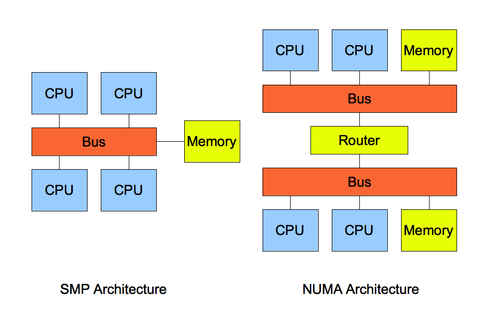

# numa节点的读写测试

## 什么是 NUMA 架构？

再说 `NUMA` 架构前，先给大家说说 `SMP` 架构，这两个架构都是针对 `CPU` 的。

`SMP` 指的是一种多个 `CPU` 处理器共享资源的电脑硬件架构，也就是说每个 `CPU` 地位平等，它们共享相同的物理资源，包括总线、内存、`IO`、操作系统等。每个 `CPU` 访问内存所用时间都是相同的，因此，这种系统也被称为一致存储访问结构（`UMA`，`Uniform Memory Access`）。

随着 `CPU` 处理器核数的增多，多个 `CPU` 都通过一个总线访问内存，这样总线的带宽压力会越来越大，同时每个 `CPU` 可用带宽会减少，这也就是 `SMP` 架构的问题。

为了解决 `SMP` 架构的问题，就研制出了 `NUMA` 结构，即非一致存储访问结构（`Non-uniform memory access`，`NUMA`）。

`NUMA` 架构将每个 `CPU` 进行了分组，每一组 `CPU` 用 `Node` 来表示，一个 `Node` 可能包含多个 `CPU` 。

**每个 `Node` 有自己独立的资源，包括内存、`IO` 等**，每个 `Node` 之间可以通过互联模块总线（`QPI`）进行通信，所以，也就意味着每个 `Node` 上的 `CPU` 都可以访问到整个系统中的所有内存。但是，访问远端 `Node` 的内存比访问本地内存要耗时很多。



## NUMA 架构跟回收内存有什么关系？

在 `NUMA` 架构下，当某个 `Node` 内存不足时，系统可以从其他 `Node` 寻找空闲内存，也可以从本地内存中回收内存。

具体选哪种模式，可以通过 `/proc/sys/vm/zone_reclaim_mode` 来控制。它支持以下几个选项：

- `0` （默认值）：在回收本地内存之前，在其他 `Node` 寻找空闲内存；
- `1`：只回收本地内存；
- `2`：只回收本地内存，在本地回收内存时，可以将文件页中的脏页写回硬盘，以回收内存。
- `4`：只回收本地内存，在本地回收内存时，可以用 `swap` 方式回收内存。

在使用 `NUMA` 架构的服务器，如果系统出现还有一半内存的时候，却发现系统频繁触发「直接内存回收」，导致了影响了系统性能，那么大概率是因为 `zone_reclaim_mode` 没有设置为 `0` ，导致当本地内存不足的时候，只选择回收本地内存的方式，而不去使用其他 `Node` 的空闲内存。

虽然说访问远端 `Node` 的内存比访问本地内存要耗时很多，但是相比内存回收的危害而言，访问远端 `Node` 的内存带来的性能影响还是比较小的。因此，`zone_reclaim_mode` 一般建议设置为 `0`。

## numactl 命令

查看节点的数量和结构

```shell
# numactl -s
policy: default
preferred node: current
physcpubind: 0 1 2 3 4 5 6 7 8 9 10 11 12 13 14 15 16 17 18 19 20 21 22 23 24 25 26 27 28 29 30 31
cpubind: 0 1
nodebind: 0 1
membind: 0 1

# numactl --hardware
available: 2 nodes (0-1)
node 0 cpus: 0 1 2 3 4 5 6 7 16 17 18 19 20 21 22 23
node 0 size: 64044 MB
node 0 free: 2184 MB
node 1 cpus: 8 9 10 11 12 13 14 15 24 25 26 27 28 29 30 31
node 1 size: 64507 MB
node 1 free: 13821 MB
node distances:
node   0   1
  0:  10  21
  1:  21  10
```

用 `numastat` 可以查看当前节点内存使用情况

```shell
# numastat
                           node0           node1
numa_hit              1930573251      1846668190
numa_miss              112253847       120764277
numa_foreign           120764277       112253847
interleave_hit             23147           23254
local_node            1930457306      1846538037
other_node             112369792       120894430

# numastat -m

Per-node system memory usage (in MBs):
Token Node not in hash table.
Token Node not in hash table.
                          Node 0          Node 1           Total
                 --------------- --------------- ---------------
MemTotal                64044.01        64507.86       128551.86
MemFree                  1977.40        13823.72        15801.12
MemUsed                 62066.61        50684.14       112750.75
Active                  40752.84        32425.27        73178.11
Inactive                19243.81        17450.24        36694.05
Active(anon)            29046.83        23446.23        52493.06
Inactive(anon)            110.44           34.09          144.53
Active(file)            11706.02         8979.03        20685.05
Inactive(file)          19133.37        17416.15        36549.52
Unevictable               283.86            0.00          283.86
Mlocked                   283.86            0.00          283.86
Dirty                       0.23            0.34            0.57
Writeback                   0.00            0.00            0.00
FilePages               31347.88        26491.89        57839.76
Mapped                    496.81           52.98          549.80
AnonPages               28922.08        23369.75        52291.83
Shmem                     224.58           96.70          321.27
KernelStack                 9.20            3.98           13.17
PageTables                 78.24           42.71          120.95
NFS_Unstable                0.00            0.00            0.00
Bounce                      0.00            0.00            0.00
WritebackTmp                0.00            0.00            0.00
Slab                     1152.19          653.02         1805.20
SReclaimable              832.21          400.87         1233.08
SUnreclaim                319.97          252.15          572.12
AnonHugePages           12048.00        13360.00        25408.00
ShmemHugePages              0.00            0.00            0.00
ShmemPmdMapped              0.00            0.00            0.00
HugePages_Total             0.00            0.00            0.00
HugePages_Free              0.00            0.00            0.00
HugePages_Surp              0.00            0.00            0.00
```

## numactl 测试

为了去除CPU变频的影响，将CPU频率设置为最高频率

```shell
sudo cpupower frequency-set -g performance
```

查看CPU频率信息

```shell
sudo cpupower frequency-info
```

测试需要使用 `/dev/shm` 目录，这个目录是使用 `tmpfs` 挂载的，也就是内存文件系统，这种文件系统是使用时动态从内存申请的，也就是实际用了内存

前边可以看到系统内包含两个 `node` ，分别用不同 `node` 上的 `CPU` 向另外两个 `node` 写入数据

`node0` 上的 `CPU` 向 `node0` 上的内存写入 `1G` 数据

```shell
numactl --cpubind=0 --membind=0 dd if=/dev/zero of=/dev/shm/A bs=1M count=1024
记录了1024+0 的读入
记录了1024+0 的写出
1073741824 bytes (1.1 GB, 1.0 GiB) copied, 0.435553 s, 2.5 GB/s
```

`node0` 上的 `CPU` 向 `node1` 上的内存写入 `1G` 数据

```shell
numactl --cpubind=0 --membind=1 dd if=/dev/zero of=/dev/shm/A bs=1M count=1024
记录了1024+0 的读入
记录了1024+0 的写出
1073741824 bytes (1.1 GB, 1.0 GiB) copied, 0.468859 s, 2.3 GB/s
```

`node1` 上的 `CPU` 向 `node1` 上的内存写入 `1G` 数据

```shell
numactl --cpubind=1 --membind=1 dd if=/dev/zero of=/dev/shm/A bs=1M count=1024
记录了1024+0 的读入
记录了1024+0 的写出
1073741824 bytes (1.1 GB, 1.0 GiB) copied, 0.43772 s, 2.5 GB/s
```

`node1` 上的 `CPU` 向 `node0` 上的内存写入 `1G` 数据

```shell
numactl --cpubind=1 --membind=0 dd if=/dev/zero of=/dev/shm/A bs=1M count=1024
记录了1024+0 的读入
记录了1024+0 的写出
1073741824 bytes (1.1 GB, 1.0 GiB) copied, 0.466304 s, 2.3 GB/s
```

读取内存测试同上

```shell
numactl --cpubind=0 --membind=0 dd if=/dev/shm/A of=/dev/null bs=1M count=1024
numactl --cpubind=0 --membind=1 dd if=/dev/shm/A of=/dev/null bs=1M count=1024
numactl --cpubind=1 --membind=1 dd if=/dev/shm/A of=/dev/null bs=1M count=1024
numactl --cpubind=1 --membind=0 dd if=/dev/shm/A of=/dev/null bs=1M count=1024
```

## 参考资料

- [内存满了，会发生什么？](https://xiaolincoding.com/os/3_memory/mem_reclaim.html)
- [numactl测试numa间读写速率](https://blog.csdn.net/mabin2005/article/details/116018566)
