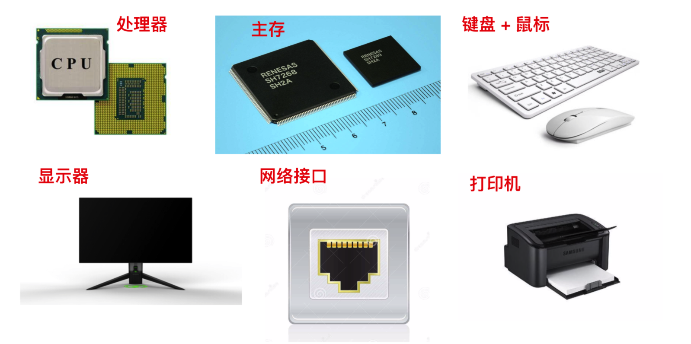

# 操作系统

现代计算机系统由一个或多个处理器、主存、打印机、键盘、鼠标、显示器、网络接口以及各种输入/输出设备构成。

然而，程序员不会直接和这些硬件打交道，而且每位程序员不可能会掌握所有计算机系统的细节，这样我们就不用再编写代码了，所以在硬件的基础之上，计算机安装了一层软件，这层软件能够通过响应用户输入的指令达到控制硬件的效果，从而满足用户需求，这种软件称之为 **操作系统**，它的任务就是为用户程序提供一个更好、更简单、更清晰的计算机模型。

