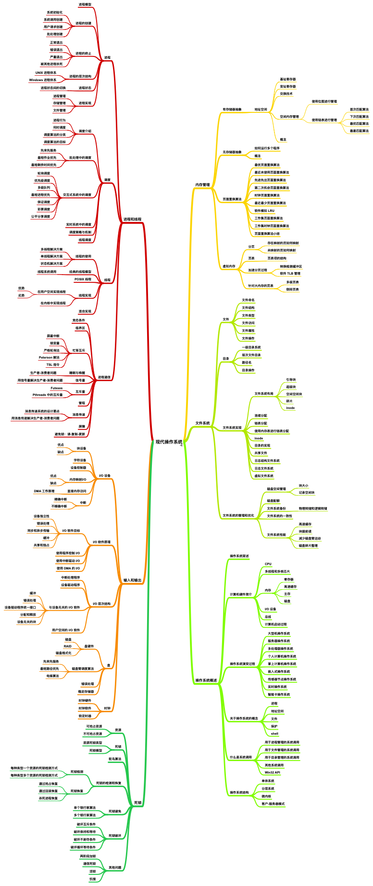

# 概述



## 搞清楚几个问题

首先你要搞明白你学习操作系统的目的是什么？操作系统的重要性如何？学习操作系统会给我带来什么？下面我会从这几个方面为你回答下。

操作系统也是一种软件，但是操作系统是一种非常复杂的软件。操作系统提供了几种抽象模型

- 文件：对 I/O 设备的抽象
- 虚拟内存：对程序存储器的抽象
- 进程：对一个正在运行程序的抽象
- 虚拟机：对整个操作系统的抽象

这些抽象和我们的日常开发息息相关。搞清楚了操作系统是如何抽象的，才能培养我们的抽象性思维和开发思路。

很多问题都和操作系统相关，操作系统是解决这些问题的基础。如果你不学习操作系统，可能会想着从框架层面来解决，那是你了解的还不够深入，当你学习了操作系统后，能够培养你的全局性思维。

学习操作系统我们能够有效的解决并发问题，并发几乎是互联网的重中之重了，这也从侧面说明了学习操作系统的重要性。

学习操作系统的重点不是让你从头制造一个操作系统，而是告诉你 操作系统是如何工作的，能够让你对计算机底层有所了解，打实你的基础。

相信你一定清楚什么是编程：

```text
Data structures + Algorithms = Programming
```

操作系统内部会涉及到众多的数据结构和算法描述，能够让你了解算法的基础上，让你编写更优秀的程序。

我认为可以把计算机比作一栋楼。计算机的底层相当于就是楼的根基，计算机应用相当于就是楼的外形，而操作系统就相当于是告诉你大楼的构造原理，编写高质量的软件就相当于是告诉你构建一个稳定的房子。
