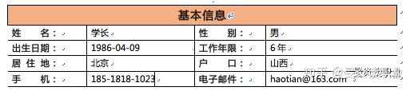

# 职场新手如何写一份优秀的简历

写简历是大学毕业生求职的第一课，但是，很多同学对此重视度不够，也缺乏相应的经验。好简历是一份好工作的敲门砖，在大多数人都没有工作经历的情况下，一份简洁、层次分明、逻辑清晰、故事性强的简历，往往成为是否获得面试机会的一个决定性因素。

那么对于初入职场的大学生学弟学妹来说，如何写一份好简历呢？学长今天**从框架、内容、要点、注意细节四个方面来给大家说一下个人的经验**。希望帮助大家对此有新的认识，得到一些启发和借鉴。

## 简历的框架（框架思维）

写任何一份书面性的东西，都要有一个框架，框架思维是我们随时都应该有意识地去使用的一个思维工具。

对于一份简历来说，一个基础的框架包括：

基本信息、求职意向、工作经历、教育经历、项目经历、职业技能、自我评价。

这是互联网求职平台拉勾网的一个框架，学长认为这个框架还是比较符合大部分人的需求的。如果同学们填写在线简历，直接按照这个架构写好直接往里面填就好；如果是纸质版简历，那么使用这个框架作为模版做成word文档再打印也是一个不错的选择。

## 简历的内容

有了框架，就是往里面写内容了。下面就按照几个大的模块，逐一讲解各个部分写作的要点。

### 基本信息

基本信息一般都放在简历最前面，主要包括：**姓名、性别、最高学历、工作年限、出生年月、所在城市、联系电话、邮箱、一句话介绍**。这些信息中除了工作年限因大家初入职场，可以不写之外，其他最好都写。

一句话介绍，这一点可以有，也可以没有。它就是对自己优势的精简概括，**一般15-20字左右即可**。如果有的话，一定要特色突出，要能引起hr或面试官的好奇。

> 比如学长以前给自己总结的一句话是：一个关注细节、执行力强的人。后来改为：一个具有自己方法论的运营人！但是，感觉还是比较空，不具体。再后来重新梳理自己的工作经验和个人特长后，改成了：有自己系统的运营方法论-221（2核心2抓手1准绳）。

另外，**基本信息部分，强烈建议用【表格】来体现，这样是为了让hr一目了然**。当然，如果是像拉勾之类的招聘网站的在线简历，一般有自己的格式，填上就好。

### 求职意向

基本信息之后，紧着最好写求职意向，就是打算求职什么岗位的工作，比如有的同学填写的人力资源。

这里提醒大家：**初入职场一定不要太过于限定自己的职业选择范围。因为有很多种职业你们根本不了解，有的职位可能你去了会发现其实还是非常适合自己的**。所以，非常建议大家多尝试一些不同的岗位。

**人的一生，很多时候，选择比努力更重要！**

求职意向写好之后，要想好面试的时候如何应对HR的提问，HR最可能问到的问题是：**你为什么选这个岗位？你的优势是什么？如果你没有准备，很可能就会被HR问住**。

### 工作经历

这部分对于很多同学来说是空白，如果没有就略过。但是，如果只要有一份兼职的工作经历，都尽量写进去。

工作经历一般包括的要素：**工作年限范围、公司名称、岗位名称、工作内容、主要成果。这里主要的是工作内容和工作成果**。

工作内容一般是对于这个岗位你做的主要工作的简介，**一般100-200字就好。先用一句话进行总结，然后分一二三点进行详细一点的说明**。

工作成果主要是你在职期间获得了什么成果，或者什么收获感悟。**如果是成果，最好呈现数字结果，比如多少人参与、多少收入类似。如果没有数字成果，可以写一下自己锻炼的能力、学到的深刻感悟**。当然感悟尽量与工作能力要求相关，并且描述要具体。

关于如何写工作经历这部分，其实还是比较重要的，以后再专门写一篇文章给大家做深入介绍。

### 教育经历

教育经历一般从大学本科以上写起就可以了，高中一般可略过。对于大学学习的课程，可以写，也可不写。一般来说对于求职的价值不大。对于初入职场的人，可以暂时写上，但是，也不要全写，写几门可能对工作有关的核心课程就行。

**如果有双学士学位的同学，一定写上，算一个小的加分项。**

另外，**写学校名称的时候，如果学校是重点大学，就一定写上，比如：燕山大学（国家重点大学）**，因为有很多HR不一定听过你的学校，不写就会有点吃亏。企业招聘的时候，对于学校还是比较看重的。

### 项目经历

项目经历这一项，大家一定不要空着，这个模块给大家提供了一个很好的展示自己能力和优势的空间，所以，大家一定要重视！

你可以写一次兼职、一次公益活动、或者一次实习，时间可长可短，这都不重要，重要的是你通过这个项目展示出自身的优势，与工作相关的能力。

项目经历部分的要素一般包括：**项目时间、项目职责、项目内容与成果**。

项目职责，就是你承担的角色，类似于工作岗位。

项目内容和成果，这个部分就要用到经典的STAR法则了。**简单来说，就是当时你面临的情景（S）是什么？你的任务（T）和职责是什么？你做了什么，采取了什么行动（A）？最终取得了什么效果（R）？这四个部分连起来构成一个连贯简短的故事**。大家尽量不要以四个大写字母开头分割成四段的方式来写，这样会让HR觉得很套路。关于STAR法则，学长下一篇会结合一些案例重点单独写一篇。

另外还有一点很重要：**写项目经历，不是让你突出项目多厉害，重要的是突出你很重要，一切内容成果都要突出自己在其中的作用**。

### 自我评价

自我评价的重要性和项目经历差不多，但是，90%的人不重视这个模块，也写得不好。尤其是应届毕业的学弟学妹，**大家写的都差不多，没有什么差别，无外乎吃苦耐劳、踏实肯干、性格开朗、兴趣广泛、责任心强…这些写法都有一个共同的特点：泛泛而谈、干巴巴、千篇一律、大而空，没有特色，显示不出你的与众不同**。

那么怎么写才有特色？

**首先要从对方（企业和hr）角度出发，想想企业最需要什么能力。然后，挑出2-4个你觉得自己具备的优点，以优点关键词 + 一个小故事案例的形式写出来，每个优点的字数100字以内即可**。

那么企业最需要什么能力的人，从通用性能力来说，**执行力、关注细节、计划性、自主性、沟通协调能力**这些与做事密切相关的素质，是任何一个岗位都非常看重的能力。

从专业能力来说，每个具体的岗位都有一些比较重要的能力，比如，如果你应聘的是互联网企业的产品经理或运营岗位，数据分析、用户思维、用户调研能力、竞品分析等都可以作为一些个人优势写出来。

对于初入职场的人来说，以通用能力入手来写更改为妥当。**建议同学们把上面说的几个通用能力都可以作为自己的优势，挑2-3个，结合自己做过的事情，写一个相应的案例**。这样你的简历在HR那里就多了很强的竞争力。大家不要怕和别人重复，你们面对的全国数百万的人在竞争，而不是你们院系、班级的几个人。

### 职业技能

关于职业技能这个部分，**主要指的是一些硬技能，比如PS、数据分析工具、Office、思维导图X-mind等等**。如果有的话最好了，没有的话也不要太担心。对于初入职场的你们并不是最重要的决定因素。

但是，有一点需要告诉大家的是，一旦你进入一个工作岗位，对于一些基本的技能工具，一定要尽快去学，不一定要多精，只要入门就已经很好了，而入门又是很容易做到的。一旦学会某个技能，下一次求职，你的技能项就不再是空白。

大家一定要有一个意识，无论工作经验还是工作技能，都要随时去积累，作为下一次求职的基础。

## 好简历的要点

就学长多年的经验来说，学长认为一份好简历最重要的在于以下三点：

### 格式

主要包括排版、字体、颜色、行间距等。这些对于大学的学弟学妹来说问题不大。主要提醒的几个点是：

1. 模块和模块（比如求职意向和工作经历）之间要界限分明，一目了然，可以采用一些色块、线条来区分；
2. 排版尽量紧凑一点，行间距不要太大；
3. 通篇字体最好使用一种正式字体，比如黑体或宋体即可。另外，非常重要的一点，一定不要有错别字；
4. 可以用颜色来突出模块或者重要内容，但是，颜色不宜过多，简历中的颜色不要超过3种。

格式不是决定性的因素，但是，如果你的简历排版、字体很乱的话，那HR可能根本不愿意多看一眼。但是，也不要过于把时间过于花费在模板格式上，不要本末倒置。

### 逻辑

逻辑性，我认为是简历中最重要的因素之一。**什么是有逻辑性呢？学长认为以金字塔原理16字来作为指导原则就足够了。也即：结论先行、以上统下、归类分组、逻辑递进**。

不管是工作经历、项目经历，还是自我介绍，总体上最好都要符合这一原则，比如工作经历，每个公司的工作经历（项目经历），横向上构成一种归纳并列的逻辑，纵向上，按照时间进度体现为一种递进的关系。但是，每一个公司的经历自身，又体现为一种演绎逻辑。

**在写每一段经历的时候，都先要有一句话统领后面说的内容，从而构成一个完整有逻辑的经历或故事。**

逻辑性这个部分会比较抽象，大家可以慢慢体会理解，不要着急一时。

### 故事

最后说一下故事。这里的故事其实更多的是说，**你的经历要写的具体生动，有时间、有细节，有数字，让人听着就像是一个绘声绘色的故事**。

比如学长讲自己的一个项目经历：

> 搭建起保险理赔项目，开拓了互联网保险业务的新方向。通过3个多月的前期调研，拜访了50多家维修厂，与同事成功搭建起一个保险理赔运营项目，在产品系统未上线的情况下，实现良性运转。

这就是一个项目经历，但是也是一个简短的故事。**建议同学们也把自己的每个项目经历（兼职、实习、公益经历）好好包装一下，多写几个版本，不断修改，选择一个最满意的版本。没有工作经历，就用项目经历来弥补**。

另外，**你的每一个经历，简历上写一个浓缩的故事，简历之外，你要把它写成一个更加完整的故事，以便面试的时候，如果面试官提问，你有充分的准备**。有的时候，可能仅仅一个准备充分的故事（经历）就可能搞定这份工作了。所以，再次强调：项目经历一定要好好准备。

以上三点是学长这么多年来找工作非常深刻的体会。限于篇幅，先简单给大家介绍一下，后期会找一些案例再逐一给大家做深入介绍。

另外，从重要性程度上来说，以上三点的重要性排序是：**故事>逻辑>格式**。

## 简历中需要注意的一些小事项

### 电子版简历与纸质简历

一般情况下，我们需要准备两种简历，电子版和纸质版。电子版又分两种，一种是在线简历，一种是word简历。不管哪种，框架和内容统一用一套即可。纸质版用word电子版直接打印就行。在线简历也用word版的内容直接复制粘贴即可。

一般写简历的时候，可以采取这样一个流程：

1. 以word简历开始，把简历的框架列出来（可参照上面的框架部分）；
2. 根据框架把自己的简历内容填写完整，并修改格式进行定稿；
3. 把word简历里的内容，按照在线简历的框架一一复制粘贴进去即可。

### 封面

一般来说没有必要为简历准备封面，价值不大。

### 简历的命名

简历的命名也是个值得关注的小细节，一般命名可采取：**个人简历+姓名的方式，便于HR一目了然，也便于HR查找**。不管电子简历还是纸质简历都要注意，这一点体现了你的职业素养。

### 英文简历

对大多数人来说没有必要，除非你去面试外企。

关于简历，本篇就说这么多，下篇继续这一话题，讲一下如何使用STAR原则。

## 参考

- [职场新手如何写一份优秀的简历](https://zhuanlan.zhihu.com/p/67775740)
