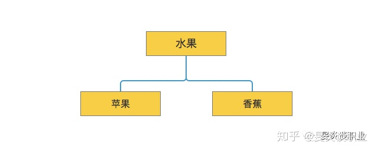
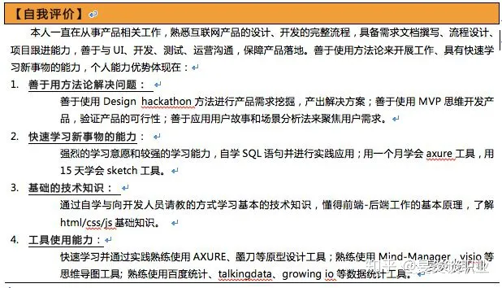

# 逻辑和数字：优秀简历的两大杀手锏

**写简历是一种说服性的表达，为了达到说服面试官或HR的目的，就要采用一些说服策略，在简历的写作中，有两个非常重要的增加说服力的因素：逻辑和数字。**

## 如何让自己的简历看上去有逻辑

古希腊哲学家亚里士多德提出过三种说服模式：道德模式、情感模式和逻辑模式。在求职方面，情感模式往往更适合于面对面的沟通交流，而不适合书面沟通。但是，逻辑模式无论在简历这种书面表达，还是面试这种语言交流中都是很适用的。

关于什么是逻辑，如何训练逻辑，这些话题是比较偏向于学术性的。逻辑学也是一门最难学习的学科，但是这不是今天讨论的主题。同学们有兴趣可以自己去学习，有逻辑学的基础，你还是会受益匪浅的。

今天，学长仅仅从实用的角度，给大家讲一下简历中能够展现逻辑的一个工具——金字塔原理。其实，这个工具不仅在简历中有用，而且在面试和日常工作中非常有用。如果想深入学习，还是建议大家去看芭芭拉-明托的《金字塔原理》。

金字塔原理这本书的核心就是16个字：**结论先行、以上统下、归类分组、逻辑递进，这被称为经典的金字塔原则。**

1. 结论先行：在任何表达沟通中，首先用一句话把核心要点、结论先说出来。
2. 以上统下：在表达中，任意层次上的思想必须是其下一层次思想的概括。
3. 归类分组：要善于对表达的思想进行分组，且每组中的思想必须属于同一逻辑范畴。
4. 逻辑递进：分组后，每组中的思想必须按照一定的逻辑顺序组织。

上面是《金字塔原理》对于16字原则的解释。不过这个解释还是有些抽象，要如何和写简历结合呢？

案例学习往往是最好的方式，所以，学长接下来结合一些实际的简历案例来给大家进行详细的讲解。

首先，对于16字原则还需要再做一点解释，**“结论先行和以上统下”是从纵向来说的，“归类分组和逻辑递进”是从横向来说的。**举一个简单的例子，比如水果和苹果，是一种包含关系，你可以把这种关系理解为一种纵向关系（或者总分关系），但是苹果和香蕉是一种横向关系（或者说并列关系）。如果总结一下这两种关系，就可以画一个简单的金字塔图：

大家觉得这个图很简单对吗？实际上，抽离“水果”这个内容，换成关于简历的内容也是一样的。

### 结论先行、以上统下

在简历中，每一段工作经历、项目经历、个人评价，都要注意使用这个原则。简单说，这就是一个总-分结构，先总括，再分一二三来写。结论句要统领下面的各个小点。

比如上面这个自我评价，**首先以一个结论句来说自己的主要能力，然后再把能力中的关键能力分了四个点，分别做了进一步的阐述。**这就是所谓的结论先行，以上统下。结论句要能够统领下面四个工作能力。

### 归类分组

归类分组，**就是把具有相同特征、属性的工作经历、工作内容尽量归为一类，将子项目的内容控制在4-7项。**比如上面把核心的工作能力分为了四个部分：方法论、快速学习能力、技术知识、工具使用能力。

### 逻辑递进

逻辑递进指的是在写作表达过程中，要注意逻辑顺序，逻辑顺序有演绎顺序和归纳顺序。**演绎顺序就是通过一个大前提和一个小前提，得出结论。归纳顺序，一般包含三种**：

1. 时间顺序：也就是第一、第二、第三等类似这样的顺序，或者实际的时间顺序（比如7月、8月、9月）。
2. 空间顺序：也称结构顺序。
3. 程度顺序：也称重要性顺序，就是先说重要的内容，再说次重要，或者不重要的内容。

当你有2-3家公司工作经历的时候，每家公司的经历按时间先后来写，这就是一种逻辑递进。这里要提醒同学们，**工作经历一般要按照倒序来写，而不是顺序**。就比如要先写2017年，再写2016年，然后2015年。公司招聘的的时候HR最感兴趣的是你最近一份工作的内容与当下招聘内容的相关性。包括你的项目经历和教育经历，都要按照这个逻辑顺序来写。

**当写一个具体的公司的工作经历时，不同的工作内容模块的介绍，就可以按照重要性程度的逻辑递进顺序来写。还拿上面的自我评价来分析。**

这个自我评价中，就是按照重要性程度来写的，**因为对于一个职场的人来说，方法论是最重要的，然后是快速学习的能力。其他两个能力相对来说重要性低一些，就放在后面。**

之所以这样做的一个原因也在于，面试官筛选简历的时候是从前往后看的，如果前面的内容不重要，没有吸引力，可能后面重要的内容面试官压根看不会看到了。这样你就可能错过一次面试机会。

通过对于以上16字金字塔原则的使用，你的简历就能很好的体现出逻辑结构的特征。

## 数字对于简历的重要作用在哪里？

### 为什么数字对简历很重要

#### 数字更能引起面试官的注意力

人类天生对数字就比较敏感，如果你的简历中有一些数字，就更容易引起面试官的注意，这样你获得面试机会的机会就更大。HR筛选简历是一个工作量非常大的事情，根本不会一个字一个字，或者一段一段仔细看的。基本上是快速的扫一眼，有亮点才会停留下来进一步细看，在这种情况下，数字的价值就显现出来了。

#### 数字是对一个人工作成果最好的衡量

管理大师德鲁克提出的目标管理中指出，目标要可衡量。衡量目标最好的手段就是数字。国家为什么统计GDP？企业为什么设置KPI？学校为什么要考试打分数？这些都是为了可衡量。而数字是最好的衡量。

尤其是企业中，企业的目标、经营成果都是以具体的数字体现出来的，这种强烈的数字导向的特殊性，就导致面试官也非常注重数字。所以，如果想让你的简历脱颖而出，那就把你的工作成果尽可能用数字体现出来。

### 简历中应该体现哪些数字？

简历中应该体现哪些数字？通常有两类数字放在简历中会比较有说服力：

#### 数量：比如产品的用户量，活动的参与人数、文章内容的阅读量、销售额、你为企业节省的成本等

但是，对于刚毕业的大学生，没有工作经验，也就缺乏企业所关心的这些数据。不过，如果你有一些实习经历或者社会活动经历，那么多多少少也会有一些数据可总结。比如，如果你参与组织过一场社会活动，就可以把参与人数规模作为一个数据写出来。如果你做过一些实习类的工作，比如编辑、或者人力资源助理，也可以总结一些数据，比如每天写稿多少字，或者多少篇。或者每天筛选了多少份简历等等。总之，多发掘你做过的事情中的数字。

#### 比率，比如业务增长率，工作的完成率、投资回报率，投资收益比，内容的阅读率等等

第一部分说的数量是一个量的指标，而比率更多是一个质的指标。质的指标往往比量的指标更有价值，更能够体现你的工作能力和工作成果。

同样的，对于应届毕业生来说，前面说的与工作相关的比率可能并没有接触过。但是，你还是可以找到一些你做过的事情中的比率。如果你组织过一个社团活动，那么参与率就是一个很好的体现你这个活动做的好坏的指标。比如，报名参与率比这个社团往届提高了几个百分点。或者你管理过学校的某个微信公众号，你的阅读率是不是比别人多几个点。这些都是一些不错的可以写到简历中的亮点内容。

总之，数字是简历中增加说服力非常重要的一个武器。写简历的时候，一定不要平铺直叙的说过程、记流水账。多说一些数字性的成果，你就比别人具有更强的竞争优势。

## 参考

- [逻辑和数字：优秀简历的两大杀手锏](https://zhuanlan.zhihu.com/p/67776085)
