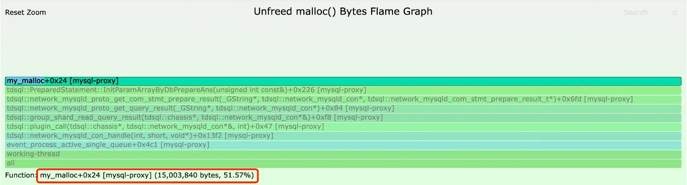

# 基于 BPF 的内存泄漏（增长）通用分析方法探索

## 背景

某个私有化环境中， 中间件 mysql-proxy 进行大量请求转发时，内存占用量持续增长，导致 OOM 现象，影响了用户业务的正常使用 。在协助分析该问题的过程中，发现一个较为普遍的业务痛点：传统分析工具（gdb、Valgrind 等）效率相对较低，尤其是私有化场景。针对这一痛点，本文提供若干相对通用的内存泄漏（增长）分析方法，协助更高效地定位发生泄漏的代码路径，以期减少人力投入成本。

## 基础概念

在展开讲述内存泄漏（增长）分析方法之前，我们先了解一些相关的基础概念。

内存泄漏包括内核内存泄漏、应用程序内存泄漏两大类。内核内存泄漏可以通过 kmemleak 进行检测，本文主要关注应用程序的内存泄漏。应用程序的内存泄漏又可以细分为：堆内存（Heap）泄漏、内存映射区（Memory Mappings）泄漏。

我们平时提及的内存泄漏，主要是指物理内存的泄漏（持续分配、映射实际的物理内存，且一直未释放），危害较大，需要立即修复。

另外，虚拟内存的泄漏（持续分配虚拟内存，但未分配、映射实际的物理内存）容易被忽视，虽然危害相对较小，但也需额外关注（进程的内存映射区总数量有上限，默认 1w）。

通常，应用程序内存分配涉及的步骤大致如下图所示：

1. 应用程序通过内存分配器（例如 libc）提供的 malloc 及其变体函数申请内存，free 函数释放相应内存。
2. 内存分配器（例如 libc）内部通过系统调用 brk 扩展堆内存（小块内存分配）。
3. 内存分配器（例如 libc）内部通过系统调用 mmap 分配内存映射区域（大块内存分配，默认不小于 128 KB）
4. 2 或 3 已申请的虚拟内存在首次写入时触发缺页异常，OS 分配实际物理页面，并将虚拟内存与其相关联，记录至页表。

其中，步骤 1~3 均为虚拟内存，步骤 4 分配实际物理内存并创建相应页表。


## 传统分析工具 gdb、Valgrind

在定位 mysql-proxy 内存泄漏（增长）问题的过程中，开发人员尝试使用了 Valgrind Memcheck、gdb 进行协助分析，前者实际效果不太理想，最终通过后者分析出泄漏原因，但整个过程耗费了较多时间。

gdb 是常用的程序调试工具，好处不用赘述。但对于内存泄漏或增长问题，gdb 缺点也较为明显，大致如下：

- 干扰程序正常运行，不适合生产环境。
- 直接定位比较困难，且要求对源码有一定了解。

Valgrind Memcheck 是一款众所周知的内存泄漏分析工具，非常强大，开发调试过程中能够快速发现场景的内存泄漏问题，不过在使用之前，建议对以下情况有所了解：

- 需要重启程序，且作为 Valgrind 子进程运行。不适合分析正在发生内存增长的进程。
- 替代默认的 malloc/free 等分配函数，目标进程运行速度减慢 20~30 倍。
- 不能很好的支持 tcmalloc、jemalloc 内存分配器。（mysql-proxy 采用了 jemalloc 内存分配器）

## 基于动态追踪的通用分析方法

对于一个正在运行、内存持续增长的应用，gdb、Valgrind Memcheck 工具其实都挺难使用。相比而言，动态追踪技术提供了一种通用且易用的方式。内存分配器相关函数调用、系统调用、缺页异常等，都可以看作一个个事件，通过对这些事件的追踪、统计等，分析有关内存使用情况的具体代码路径，可以在不深入源码细节的前提下快速缩小泄漏发生的范围。

本文涉及两种基于动态追踪的通用分析方法：内存分配器行为分析、缺页异常事件分析，涵盖应用程序内存分配的常见过程。

### 内存分配器行为分析

内存分配器（glibc、jemalloc 等）行为分析整体思路如下：

- 站在应用视角，重点关注应用程序内存分配的代码路径。
- 动态追踪内存分配相关函数，统计未释放内存分配的调用栈与总字节数量，形成分析工具 memstacks。

#### 开发新工具 memstacks

该工具支持生成两种类型的火焰图：

- 仅追踪 malloc 及其变体函数，不做 free 抵消。结果可用于生成全量内存分配火焰图。
- 追踪 malloc 及其变体函数、free 函数，计算出追踪期间未释放的内存分配。结果可用于生成未释放内存分配火焰图。

其实现原理大致如下：

- 借鉴现有 BCC 工具 memleak、mallocstacks，支持生成折叠栈，可生成全量内存分配火焰图、未释放内存分配火焰图。
- 借助 uprobes 动态追踪 malloc（以及变体 cmalloc、realloc）、free。


如上图所示，现有 BCC 工具 memleak、mallocstacks 各有优劣。新工具 memstacks 结合两者优点，允许有选择性的生成全量内存分配火焰图或者未释放内存分配火焰图需要的折叠栈格式。

#### 全量内存分配火焰图

执行以下命令，追踪 mysql-proxy 进程所有 malloc 及其变体调用 60s，并生成全量内存分配火焰图。

```shell
# 步骤 1. 追踪 60s，生成全量内存分配折叠栈
# 其中，参数 -a 表示追踪所有的 malloc 及其变体，但不追踪 free 进行相互抵消。参数 -f 表示生成折叠栈，用于步骤 2 生成火焰图。
./memstacks -p $(pgrep -nx mysql-proxy) -af 60 > all_mallocs.stacks

# 步骤 2. 执行下述命令生成全量内存分配火焰图，输出至文件 all_mallocs.svg。
./flamegraph.pl --color=mem --title="All malloc() bytes Flame Graph" --countname="bytes" < all_mallocs.stacks > all_mallocs.svg
```

火焰图如下所示，可以协助开发者理解 mysql-proxy 调用 malloc 及其变体的关键代码路径。


#### 未释放内存分配火焰图

执行以下命令，追踪 mysql-proxy 进程未释放 malloc 及其变体调用 60s，并生成内存分配火焰图。

```shell
# 步骤 1. 追踪 60s，生成未释放内存分配折叠栈
# 其中，参数 -f 表示生成折叠栈，用于步骤 2 生成火焰图。
memstacks -p $(pgrep -nx mysql-proxy) -f 60 > unfreed_mallocs.stacks

# 步骤 2. 执行下述命令生成未释放内存分配火焰图，输出到文件 unfreed_mallocs.svg。
./flamegraph.pl --color=mem --title="Unfreed malloc() bytes Flame Graph" --countname="bytes" < unfreed_mallocs.stacks > unfreed_mallocs.svg
```

火焰图如下所示，其中：

- 未释放内存共计 27.75 MB（追踪期间，通过 pidstat 观察到 mysql-proxy 进程 RSS 增量接近 27 MB，与未释放内存统计量 27.75 MB 基本一致）。
- 已分配但未释放的代码路径主要有两处。其中，据研发反馈，Item_param::set_str 正是导致 mysql-proxy 内存泄漏发生的地方。而另一处并非真正的泄漏，该工具有一定的副作用，由于追踪的最后阶段有一些刚分配的内存还未来得及释放，需要进一步阅读源码甄别。另外，建议多运行几次对比下结果，排除那些经常变化的分配路径。


对已分配但未释放的代码路径展开，结果如下：




相比全量内存分配火焰图，数据量减少近 60 倍，需要重点关注的代码路径减少也比较明显。因此，推荐优先使用未释放内存分配火焰图进行分析。

### 缺页异常事件分析

相比内存分配器行为分析，缺页异常事件分析提供了另一种视角，整体思路如下：

- 站在内核视角，关注的是首次写入触发缺页异常的代码路径，而不是触发内存分配的代码路径。前者是导致进程 RSS 增长的原因，后者仅分配了虚拟内存，尚未映射物理内存。
- 追踪缺页异常事件，统计未释放物理内存的调用栈与总页面数量，形成分析工具 pgfaultstacks。

#### 现有分析工具

传统工具 perf，基于软件事件 page-faults。

```shell
perf record -p $(pgrep -nx mysql-proxy) -e page-faults -c 1 -g -- sleep 60
```

BCC 工具 stackcount，基于静态追踪点 exceptions:page_fault_user。

```shell
stackcount -p $(pgrep -nx mysql-proxy) -U t:exceptions:page_fault_user
```

现有分析工具虽然方便，但是以增量的方式去统计，不考虑追踪过程中被释放的物理内存，最终统计的结果通常会偏大，对内存泄漏（增长）的分析会造成干扰。

#### 缺页异常火焰图（现有版）

执行以下命令，追踪 mysql-proxy 进程所有缺页事件 60s，并生成缺页异常火焰图。

```shell
perf record -p $(pgrep -nx mysql-proxy) -e page-faults -c 1 -g -- sleep 60 > pgfault.stacks

./flamegraph.pl --color=mem --title="Page Fault Flame Graph" --countname="pages" < pgfault.stacks > pgfault.svg
```

火焰图具体如下，共计 420,342 次缺页事件，但不是每一次缺页事件都分配一个新的物理页面（大多数情况下未分配），mysql-proxy RSS 实际增长量仅 60 多MB 。


#### 开发新工具 pgfaultstacks

该工具的实现原理大致如下：

- 改进现有缺页事件统计方式（过滤物理页面已存在的缺页事件，并在追踪完成后读取目标进程的内存映射列表，通过计算将已释放的物理页面排除在外），仅关注真正泄漏的物理内存。
- 借助 tracepoint 或 kprobe 动态追踪 page faults 事件，一般情况下性能开销可忽略不计。

#### 缺页异常火焰图

执行以下命令，追踪 mysql-proxy 进程满足过滤条件的缺页事件 60s，并生成缺页火焰图。

```shell
# 步骤 1. 追踪 60s，生成缺页异常折叠栈。其中，参数 -f 表示生成折叠栈，用于步骤 2 生成火焰图。
pgfaultstacks -p $(pgrep -nx mysql-proxy) -f 60 > pgfault.stacks

# 步骤 2. 生成缺页火焰图，输出到文件 pgfault.svg。
./flamegraph.pl --color=mem --title="Page Fault Flame Graph" --countname="pages" < pgfault.stacks > pgfault.svg
```

缺页火焰图如下，其中：

- 共计增加 17801 个物理页面（与 mysql-proxy 进程 RSS 增量基本一致）。
- 重点关注函数 g_string_append_printf。（注：非内存泄漏发生的环境，仅用来演示缺页异常火焰图）


相比现有版，该版本的数据量减少 20 多倍，需要重点关注的代码路径减少也比较明显。

## 总结

本文以实际生产中 mysql-proxy 内存泄漏问题作为分析对象，探索基于动态追踪技术的通用内存泄漏（增长）分析方法：内存分配器行为分析、缺页异常事件分析，并针对现有分析工具进行改进，形成相应的分析工具 memstacks、pgfaultstacks（源码文件在附件中）。工具使用者仅需关注少数可能导致内存泄漏的代码路径，有效提升定位内存泄漏（增长）问题的效率。
