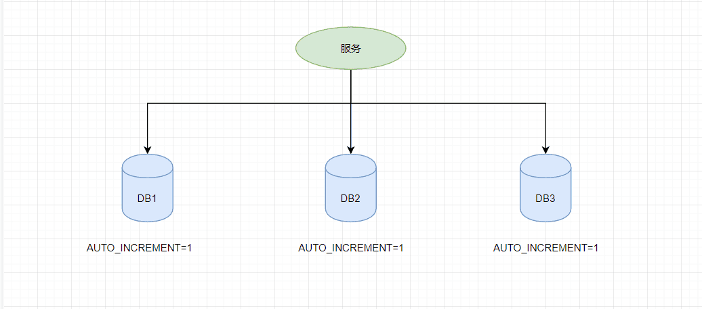

# 全局唯一ID实现方案

> 本文主要介绍常见的分布式ID生成方式，大致分类的话可以分为两类：一种是类DB型的，根据设置不同起始值和步长来实现趋势递增，需要考虑服务的容错性和可用性; 另一种是类snowflake型，这种就是将64位划分为不同的段，每段代表不同的涵义，基本就是时间戳、机器ID和序列数。这种方案就是需要考虑时钟回拨的问题以及做一些 buffer的缓冲设计提高性能。

## 为什么需要全局唯一ID

传统的单体架构的时候，我们基本是单库然后业务单表的结构。每个业务表的 `ID` 一般我们都是从 `1` 增，通过 `AUTO_INCREMENT=1` 设置自增起始值，但是在分布式服务架构模式下分库分表的设计，使得多个库或多个表存储相同的业务数据。这种情况根据数据库的自增 `ID` 就会产生相同 `ID` 的情况，不能保证主键的唯一性。



如上图，如果第一个订单存储在 `DB1` 上则订单 `ID` 为 `1`，当一个新订单又入库了存储在 `DB2` 上订单 `ID` 也为 `1`。我们系统的架构虽然是分布式的，但是在用户层应是无感知的，重复的订单主键显而易见是不被允许的。那么针对分布式系统如何做到主键唯一性呢？

## UUID

`UUID` （Universally Unique Identifier），通用唯一识别码的缩写。`UUID` 是由一组 `32` 位数的 `16` 进制数字所构成，所以 `UUID` 理论上的总数为 `16^32=2^128`，约等于 `3.4 x 10^38`。也就是说若每纳秒产生 `1` 兆个 `UUID`，要花 `100` 亿年才会将所有 `UUID` 用完。

生成的 `UUID` 是由 `8-4-4-4-12` 格式的数据组成，其中 `32` 个字符和 `4` 个连字符 `-`，一般我们使用的时候会将连字符删除 `uuid.toString().replaceAll("-","")`。目前 `UUID` 的产生方式有 `5` 种版本，每个版本的算法不同，应用范围也不同。

- 基于时间的 `UUID` - 版本1： 这个一般是通过当前时间，随机数，和本地 `MAC` 地址来计算出来，可以通过 `org.apache.logging.log4j.core.util` 包中的 `UuidUtil.getTimeBasedUuid()` 来使用或者其他包中工具。由于使用了 `MAC` 地址，因此能够确保唯一性，但是同时也暴露了 `MAC` 地址，私密性不够好。
- `DCE` 安全的 `UUID` - 版本2 `DCE`（Distributed Computing Environment）安全的 `UUID` 和基于时间的 `UUID` 算法相同，但会把时间戳的前 `4` 位置换为 `POSIX` 的 `UID` 或 `GID`。这个版本的 `UUID` 在实际中较少用到。
- 基于名字的`UUID`（MD5）- 版本3 基于名字的 `UUID` 通过计算名字和名字空间的 `MD5` 散列值得到。这个版本的 `UUID` 保证了：相同名字空间中不同名字生成的 `UUID` 的唯一性；不同名字空间中的 `UUID` 的唯一性；相同名字空间中相同名字的 `UUID` 重复生成是相同的。
- 随机 `UUID` - 版本4 根据随机数，或者伪随机数生成 `UUID`。这种 `UUID` 产生重复的概率是可以计算出来的，但是重复的可能性可以忽略不计，因此该版本也是被经常使用的版本。`JDK` 中使用的就是这个版本。
- 基于名字的`UUID`（SHA1） - 版本5 和基于名字的 `UUID` 算法类似，只是散列值计算使用 `SHA1`（Secure Hash Algorithm 1）算法。

我们 `Java` 中 `JDK` 自带的 `UUID` 产生方式就是版本`4`根据随机数生成的 `UUID` 和版本3基于名字的 `UUID`，有兴趣的可以去看看它的源码。

```java
public static void main(String[] args) {

    //获取一个版本4根据随机字节数组的UUID。
    UUID uuid = UUID.randomUUID();
    System.out.println(uuid.toString().replaceAll("-",""));

    //获取一个版本3(基于名称)根据指定的字节数组的UUID。
    byte[] nbyte = {10, 20, 30};
    UUID uuidFromBytes = UUID.nameUUIDFromBytes(nbyte);
    System.out.println(uuidFromBytes.toString().replaceAll("-",""));
}
```

得到的UUID结果

```text
59f51e7ea5ca453bbfaf2c1579f09f1d
7f49b84d0bbc38e9a493718013baace6
```

虽然 UUID 生成方便，本地生成没有网络消耗，但是使用起来也有一些缺点

- 不易于存储：`UUID` 太长，`16`字节`128`位，通常以`36`长度的字符串表示，很多场景不适用。
- 信息不安全：基于 `MAC` 地址生成 `UUID` 的算法可能会造成 `MAC` 地址泄露，暴露使用者的位置。
- 对 `MySQL` 索引不利：如果作为数据库主键，在 `InnoDB` 引擎下，`UUID` 的无序性可能会引起数据位置频繁变动，严重影响性能，可以查阅 `Mysql` 索引原理 `B+` 树的知识。

## 数据库生成

## 参考

- [全局唯一ID实现方案](https://pdai.tech/md/arch/arch-z-id.html)
