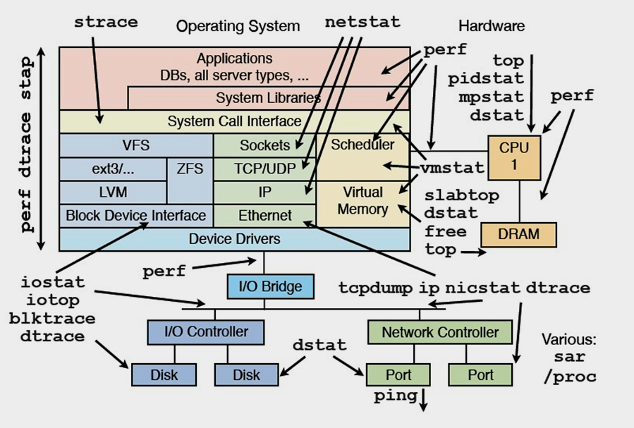

# 常见性能优化方法

## 为什么需要性能优化

- 性能直接影响用户体验
- 性能可以提高用户转换率
- 提升性能可以节省成本

## 性能的定义

总体来说，系统性能就是两个事：

- Throughput ，吞吐量。也就是每秒钟可以处理的请求数，任务数。
- Latency， 系统延迟。也就是系统在处理一个请求或一个任务时的延迟。

一般来说，一个系统的性能受到这两个条件的约束，缺一不可。比如，我的系统可以顶得住一百万的并发，但是系统的延迟是2分钟以上，那么，这个一百万的负载毫无意义。系统延迟很短，但是吞吐量很低，同样没有意义。所以，一个好的系统的性能测试必然受到这两个条件的同时作用。

有经验的朋友一定知道，这两个东西的一些关系：

- Throughput越大，Latency会越差。因为请求量过大，系统太繁忙，所以响应速度自然会低。
- Latency越好，能支持的Throughput就会越高。因为Latency短说明处理速度快，于是就可以处理更多的请求。

## 性能测试

经过上述的说明，我们知道要测试系统的性能，需要我们收集系统的Throughput和Latency这两个值。

- 首先，需要定义Latency这个值，比如说，对于网站系统响应时间必需是5秒以内（对于某些实时系统可能需要定义的更短，比如5ms以内，这个更根据不同的业务来定义）
- 其次，开发性能测试工具，一个工具用来制造高强度的Throughput，另一个工具用来测量Latency。对于第一个工具，你可以参考一下“十个免费的Web压力测试工具”，关于如何测量Latency，你可以在代码中测量，但是这样会影响程序的执行，而且只能测试到程序内部的Latency，真正的Latency是整个系统都算上，包括操作系统和网络的延时，你可以使用Wireshark来抓网络包来测量。这两个工具具体怎么做，这个还请大家自己思考去了。
- 最后，开始性能测试。你需要不断地提升测试的Throughput，然后观察系统的负载情况，如果系统顶得住，那就观察Latency的值。这样，你就可以找到系统的最大负载，并且你可以知道系统的响应延时是多少。

再多说一些

- 关于Latency，如果吞吐量很少，这个值估计会非常稳定，当吞吐量越来越大时，系统的Latency会出现非常剧烈的抖动，所以，我们在测量Latency的时候，我们需要注意到Latency的分布，也就是说，有百分之几的在我们允许的范围，有百分之几的超出了，有百分之几的完全不可接受。也许，平均下来的Latency达标了，但是其中仅有50%的达到了我们可接受的范围。那也没有意义。
- 关于性能测试，我们还需要定义一个时间段。比如：在某个吞吐量上持续15分钟。因为当负载到达的时候，系统会变得不稳定，当过了一两分钟后，系统才会稳定。另外，也有可能是，你的系统在这个负载下前几分钟还表现正常，然后就不稳定了，甚至垮了。所以，需要这么一段时间。这个值，我们叫做峰值极限。
- 性能测试还需要做Soak Test，也就是在某个吞吐量下，系统可以持续跑一周甚至更长。这个值，我们叫做系统的正常运行的负载极限。

性能测试有很多很复要的东西，比如：burst test等。 这里不能一一详述，这里只说了一些和性能调优相关的东西。总之，性能测试是一细活和累活。

## 性能优化的步骤

- 定位系统的瓶颈点
- 针对瓶颈点分析具体的优化措施

## 定位系统瓶颈

- CPU：perf、cpu火焰图、top
  - 先看CPU利用率，如果CPU利用率不高，但是系统的Throughput和Latency上不去了，这说明我们的程序并没有忙于计算，而是忙于别的一些事，比如IO。（另外，CPU的利用率还要看内核态的和用户态的，内核态的一上去了，整个系统的性能就下来了。而对于多核CPU来说，CPU 0 是相当关键的，如果CPU 0的负载高，那么会影响其它核的性能，因为CPU各核间是需要有调度的，这靠CPU0完成）
- 磁盘IO：iostat, iotop, sar
  - 然后，我们可以看一下IO大不大，IO和CPU一般是反着来的，CPU利用率高则IO不大，IO大则CPU就小。关于IO，我们要看三个事，一个是磁盘文件IO，一个是驱动程序的IO（如：网卡），一个是内存换页率。这三个事都会影响系统性能。
- 网络IO和网络连接数：netstat, ss, tcpdump, sar
  - 然后，查看一下网络带宽使用情况，在Linux下，你可以使用iftop, iptraf, ntop, tcpdump这些命令来查看。或是用Wireshark来查看。
- 内存：vmstat, free
- 如果CPU不高，IO不高，内存使用不高，网络带宽使用不高。但是系统的性能上不去。这说明你的程序有问题，比如，你的程序被阻塞了。可能是因为等那个锁，可能是因为等某个资源，或者是在切换上下文。

通过了解操作系统的性能，我们才知道性能的问题，比如：带宽不够，内存不够，TCP缓冲区不够，等等，很多时候，不需要调整程序的，只需要调整一下硬件或操作系统的配置就可以了。

## 性能优化策略

一般来说，性能优化也就是下面的几个策略

- 用空间换时间。各种cache如CPU L1/L2/RAM到硬盘，都是用空间来换时间的策略。这样策略基本上是把计算的过程一步一步的保存或缓存下来，这样就不用每次用的时候都要再计算一遍，比如数据缓冲，CDN，等。这样的策略还表现为冗余数据，比如数据镜象，负载均衡什么的。
- 用时间换空间。有时候，少量的空间可能性能会更好，比如网络传输，如果有一些压缩数据的算法（如前些天说的“Huffman 编码压缩算法” 和 “rsync 的核心算法”），这样的算法其实很耗时，但是因为瓶颈在网络传输，所以用时间来换空间反而能省时间。
- 简化代码。最高效的程序就是不执行任何代码的程序，所以，代码越少性能就越高。关于代码级优化的技术大学里的教科书有很多示例了。如：减少循环的层数，减少递归，在循环中少声明变量，少做分配和释放内存的操作，尽量把循环体内的表达式抽到循环外，条件表达的中的多个条件判断的次序，尽量在程序启动时把一些东西准备好，注意函数调用的开销（栈上开销），注意面向对象语言中临时对象的开销，小心使用异常（不要用异常来检查一些可接受可忽略并经常发生的错误），…… 等等，等等，这连东西需要我们非常了解编程语言和常用的库。
- 并行处理。如果CPU只有一个核，你要玩多进程，多线程，对于计算密集型的软件会反而更慢（因为操作系统调度和切换开销很大），CPU的核多了才能真正体现出多进程多线程的优势。并行处理需要我们的程序有Scalability，不能水平或垂直扩展的程序无法进行并行处理。从架构上来说，这表现为——是否可以做到不改代码只是加加机器就可以完成性能提升？

总之，根据2：8原则来说，20%的代码耗了你80%的性能，找到那20%的代码，你就可以优化那80%的性能。

## 代码层面

- cache line优化、cpu分支预测、函数内联等
  - [编译优化](../cpp/C%2B%2B%20%E9%9D%A2%E8%AF%95%E7%AA%81%E7%A0%B4/1.%20C%2B%2B%20%E7%BC%96%E8%AF%91%E4%B8%8E%E5%86%85%E5%AD%98%E7%9B%B8%E5%85%B3/12.%20%E7%BC%96%E8%AF%91%E4%BC%98%E5%8C%96.md)
- 选用性能更好的第三方库，如protobuf、fmtlib、rapidjson、jemalloc（内存分配）
- C++语言层面，如移动语义、std::string_view等
- 多线程，即提高并行性

## 网络调优

- HTTP(S)
  - [https://xiaolincoding.com/network/2_http/http_optimize.html](https://xiaolincoding.com/network/2_http/http_optimize.html)
  - [https://xiaolincoding.com/network/2_http/https_optimize.html](https://xiaolincoding.com/network/2_http/https_optimize.html)
- TCP
  - [https://xiaolincoding.com/network/3_tcp/tcp_optimize.html](https://xiaolincoding.com/network/3_tcp/tcp_optimize.html)
  - 使用可靠UDP[https://xiaolincoding.com/network/3_tcp/quic.html](https://xiaolincoding.com/network/3_tcp/quic.html)
- 使用IO多路复用，这个更多算是代码框架层面的问题

## 系统调优

### 使用高版本内核

- 高版本glibc的内存性能更好
  - memcpy由SSE指令集提升至AVX
- jemalloc版本升级的收益
- 编译器支持更高级的c++标准

### IO模型

- 同步阻塞IO
- 同步无阻塞方式。其通过fctnl设置 O_NONBLOCK 来完成。
- 对于select/poll/epoll这三个是I/O不阻塞，但是在事件上阻塞，算是：I/O异步，事件同步的调用。
- AIO方式。这种I/O 模型是一种处理与 I/O 并行的模型。I/O请求会立即返回，说明请求已经成功发起了。在后台完成I/O操作时，向应用程序发起通知，通知有两种方式：一种是产生一个信号，另一种是执行一个基于线程的回调函数来完成这次 I/O 处理过程。

第四种因为没有任何的阻塞，无论是I/O上，还是事件通知上，所以，其可以让你充分地利用CPU，比起第二种同步无阻塞好处就是，第二种要你一遍一遍地去轮询。Nginx之所所以高效，是其使用了epoll和AIO的方式来进行I/O的。

### 多核CPU调优

- cpu亲和性，taskset
- numactl命令
  - NUMA（Non-Uniform Memory Access），传统的多核运算是使用SMP(Symmetric Multi-Processor )模式，多个处理器共享一个集中的存储器和I/O总线。于是就会出现一致存储器访问的问题，一致性通常意味着性能问题。NUMA模式下，处理器被划分成多个node， 每个node有自己的本地存储器空间。
  - `numactl --membind 1 --cpunodebind 1 --localalloc myapplication`

## 架构层面

### 缓存

- [架构之高并发：缓存](https://pdai.tech/md/arch/arch-y-cache.html)
- 缓存预热

## 参考

- [我们为什么需要性能优化以及关于性能优化的一些建议](https://zhuanlan.zhihu.com/p/51996029)
- [性能调优攻略](https://coolshell.cn/articles/7490.html)
