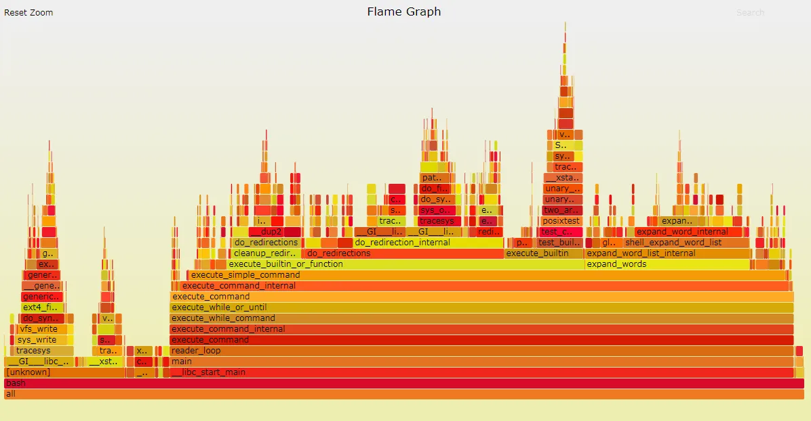
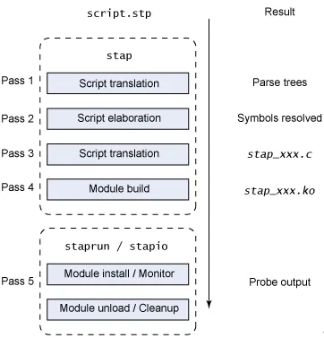
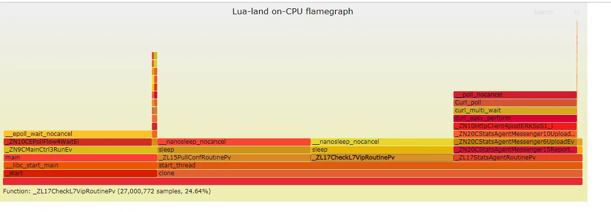

# 性能调优入门：使用火焰图和 systemtap 定位性能问题

> 非常详尽的火焰图入门使用经验，穿插了一些原理机制，不论是学会如何使用火焰图定位性能问题或者是增进对 systemtap 的理解都有一定益处

让我们回想一下过去还是编程新手的我们一般是如何调试程序的：通常是在没有数据的情况下依靠主观臆断来瞎蒙，稍微有些经验的则会对差异代码二分或者逐段调试，而不是考虑问题到底是什么引起的！毫无疑问，调优程序性能问题的时候，也像医生给疑难杂症病人看病一样，需要先有一定诊断思路，其次需要有各种诊断工具（比如 X 光片、听诊器等），最后根据诊断信息对症下药。性能调优工具（比如 perf / gprof 等）之于性能调优就像 X 光之于病人一样，它可以一针见血的指出程序的性能瓶颈。

但是常用的性能调优工具 perf 等呈现内容，一般只能列出单一的调用栈或者非层次化的时间分布，不够直观。如何将性能分析工具 perf 等采集的数据更加直观的展现呢？这里便需要使用火焰图。

## 初识火焰图

火焰图（Flame Graph）是由 Linux 性能优化大师 Brendan Gregg 发明的，和所有其他的 profiling 方法不同的是，火焰图以一个全局的视野来看待时间分布，它从底部往顶部，列出所有可能的调用栈。



火焰图整个图形看起来就像一个跳动的火焰，这就是它名字的由来。

火焰图有以下特征（这里以 on-cpu 火焰图为例）：

- 每一列代表一个调用栈，每一个格子代表一个函数
- 纵轴展示了栈的深度，按照调用关系从下到上排列。最顶上格子代表采样时，正在占用 cpu 的函数
- 横轴代表整个采样范围，但需要注意其并不代表时间，火焰图将采集的多个调用栈等信息通过按字母横向排序的方式将众多信息聚合在一起
- 横轴格子的宽度代表其在采样中出现频率，所以一个格子的宽度越大越说明其可能是瓶颈
- 火焰图格子的颜色是随机的暖色调，方便区分各个调用信息
- 其他的采样方式也可以使用火焰图， on-cpu 火焰图横轴是指 cpu 占用时间，off-cpu 火焰图横轴则代表阻塞时间。
- 采样可以是单线程、多线程、多进程甚至是多 host，进阶用法可以参考进阶阅读

### 火焰图类型

常见的火焰图类型有 On-CPU，Off-CPU，还有 Memory，Hot/Cold，Differential 等等。他们分别能解决什么样的问题呢？

这里笔者主要使用到的是 On-CPU、Off-CPU 以及 Memory 火焰图，所以这里仅仅对这三种火焰图作比较，也欢迎大家补充和斧正。

|火焰图类型|横轴含义|纵轴含义|解决问题|采样方式|
|-|-|-|-|-|
|cpu 火焰图|cpu占用时间|调用栈|找出 cpu 占用高的问题函数；分析代码热路径|固定频率采样 cpu 调用栈|
|off-cpu 火焰图|阻塞时间|调用栈|i/o、网络等阻塞场景导致的性能下降；锁竞争、死锁导致的性能下降问题|固定频率采样阻塞事件调用栈|
|内存火焰图|内存申请/释放函数调用次数|调用栈|内存泄露问题；内存占用高的对象/申请内存多的函数；虚拟内存或物理内存泄露问题|有四种方式： 跟踪malloc/free；跟踪brk；跟踪mmap；跟踪页错误|

### 火焰图分析技巧

- 纵轴代表调用栈的深度（栈桢数），用于表示函数间调用关系：下面的函数是上面的函数的父函数。
- 横轴代表消耗的时间，一个格子的宽度越大越说明其可能是瓶颈。
- 不同类型火焰图适合优化的问题不同，比如 on-cpu 火焰图解决 cpu 计算消耗，off-cpu 火焰图解决阻塞和锁抢占等问题。
- 无意义的事情：横向先后顺序是为了聚合，跟函数间依赖或调用关系无关；火焰图各种颜色是为方便区分，本身不具有特殊含义
- 多练习：进行性能优化有意识的使用火焰图的方式进行性能调优（如果时间充裕）

## 如何绘制火焰图？

要生成火焰图，必须要有一个顺手的动态追踪工具，如果操作系统是 Linux 的话，那么选择通常是 perf 或者 systemtap 中的一种。其中 perf 相对更常用，多数 Linux 都包含了它，SystemTap 则功能更为强大，监控也更为灵活。

## perf 绘制火焰图

```shell
git clone https://github.com/brendangregg/FlameGraph.git
# 使用 dwarf 方式追踪调用栈，追踪 2 s
perf record --call-graph dwarf -p PID -- sleep 2
perf script | FlameGraph/stackcollapse-perf.pl | FlameGraph/flamegraph.pl > out.svg
```

## SystemTap 绘制火焰图

SystemTap 是动态追踪工具，它通过探针机制，来采集内核或者应用程序的运行信息，从而可以不用修改内核和应用程序的代码，就获得丰富的信息，帮你分析、定位想要排查的问题。SystemTap 定义了一种类似的 DSL 脚本语言，方便用户根据需要自由扩展。不过，不同于动态追踪的鼻祖 DTrace ，SystemTap 并没有常驻内核的运行时，它需要先把脚本编译为内核模块，然后再插入到内核中执行。这也导致 SystemTap 启动比较缓慢，并且依赖于完整的调试符号表。

使用 SystemTap 绘制火焰图的主要流程如下：

- 安装 SystemTap 以及 操作系统符号调试表
- 根据自己所需绘制的火焰图类型以及进程类型选择合适的脚本
- 生成内核模块
- 运行 SystemTap 或者运行生成的内核模块统计数据
- 将统计数据转换成火焰图

### 安装 SystemTap 以及 操作系统符号调试表

[SystemTap官方文档](https://sourceware.org/systemtap/SystemTap_Beginners_Guide.pdf)

使用 yum 工具安装 systemtap:

```shell
yum install systemtap systemtap-runtime -y
# 依赖
yum install kernel kernel-devel kernel-debuginfo -y

# systemtap提供的依赖安装脚本，但不一定能成功
stap-prep
```

stap-prep 后报错，原因是相关的包没有找到

```text
package kernel-debuginfo-4.18.0-193.28.1.el8_2.x86_64 is not installed
```

由于 systemtap 工具依赖于完整的调试符号表，而且生产环境不同机器的内核版本不同（虽然都是CentOS 7/8版本，但是内核版本后面的小版本不一样，可以通过 uname -a 命令查看）所以我们还需要安装 kernel-debuginfo 包、 kernel-devel 包

各个包的作用：

- kernel-modules-extra - 包含用于默认禁用加载的个别硬件和模块的内核模块。
- kernel-debug - 包含内核诊断启用大量调试选项的内核，但牺牲了性能降低。
- kernel-tools - 包含用于操作 Linux 内核和支持文档的工具。
- kernel-devel - 包含内核标头和 makefile，以根据 kernel 软件包构建模块。
- kernel-abi-stablelists - 包含与 RHEL 内核 ABI 相关的信息，包括外部 Linux 内核模块和 yum 插件辅助功能所需的内核符号列表。
- kernel-headers - 包含 C 标头文件，用于指定 Linux 内核与用户空间库和程序之间的接口。头文件定义了构建大多数标准程序所需的常量结构和常量。

centos8下载地址：

- [kernel-debuginfo](http://debuginfo.centos.org/8/x86_64/Packages/)
- [kernel-devel](https://centos.pkgs.org/8/centos-baseos-x86_64/)

我这里是安装了这两个依赖包，kernel-devel和kernel使用yum安装成功了

```text
# kernel-debuginfo需要依赖kernel-debuginfo-common
rpm -i kernel-debuginfo-common-x86_64-4.18.0-193.28.1.el8_2.x86_64.rpm
rpm -i kernel-debuginfo-4.18.0-193.28.1.el8_2.x86_64.rpm
```

#### 验证

```shell
$ stap -v -e 'probe kernel.function("vfs_read") {printf("read performed\n"); exit()}'
Pass 1: parsed user script and 481 library scripts using 239372virt/81300res/12372shr/68484data kb, in 200usr/40sys/240real ms.
Pass 2: analyzed script: 2 probes, 1 function, 0 embeds, 0 globals using 293888virt/136700res/13424shr/123000data kb, in 1250usr/30sys/1285real ms.
Pass 3: translated to C into "/tmp/stapxcfbN4/stap_0bb1e08cd5081875b7dd4e04d3b7cb3d_1398_src.c" using 293888virt/136956res/13680shr/123000data kb, in 0usr/0sys/7real ms.
Pass 4: compiled C into "stap_0bb1e08cd5081875b7dd4e04d3b7cb3d_1398.ko" in 15220usr/2740sys/18646real ms.
Pass 5: starting run.
read performed
Pass 5: run completed in 20usr/30sys/393real ms.
```

同时再执行 stap-prep 也不报错了

### 根据自己所需绘制的火焰图类型以及进程类型选择合适的脚本

使用 SystemTap 统计相关数据往往需要自己依照它的语法，编写脚本，具有一定门槛。幸运的是，github 上春哥（agentzh）开源了两组他常用的 SystemTap 脚本：[openresty-systemtap-toolkit](https://github.com/openresty/openresty-systemtap-toolkit) 和 [stapxx](https://github.com/openresty/stapxx)，这两个工具集能够覆盖大部分 C 进程、nginx 进程以及 Openresty 进程的性能问题场景。

我们这里需要绘制 off-cpu 火焰图，所以使用 sample-bt-off-cpu 脚本即可

### 生成内核模块

现在我们有了统计脚本，也安装好了 systemtap，应该就可以使用了

Systemtap 执行流程如下：



- parse：分析脚本语法
- elaborate：展开脚本 中定义的探针和连接预定义脚本库，分析内核和内核模块的调试信息
- translate：将脚本编译成c语言内核模块文件放 在$HOME/xxx.c 缓存起来，- 避免同一脚本多次编译
- build：将c语言模块文件编译成.ko的内核模块，也缓存起来。
- 把模块交给staprun，staprun加载内核模块到内核空间,stapio连接内核模块和用户空间，提供交互IO通道,采集数据。

运行脚本，会生成一个内核模块

```shell
# -p 8682 是需要监控的进程的进程号
# -t 30 是指会采样30秒
./sample-bt-off-cpu -p 8692 -t 30
```

生成的内核模块名称形如 stap_xxxxx.ko

### 运行内核模块统计数据

内核模块签名完成后，便可以使用 `staprun` 命令手工运行相关内核模块了

命令：

```shell
staprun -x {进程号} {内核模块名} > demo.bt
# 值得注意的是，监控的进程要有一定负载 systemtap 才可以采集到相关数据，即在采集时，同时需要要有一定请求量（通常是自己构造请求，压测进程）
```

### 将统计数据转换成火焰图

获得了统计数据 demo.bt 后，便可以使用火焰图工具绘制火焰图了

下载 FlameGraph，链接：[FlameGraph](https://github.com/brendangregg/FlameGraph)

命令：

```shell
./stackcollapse-stap.pl demo.bt > demo.folded
./flamegraph.pl demo.folded > demo.svg
```

这样便获得了 off-cpu 火焰图



## 看图说话

趁热打铁，通过几张火焰图熟悉下如何使用火焰图

图片来自于春哥微博或者个人近期定位的问题

### on-cpu 火焰图

#### Apache APISIX QPS急剧下降问题


Apache APISIX 是一个开源国产的高性能 api 网关，之前在进行选型压测时，发现当 route 匹配不中场景下， qps 急剧下降，在十六核 cpu 打满的情况下只有几千 qps，通过绘制火焰图发现，其主要耗时在一个 table 插入阶段(lj_cf_table_insert)，分析代码发现是该 table 一直没有释放，每次匹配不中路由会插入数据，导致表越来越大，后续插入耗时过长导致 qps 下降。

### off-cpu 火焰图

#### nginx 互斥锁问题


这是一张 nginx 的 off-cpu 火焰图，我们可以很快锁定到 ngx_common_set_cache_fs_size -> ngx_shmtx_lock -> sem_wait 这段逻辑使用到了互斥锁，它让 nginx 进程绝大部分阻塞等待时间花费在获取该锁。

#### agent 监控上报断点问题


这是一张 agent 的 off-cpu 火焰图，它是一个多线程异步事件模型，主线程处理各个消息，多个线程分别负责配置下发或者监控上报的职责。当前问题出现在监控上报性能差，无法在周期（一分钟）内完成监控数据上报，导致监控断点，通过 off-cpu 火焰图我们可以分析出，该上报线程花费了大量的时间使用 curl_easy_perform 接口收发 http 监控数据消息中。

依据火焰图将发送 http 消息的逻辑改为异步非阻塞后，该问题解决。

## 进阶阅读

谷歌搜索演讲：Blazing Performance with Flame Graphs
演讲 ppt：[blazing-performance-with-flame-graphs](https://www.slideshare.net/brendangregg/blazing-performance-with-flame-graphs)

## FAQ

### 使用 perf 或者 systemtap 的方式采集数据，会对后台服务有性能影响吗？

有，但是很小，可以基本忽略不计。

它们使用系统的探针或者使用一些自定义的动态探针进行数据采集，第一对代码无侵入性，它既不需要停止服务，也不需要修改应用程序的代码；第二，它们是以内核模块/内核原生的方式跟踪用户态和内核态的所有事件，并通过一系列优化措施，进行采样统计，对目标服务性能影响极小，大概在5%左右或者更低的性能损耗。相较于 gdb 这种静态调试或者 valgrind 等将进程运行在沙箱来说，动态追踪 perf 或者 systemtap 或者 ebpf 的性能损耗基本可以忽略不计。

### 目标进程重启后，systemtap 是否需要重新生成内核模块？

不需要。甚至同一个 linux 内核版本下的同一个二进制进程（md5值一致），在安装 kernel 调试符号表后，就可以一次生成内核模块，多次使用了。

当 linux 内核版本不一致，符号表有变化，需要重新生成内核模块；当目标进程二进制文件重新编译后，也需要重新生成统计用的 systemtap 内核模块。

## 部分使用问题记录

### 如何在容器中绘制火焰图？

如果是on-cpu火焰图可以直接使用perf record命令绘制即可

如果是off-cpu之类的火焰图，则需要另外分析

若系统/容器支持ebpf可以使用bcc工具集，使用如下命令绘制off-cpu火焰图

```shell
/usr/share/bcc/tools/offcputime -df -p `pgrep -nx mysqld` 30 > out.stacks
```
