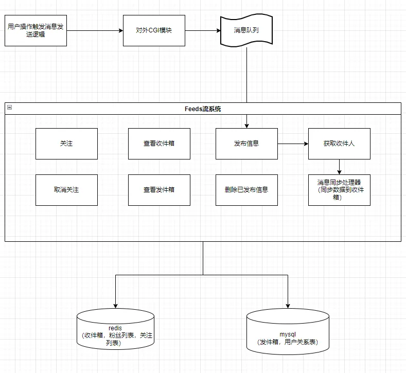
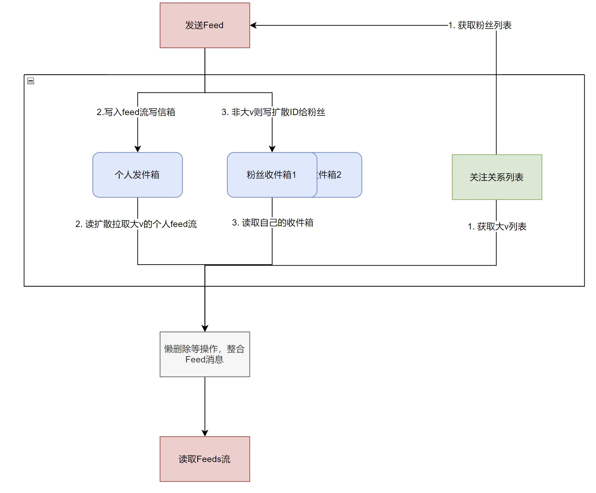

# 如何开发一个Feeds流系统——写扩散模式

> 抖音的猜你喜欢，微博的关注动态，知乎的热搜榜单。。。。。。上述我们生活中常见的应用其实都是Feeds流场景。本文主要针对Feeds流进行介绍，将从Feeds流的演变入手，带你一步步了解Feeds流，而后学习如何从开发角度入手，对其进行建模，抽象出Feeds流常见的架构，最终搭建高可用、高扩展、高性能的Feeds流应用。

## 了解Feeds流

在学习如何开发 `Feeds` 流应用前，我们需要先了解什么是 `Feeds` 流。

### 什么是Feeds流

`Feeds` 流是一个持续更新并展示给用户的信息流。它将用户主动订阅的若干消息源组合在一起形成内容聚合器，帮助用户持续地获取最新的订阅源内容。所以它通常具有千人千面的个性化特点。 举例来说，我们在各类手机 `App` 中能看到的猜你喜欢，你的关注和好友动态等功能，都是 `Feeds` 流的一种表现形式。某种意义上来说，你可以一直向下滑动，而后获取到信息的应用，都是属于 `Feeds` 流。

### 为什么会有Feeds流

了解了什么是 `Feeds` 流后，我们可以从产品角度思考一下，为什么会有 `Feeds` 流。

我们可以和传统的信息获取渠道，电视，报纸，杂志进行对比。以前我们获取的信息，通常是主动前往某个信息聚合的渠道，如：电视的新闻台，去买一份报纸，订购一本杂志。而后，我们从中大量阅读，然后才能获取到我们感兴趣的信息。上述流程我们可以知道，我们想要获取丰富的信息可不容易。

所以，这就有了 `Feeds` 流的出现了，它的主要作用是：**信息聚合**。也就是**它可以根据你的行为去聚合你想要的信息，然后再将它们以轻松易得的方式提供给你**。这个方式就是信息流的方式，你只需要不断的滑动，就可以再各种信息中穿梭，而不需要自己去寻找，被动接收信息。当然，仅仅是流的方式还不以让它成为现今主流的新闻媒体传播途径。因为传统的电视节目，当你不感兴趣的时候，你也可以换台进行切换，也是一种简单易得，可自由选择的方式。`Feeds` 最核心的能力在于聚合。他会根据你的行为聚合出你想要的信息，例如：微博是通过你的关注列表了解你可能想要的信息源，而后以时间轴的形式聚合各种信息推给你。后来又出现了抖音的猜你喜欢，它不需要你的手动关注，而是根据你的阅览时长，点赞等信息生成你的用户画像，从而聚合你可能感兴趣的信息。朋友圈的 `Feeds` 流则是根据你的好友关系，从而聚合了你可能想要的信息。

正是有了这种丰富多彩的信息聚合能力，用户在使用 `Feeds` 流获取信息的时候，就容易获得他们感兴趣的内容。从而有一个很好的使用体验。

### Feeds流的分类

上面提到了几种 `Feeds` 流的应用场景，有：微信朋友圈，微博的关注页，抖音的推荐页。这几个例子其实信息聚合的角度都不相同，为此，我们可以对 `Feeds` 流进行分类，了解不同类型的 `Feeds` 流，才知道开发过程中，如何针对不同的应用场景，去设计最合适的架构，实现 `Feeds` 流功能。

首先，我们可以从Feeds流的信息源聚合依据进行分类，关系有三种：

||||
|-|-|-|
|推荐逻辑|无需依赖关系|抖音推荐页|
|推荐逻辑|单向依赖关系|微博关注页|
|推荐逻辑|双向依赖关系|微信朋友圈|

从上图我们可以知道，抖音推荐页可以从你的操作行为中生成你的用户画像，再去匹配聚合信息。而微博则是单向依赖关系，即：我关注了某个大v，就可以获取他发布的信息。这里的信息聚合依据是单向的关注关系。而微信朋友圈则是双向关系，需要两个人互相通过好友，才会聚合对方的信息到自己的朋友圈中。

三种聚合逻辑，分别适用于信息探测，信息订阅和熟人社交场景中，各有各的优点。

而除了从信息源聚合依据出发进行分类以外，也可以从 `Feed` 流本身的**展示逻辑**出发进行分类，关系有两类：

||||
|-|-|-|
|展示逻辑|权重推荐|抖音推荐页|
|展示逻辑|时间顺序展示,又叫timeline|微信朋友圈,微博关注页|

注意：微博热榜很多人也算成了 `Feeds` 流，但是严格意义上来说，他是一个信息流。所有人看到的热榜数据都是一样的，这缺失了信息聚合的特征。所以，本质上热榜的底层模型应该是排行榜，而非 `feeds` 流。这里不将它归为一类。

两个分类是从两个维度对 `Feeds` 流进行的划分，但是，不管是什么维度的分类，都是为了更好的贴近业务特点，进行建模开发。

|信息源选择依据\排序依据|权重推荐|时间顺序|
|-|-|-|
|无需依赖关系(无强依赖关系)|抖音推荐页|-|
|单向依赖关系(关注)|-|微博关注页|
|双向依赖关系(好友)|-|微信朋友圈|

实际上，上述表格又可以进一步总结为两类：

|分类|应用场景|
|-|-|
|依据隐含兴趣推荐信息,按权重排序展示的feeds流|抖音推荐页|
|依据用户关系拉取信息,按时间顺序展示的feeds流|微博关注页、微信朋友圈|

### 了解Feeds流的前世今生

通过上面的介绍，想必你对 `Feeds` 流已经有了一定的了解。那么再说一下它的前身。

`Feeds` 流其实不是一开始就是这种形式。它起源于 `RSS` 系统。`RSS` 翻译过来就是简易信息聚合，它将用户主动订阅的若干消息源组合在一起形成内容（`aggregator`），帮助用户持续地获取最新的订阅源内容。对用户而言，聚合器是专门用来订阅网站的软件，一般称为 `RSS` 阅读器、`Feed` 阅读器等。用户选择订阅多个订阅源，网站提供 `Feed` 网址 ，用户将 `Feed` 网址登记到聚合器里，在聚合器里形成聚合页，用户便能持续地获取最新的订阅源内容。整个交互流程简而言之是：用户主动订阅感兴趣的多个订阅源，订阅器帮用户及时更新订阅源信息，然后按照 `timeline` 时间顺序展示出来。这样，用户可以通过订阅器获取即时信息，而不用每天都检查各个订阅源是否有更新。

可以看出，上述方式很像是在订购杂志，杂志一旦更新，就会寄到家中。但是那时候的的 `RSS` 系统，能订阅的只是新闻网站以及博客。直到后来，`Facebook` 宣布了一项新的首页形式「News Feed」，这一形式打破了传统 `RSS` 的订阅方式。`News Feed` 可以看做一个新型聚合器：订阅源由某个新闻网站变成了生产内容的人或者团体，而内容由网站输出的公告新闻，变成了好友（关注对象）的动态（发布的内容以及其他的社交行为）。这样一来，内容丰富程度直线提高，内容发布者和订阅者也由：人和网站变成了人和人，社交距离大大拉近。很快，这种信息获取模式就普及起来了。从此以后，`RSS` 被迫淡出历史舞台。

### Feeds流模型中的术语

|名称|说明|备注|
|-|-|-|
|Feed|Feed流中的每一条状态或者消息都是Feed，比如朋友圈中的一个状态就是一个Feed，微博中的一条微博就是一个Feed。|-|
|Feeds流|Feed流本质上是数据流，核心逻辑是服务端系统将 “多个发布者的信息内容” 通过 “关注收藏屏蔽等关系” 推送给 “多个接收者”。常见的，比如微博上的超话，新版本的微信公众号订阅消息，抖音里的视频流等等|三大特点：少部分人发布；基于订阅行为关联关系；大多数人读取信息|
|Timeline|Timeline其实是一种Feed流的类型，微博，朋友圈都是Timeline类型的Feed流，但是由于Timeline类型出现最早，使用最广泛，最为人熟知，有时候也用Timeline来表示Feed流。|又叫时间轴|
|关注页Timeline|展示其他人Feed消息的页面，比如朋友圈，微博的首页等。|又叫做收件箱，每个用户能看到的消息都会被存储到收件箱中|
|个人页Timeline|展示自己发送过的Feed消息的页面，比如微信中的相册，微博的个人页等|又叫做发件箱，自己发布的消息都会被记录到自己的发件箱中。别人的收件箱内的消息，也是从他的各个关注人的发件箱内同步过来的。|
|写扩散|一种消息同步方式，用户发布消息后，消息被记录到用户的发件箱中，此时立刻将发件箱内的消息同步给所有用户。|又叫做推模式|
|读扩散|一种消息同步方式，用户发布消息后，消息被记录到用户的发件箱中。而消息的接收方此时没有收到消息。等到消息接收方需要查看收件箱的时候，才会去接收方关注的所有关注人发件箱中拉取消息，完成消息同步。|又叫做拉模式|

## 了解Feeds流模型的架构

通过上面的介绍，想必你对于将要开发的 `Feeds` 流是什么已经足够了解了。那么，接下来我们从开发的角度切入，再次学习 `Feeds` 流。

我们已经知道了 `Feeds` 流可以分为两大类：基于兴趣推荐，和基于用户关系拉取。两种模式的 `Feeds` 流底层的原理差别很大，所以要分别进行介绍。先介绍第一种：基于用户关系拉取的 `Feeds` 流。

### 依赖用户关系的时间顺序Feeds流

第一类Feeds流是依赖用户关系的，按时间顺序进行整合展示的 `Feeds` 流。在开发这个模型前，我们需要先了解这个模型主要面对的挑战在哪儿。

#### Feeds流模型面临的挑战

1. Feed是一种实时消息，由于消息是实时产生，实时消费，实时推送的，因此满足实时性是关键。（性能要求高）
2. 消息来自于很多不同的消息源，消息的产生属于海量级别。（存储要求大）
3. 性能考虑：从消息产生到消息消费产生巨大的读写比。（读写失衡模型，时间排序）
4. 消息发布出去后，要求用户能够感知，起码满足最终一致性，不可以出现消息丢失。（原子性）

#### Feeds流模型需要的基本功能

了解了 `Feeds` 流的面对的挑战后，我们先不着急去处理问题，而是进入具体的功能中去分析 `Feeds` 流模型需要开发的功能。包括如下：

1. 用户发布消息：用户可以发布一条消息，他的订阅者都能感知到他发布了消息；（不仅是消息确保推送出去，而且要有红点提示）
2. 用户删除发布的消息：用户可以删除一条已经发布的消息，他的订阅者都能实时感知到这条消息被删除了；
3. 用户查看自己发布的消息：用户查看自己已经发布的所有消息；
4. 用户订阅消息源：用户可以订阅感兴趣的人，关注的博主以后发送的消息都可以在用户的 `feeds` 流中查看到。需要注意的是，有的场景中要求用户 `Feeds` 流中能看到博主在被关注之前发的消息，这就要求订阅的时候，还要主动同步一份博主的所有消息到用户的 `Feeds` 流中。
5. 用户取消消息源订阅：用户可以取消已经订阅的人，取关后，`Feeds` 流中关于他的所有消息要除去。
6. 用户查看订阅的消息流（`Feeds`流）：用户可以以 `timeline` 的形式查看所有订阅的消息源发布的消息。消息的删除和更新，都会实时被用户感知到。`Feeds` 流的翻页问题：用户翻页 `Feeds` 流的时候，不管 `Feeds` 流更新了多少内容，此时都是沿着最后一次看到的信息往下看。`Feeds` 流前面的信息被删改不予理会。
7. 额外功能：消息支持配置黑白名单，进行细粒度可见权限控制
8. 可扩展功能：信息可以支持被评论，评论本身也有增删改查

#### 面临问题和解决方案

了解了上述 `Feeds` 流需要开发的基本功能，我们进一步对功能实现中可能遇到的问题进行分析，并且给出处理方案：

##### 发布者发布消息后，订阅者如何读取消息？

1. 这里一般有三种方案：读扩散，写扩散和读写结合。
   - 读扩散：订阅者读取最新收件箱消息的时候，订阅者主动去查询关注的人的发件箱，遍历所有的人，获取所有的消息，然后更新到自己的收件箱中。
   - 写扩散：发布者发布消息后，立刻将自己的消息同步给他所有的粉丝的收件箱中
   - 读写结合：由于 `Feeds` 流是读多写少的场景，所以一般情况下，我们采用写扩散，系统的性能会比读扩散要好。但是，当有大v发布者出现时，他每次发布消息，可能消息需要同步给1亿用户，这样写扩散的性能会被严重影响到。所以，在大v用户上，采用读写结合的方式进行处理。具体来说就是：大v用户发布消息，消息写扩散到活跃用户收件箱。而不活跃用户在登录的时候，会去主动拉取大v用户的发件箱，完成自身收件箱的更新。
2. 由于 `Feeds` 流模型是一种读多写少的场景，所以一般采用写扩散更好。
3. 当出现大v的时候，写扩散也太慢了，则采用冷热分离方案。热粉丝则写扩散同步，冷粉丝（僵尸粉）则读扩散。冷热粉丝可以记录登录次数，时长进行分类。也可以采用 `session` 池方案，判断在线的粉丝才进行写扩散。

##### Feeds流是怎么翻页的？

1. `Feeds` 流是一个动态列表，每时每刻都可能在更新，所以传统的使用 `page_size` 和 `page_num` 来分页就不能满足使用了。因为但凡两页之间出现内容的添加或删除，都会导致错位问题。
   - `Feeds` 流的分页入参不会使用 `page_size` 和 `page_num`，而是使用 `last_id` 来记录上一页最后一条内容的`id`。前端读取下一页的时候，必须将 `last_id` 作为入参，后台直接找到 `last_id` 对应数据，再往后偏移 `page_size` 条数据，返回给前端，这样就避免了错位问题。注意：采用该 `last_id` 方式要求数据不能被删除，否则前端持有这个 `id`，就又可能找不到对应的记录。为此，删除都采用标志位表示删除。当拉出的数据存在删除的时候，进行再次查询补充。
2. 写扩散下的翻页：由于用户收件箱是提前排序准备好的，所以 `last_id` 直接往后读取即可。
3. 读扩散下的翻页：由于读扩散下，用户的收件箱是实时计算出来的，他翻页的时候，需要去所有关注人的发件箱中拉取一定量的数据。拉取后，需要记录当前拉取到了写信箱的 `write_last_id`，多少个关注就要记录了多少个 `write_last_id`。而后翻页的时候，需要用这些 `write_last_id` 往后拉取新的一定量（比如 `page_size` 个）的数据。再用这些数据组成的新收件箱列表，筛选 `page_size` 条返回前端。同时，还需要更新他实际拉取了消息的写信箱中的 `write_last_id`，并且存储。当下一次翻页的时候，这批 `write_last_id` 将作为下次的翻页时定位的依据。
4. 对比下来看得出：读扩散的翻页比写扩散复杂很多。

##### 写扩散模式下的删除

写扩散模式下，用户发布消息可以慢慢扩散出去，但是删除，修改都要扩散出去，速度过慢会出现时效性问题。而且，如果真的是删除了数据，可能会影响Feeds流的分页功能（第二点已经介绍）。这种情况怎么处理？

1. 采用软删除+懒删除机制
   - 软删除是指：消息内容不进行实际删除，而是将消息置为删除状态即可，不扩散出去。如此一来，用户在自己的读取收件箱中消息的时候，是先获取了消息Id后，再去数据库查出消息内容，而后判断状态进行过滤，把已经删除的状态剔除，不返回给前端。此时也需要重新进行捞数据，填充分页内容。
   - 懒删除是指：如果过滤了某个消息，此时才把消息从用户收件箱中真正删除。（redis的zset中的对应id进行剔除，完成Feeds流表的刷新）
2. 软删除和懒删除的具体实现如下：采用读扩散回查方案。
   - 本次需求，我们的写扩散只写了一个消息id到用户的收件箱中，所以，用户查询收件箱信息的时候，要进行一个回查将信息丰富（该方案相比直接把内容一起写入收件箱内会更加节约内存，减少冗余数据，同时消息删除无需扩散）。

##### 用户的收件箱刷新时机问题

用户收件箱是消息同步库，缓存的只是消息id而已，所以可以全量存储所有的关注人发布信息的id。但是，消息同步库内的消息实际上变化很大，如果全部采用写扩散方式，则会导致实时性问题很大。所以对不同的触发刷新操作，我们需要进行不同处理，各操作如下：

- 关注他人时，用户的收件箱是否需要触发刷新：当用户关注了另一个用户后，他的收件箱需要获取到关注用户的发件箱内所有消息，然后刷新自己的收件箱。（写扩散）
- 取消关注他人时，用户的收件箱如何刷新：取消关注由于也是一个低频操作，所以在取消的时候，也是采用写扩散的方式。可以异步将用户的 `feeds` 流整体刷新一次，将被取消关注者的 `feed` 剔除。(写扩散)
- 关注人删除或者修改自己消息时，用户的收件箱如何刷新：这里也可以采用回查的方式：由于我们收件箱只存储 `id`，消息内容需要回查发件人发件箱的具体消息，所以，回查的时候可以获取最新消息以此完成删除、修改的同步。
- 总结：收件箱刷新有两类，一类是关注人变更，此时采用写扩散；一类是消息的删除和修改变更，此时依赖回查，采用读扩散。

上述就是我们 `Feeds` 流模型会遇到的问题，已经给出的一个解决方案。当然，不同的业务场景会遇到不同的侧重点，上述方案仅仅是一个参考。

## 总体设计

### 架构设计

上面我们 `Feeds` 流的底层模型进行了详细的分析，综合考虑后，本次开发决定采用以下架构进行开发系统。

上图可以看出是一个消息发布的流程交互，通过经过的节点看出我们系统的一个架构。虽然前文讨论了很多问题，但其实底层落到 `DB` 就是几个表，每个表进行良好的设计后，就可以满足我们的基础的性能要求了。而后是我们的系统内部，核心难点是发布和拉取 `Feeds` 流两个功能。对这些问题，下面我们也会具体分点介绍设计。

#### 数据结构设计

数据结构设计说明： 本次系统以面向对象思维进行开发，对 `Feeds` 流中需要的功能进行抽象，抽象了以下数据结构（简略版本）：

1. 消息
   - 属性：消息标题，消息内容，消息附件，消息类型，消息渠道。。。
   - 方法：丰富消息内容
2. 消息发布处理器
   - 属性：发送用户，发布配置，消息id。。。
   - 方法：获取消息id，获取接受者，获取发布配置，同步消息，保存消息
3. 用户（消息拉取器）
   - 属性：用户uid，用户当前操作，用户当前页面渠道
   - 方法：获取关注列表，获取粉丝列表，查询发件箱，查询收件箱（收件箱过滤，包括黑白名单，软删除等）
4. 发布配置
   - 属性：发布渠道，发布方式
   - 方法：获取发布方式，获取发布渠道

#### 存储和缓存设计

实现消息推送逻辑，需要将信息进行存储，下面是存储表的设计：

- 消息表(消息发布表)

|字段名称|字段说明|备注|
|-|-|-|
|msg_id|消息id| |
|oper_type|操作类型|一般的feeds流系统可以没有这个字段，该字段是和下面的发布配置表结合，用作后续扩展为消息推送系统的时候用的|
|msg_title|消息标题| |
|msg_content|消息内容|存储json|
|msg_type|消息类型：文字，视频等|用于扩展|
|msg_status|消息状态：用于标记软删除|用于扩展|
|msg_channel|消息所属渠道|用于扩展，将来可以接入多个系统|
|extra_info|额外信息|存储json，用于扩展|
|sender_id|发布者| |
|ctime|发布时间| |
|utime|修改时间| |
|uuid|修改人| |

- 收件箱
  - 采用redis的zset进行存储，key是“接收者uid+channelid”，value为“值：发件人uid+消息id，score：发布时间戳” 。这样设计，可以将计算下沉，每次收件箱出现消息的刷新的时候，都会自行排序

- 发布配置表(一般的feeds流可以不考虑这个，我这是后期打算扩展做成消息推送系统，这里也可以提供给大家参考。)

|字段名称|字段说明|备注|
|-|-|-|
|send_id|发布id| |
|send_type|发布类型：立即发布，定时发布，周期发布| |
|send_crontab|发布规则|定时发布的时候存储crontab|
|send_msg_channel|发布渠道，如邮件，短信，站内信等|指定推送消息的渠道|
|channel|配置所属渠道|用于扩展，将来可以接入多个系统|
|send_rule|发布规则：确定在什么操作的时候，会触发发布|如：通过审核的时候，会推送消息；或者配置发布活动时，会触发推送|
|extra_info|额外信息|存储json，用于扩展|
|cuid|创建者| |
|ctime|创建时间| |
|utime|修改时间| |
|uuid|修改人| |

- 关注关系表

|字段名称|字段说明|备注|
|-|-|-|
|main_uid|博主uid| |
|follower_uid|粉丝uid| |
|status|两者状态，主要记录是否拉黑关系|扩展预留|
|hot_follower|该粉丝是否是热数据|当对大v采用冷热分离的时候，热粉丝如果单独存储，需要进行粉丝和热用户的大范围取交集。所以将每个人的粉丝关系进行标记，查询热数据的时候就可以避免取交集。粉丝冷热状态变更采用写扩散即可|
|extra_info|额外信息|存储json，用于扩展|
|cuid|创建者| |
|ctime|创建时间| |
|utime|修改时间| |
|uuid|修改人| |

#### 核心业务流程

##### 发布Feed流程

当你发布一条Feed消息的时候，流程是这样的：

- Feed消息先进入一个队列服务。
- 先从关注列表中读取到自己的粉丝列表，以及判断自己是否是大V。
- 将自己的Feed消息写入个人页Timeline（发件箱）。
- 如果是大V，此时拉取活跃用户；如果是普通用户，则拉取自己的所有粉丝用户。然后将自己的Feed消息同步写给自己的粉丝，同步的内容为Feed ID。
- 发布Feed的流程到此结束。

##### 读取Feed流流程

当刷新自己的Feed流的时候，流程是这样的：

- 读取自己关注的大V列表
- 去读取自己的收件箱，范围起始位置是上次读取到的最新Feed的ID，结束位置可以使当前时间，也可以是MAX。然后通过查询出来的FeesId反查Feeds内容，并且把已经软删除的数据剔除出去。
- 如果有拉取到关注的大V列表，则再次并发读取每一个大V的发件箱，如果关注了10个大V，那么则需要10次访问。
- 合并2和3步的结果，然后按时间排序，返回给用户。

至此，使用推拉结合，冷热分离方式的Feeds流发布，读取Feeds流的流程都结束了。

核心的发布Feed、拉取Feeds流的总体交互图如下：

## 总结

相信看了本文以后，对于如何实现一个较为可靠，性能相对有保证的Feeds流系统，你已经有了一定的了解。那么，本次Feeds流的小结到此为止，基于兴趣推荐的Feeds流等后续有时间再更新。

## 参考

- [Feeds流总述，绝顶!!](https://www.cnblogs.com/hanease/p/16268084.html)
- [朋友圈不知你看到的那么简单，千万Feed流系统的存储技术解密](https://www.likecs.com/show-203874463.html)
- [Feeds流架构简述](https://www.cnblogs.com/hanease/p/15906516.html)
- [feed流拉取，读扩散，究竟是啥？](https://javajgs.com/archives/27030)
- [朋友圈微博feed流，推拉实践](https://javajgs.com/archives/27028)
- [Feed 流设计: 如何对多态内容进行抽象？(这文章用状态机的思想+流水去思考Feeds流，也挺有意思的)](https://mednoter.com/design-of-feed-part-one.html)
- [Feeds流系统](http://www.manongjc.com/detail/23-azazcssschtbkgx.html)
- [Feed流系统设计-总纲：总结的也很nice](https://www.cnblogs.com/hanease/p/16268084.html)
- [简述了基于推荐的Feeds流](https://www.163.com/dy/article/EJ4EAIFM05376OPS.html)
- [知乎的Feeds流架构](https://www.modb.pro/db/145608)
