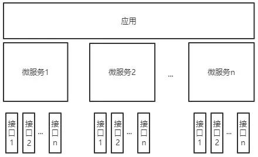
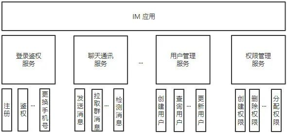

# 微服务接口设计原则

本文结合自身后台开发经验，从高可用、高性能、易维护和低风险（安全）角度出发，尝试总结业界常见微服务接口设计原则，帮助大家设计出优秀的微服务。

## 前言

微服务是一种系统架构风格，是 SOA（面向服务架构）的一种实践。微服务架构通过业务拆分实现服务组件化，通过组件组合快速开发系统，业务单一的服务组件又可以独立部署，使得整个系统变得清晰灵活：

- 原子服务
- 独立进程
- 隔离部署
- 去中心化服务治理

一个大型复杂的软件应用，都可以拆分成多个微服务。各个微服务可被独立部署，各个微服务之间是松耦合的。现如今后台服务大部分以微服务的形式存在，每个微服务负责实现应用的一个功能模块。而微服务由一个个接口组成，每个接口实现某个功能模块下的子功能。

以一个 IM 应用为例，它的功能架构可能是下面这样的：

所以如果是后台开发的同学，经常需要实现一个后台微服务来提供相应的能力，完成业务功能。

服务以接口形式提供服务。在实现服务时，我们要将一个大的功能拆分成一个个独立的子功能来实现，每一个子功能就是我们要在服务中实现的一个接口。

有时一个服务会有很多接口，每个接口所要实现的功能可能会有关联，那么这就非常考验设计服务接口的功底，让服务变得简单可靠。

业界已经有很多比较成熟的实践原则，可以帮助我们设计实现出一个可靠易维护的服务。

微服务设计原则并没有严格的规范，下面结合业界成熟的方法和个人多年后台开发经验，介绍高可用，高性能，易维护，低风险服务常用的设计原则。

## 高可用

## 参考

- [微服务接口设计原则](https://www.cnblogs.com/88223100/p/Microservice-Interface-Design-Principles.html)
