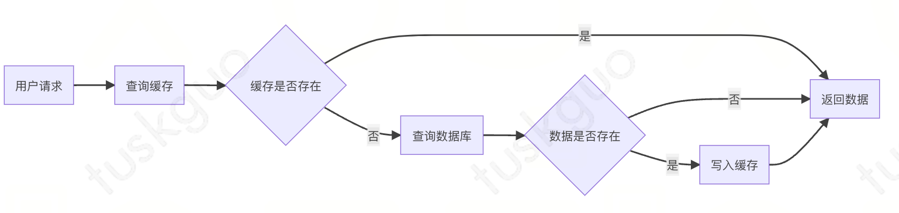
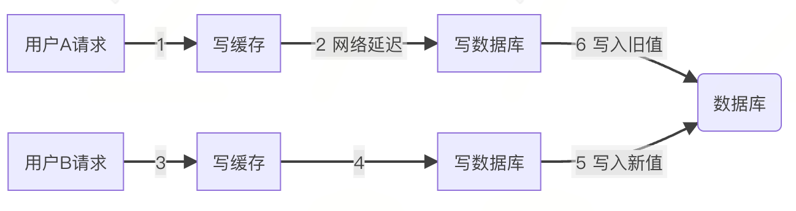
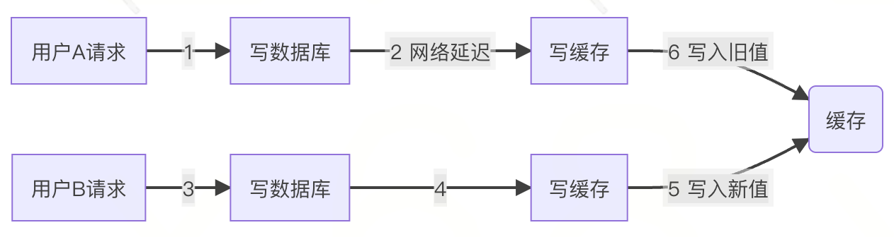
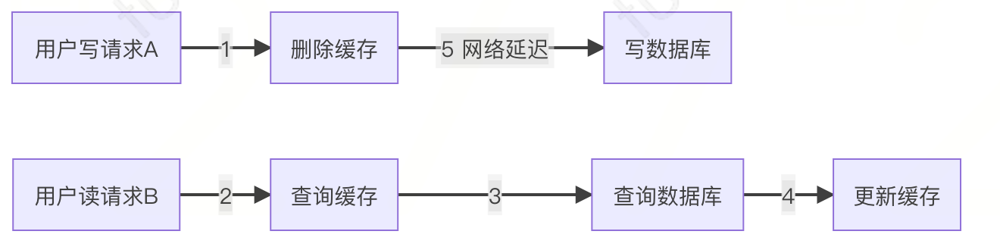
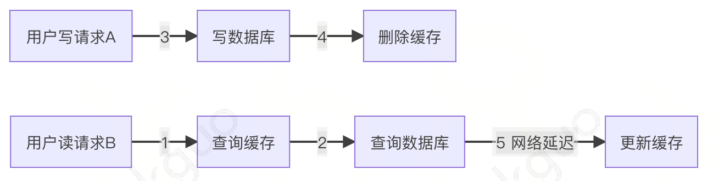

# 如何保证缓存和数据库双写一致性

缓存（比如：`redis`）和数据库（比如：`mysql`）双写数据一致性问题，是一个跟开发语言无关的公共问题，尤其在高并发的场景下，这个问题变得更加严重。今天这篇文章我会从浅入深，跟大家一起聊聊，缓存和数据库双写数据一致性问题常见的解决方案。

## 问题背景

通常情况下，我们使用缓存的主要目的是为了提升查询的性能。大多数情况下，我们是这样使用缓存的:

这个看起来没什么问题，但忽略了一个非常重要的细节：如果数据库中的某条数据，放入缓存后又立马被更新了，那该如何更新缓存呢？

## 解决方案

对于更新缓存的方案，很多人第一个想到的可能是在数据库更新操作中直接更新缓存。

那么问题来了：到底是先写缓存，还是先写数据库呢？ 目前有以下 `4` 种方案：

1. 先写缓存，再写数据库
2. 先写数据库，再写缓存
3. 先删缓存，再写数据库
4. 先写数据库，再删缓存

我们在这里先聊聊先写缓存，再写数据库的情况。

### 先写缓存，再写数据库

其中请求`A`是旧数据，而请求`B`是新数据

1. 请求`A`先过来，刚写完了缓存。但由于网络延迟，还没来得及写数据库。
2. 这时候，请求`B`过来了，先写了缓存。
3. 接下来，请求`B`顺利写了数据库。
4. 此时，请求`A`到达，也写了数据库。

在这个过程当中，请求`B`在数据库中的 `新数据` ，被请求`A`的 `旧数据` 覆盖了，出现了数据不一致的情况。

### 先写数据库，再写缓存

如果先写数据库，再写缓存呢。

其中请求`A`是旧数据，而请求`B`是新数据

1. 请求`A`先过来，刚写完了数据库。但由于网络延迟，还没来得及写缓存。
2. 这时候，请求`B`过来了，先写了数据库。
3. 接下来，请求`B`顺利写了缓存。
4. 此时，请求`A`到达，也写了缓存。

很显然，在这个过程当中，请求`B`在缓存中的 `新数据` ，被请求`A`的 `旧数据` 覆盖了，还是出现了数据不一致的情况。

### 先删缓存，再写数据库

通过上面的内容我们得知，如果直接更新缓存的问题很多。 那么，为何我们不能换一种思路：不去直接 `更新缓存` ，而改为 `删除缓存` 呢？ 删除缓存方案，同样有两种：

- 先删缓存，再写数据库
- 先写数据库，再删缓存

我们一起先看看：先删缓存，再写数据库的情况。

假设在高并发的场景中，同一个用户的同一条数据，有一个写数据请求`A`，还有另一个读数据请求`B`，如下图所示

1. 请求`A`先过来，把缓存删除了。但由于网络延迟，还没来得及写数据库。
2. 这时请求`B`过来了，先查缓存发现没数据，再查数据库，有数据，但是旧值。
3. 请求`B`将数据库中的旧值，更新到缓存中。
4. 请求`A`延迟结束，把新值写入数据库。

在这个过程当中也出现了数据不一致的问题。

### 先写数据库，再删缓存

从前面得知，先删缓存，再写数据库，在高并发的情况下，也可能会出现缓存和数据库的数据不一致的情况。

接下来，我们重点看看先写数据库，再删缓存的方案。

还是假设在高并发的场景中，同一个用户的同一条数据，有一个写数据请求`A`，还有另一个读数据请求`B`，如下图所示

1. 请求`B`先过来，查询缓存时缓存因为缓存 `缓存过期`不存在了，就去查询数据库，查询完成后，由于网络原因还没更新缓存。
2. 请求`A`写完数据库后删除了缓存。
3. 请求`B`更新缓存为旧值

从上面的情况分析，先更新数据库，再删除缓存也是会出现数据不一致性的问题，但是在实际中，这个问题出现的概率并不高。

`因为缓存的写入通常要远远快于数据库的写入`，所以在实际中很难出现请求A已经更新了数据库并且删除了缓存，请求B才更新完缓存的情况。

## 总结

综合看下来，方案`3`、`4`删除缓存是最适合的，但是如何解决数据不一致的问题呢？

那就是给加缓存过期时间，就是缓存过期后会重新更新缓存为最新的值，保证最终一致性。但是如果对实时性要求比较高可能就不适合了。

还有一个方法就是延时缓存双删，即在写数据库之前删除一次，写完数据库后再删除一次。这个间隔要根据实际需要设置，间隔太短的话读请求还没更新缓存，写请求就又删除缓存，这个删除就没有意义；间隔太长就会影响实时性。

其实`3`、`4`方案还存在一个共同的问题，就是删除缓存失败了怎么办呢？

那就还需要加 `重试机制` 。

如果删除缓存失败了，就立即重试，比如最多重试`3`次，如果重试`3`次都失败了，就需要写入数据库记录一下或者监控告警人工处理了。

当然如果直接在请求里直接 `同步重试`，在高并发场景中可能会影响性能，这时就需要改成 `异步重试`了。异步重试的方式有很多种，比如：

- 单独起一个进程或线程专门用来重试，但是如果程序异常退出可能会造成数据丢失。
- 把重试操作写入数据库，通过定时任务进行重试。
- 把重试操作写入消息队列，由消费者进行重试。
- 订阅`mysql`的`binlog`日志，在数据库更新请求中删除缓存。

综上，上面介绍了几种情况的具体问题和解决方案，那么实际工作中应该如何选择呢？ 一般情况下可以选择先写数据库，再删缓存的方式，因为这种方案出现问题的概率比较小。 但是如果是请求量比较大，并发很高的话；或者对数据一致性和实时性要求比较高的话，就需要引入异步重试、延时缓存双删等更多机制来保证了。
