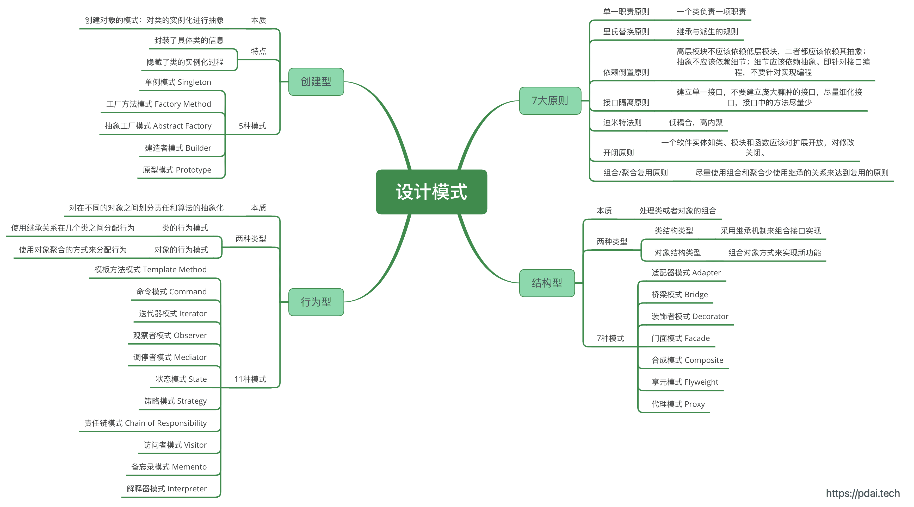
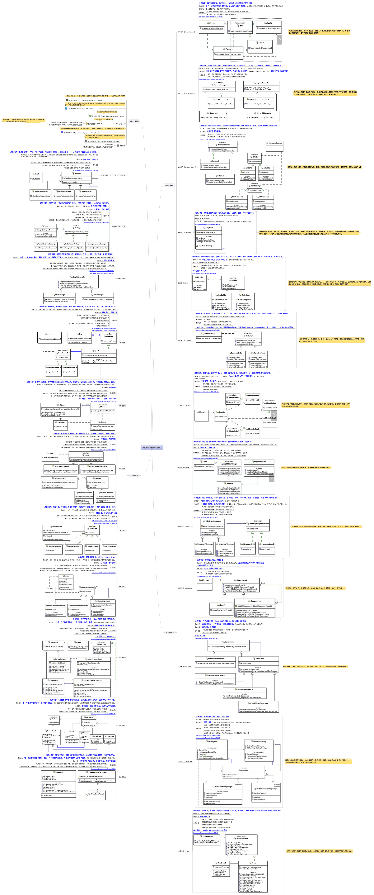

# 设计模式

## 设计模式原则

- 单一职责原则【SINGLE RESPONSIBILITY PRINCIPLE】: 一个类负责一项职责。一个软件实体，如类、模块和函数，有且仅有一个引起它变化的原因，同理，一个软件实体只负责一项职责
- 里氏替换原则【LISKOV SUBSTITUTION PRINCIPLE】: 继承与派生的规则。子类型必须能够替换掉它们的父类型
- 依赖倒置原则【DEPENDENCE INVERSION PRINCIPLE】
  - 要依赖于抽象，不要依赖于具体类
  - 高层模块不应该依赖低层模块，二者都应该依赖其抽象；
  - 抽象不应该依赖细节；细节应该依赖抽象。
  - 即针对接口编程，不要针对实现编程。
  - 底层模块接口应该是有高层提出的，由底层进行具体实现，也就是底层接口的所有权在高层模块，因此是一种所有权倒置
- 接口隔离原则【INTERFACE SEGREGATION PRINCIPLE】: 不应该强迫客户依赖于它们不用的方法。建立单一接口，不要建立庞大臃肿的接口，尽量细化接口，接口中的方法尽量少。
- 迪米特法则【LOW OF DEMETER】: 低耦合，高内聚。
- 开闭原则【OPEN CLOSE PRINCIPLE】
  - 一个软件实体如类、模块和函数应该对扩展开放，对修改关闭。
  - 关键在于合理的抽象，分离出变与不变的部分，为变的部分预留可扩展的方式
- 组合/聚合复用原则【Composition/Aggregation Reuse Principle(CARP) 】: 尽量使用组合和聚合少使用继承的关系来达到复用的原则。
- 最少知识原则【LKP，Least Knowledge Principle】：只和你的朋友对话，应尽量减少对象之间的交互，从而松散类之间的耦合，达到高内聚、低耦合

## 24大设计模式

## 创建型设计模式

- 单例模式(Singleton pattern): 确保一个类只有一个实例，并提供该实例的全局访问点
- 简单工厂(Simple Factory)，它把实例化的操作单独放到一个类中，这个类就成为简单工厂类，让简单工厂类来决定应该用哪个具体子类来实例化，这样做能把客户类和具体子类的实现解耦，客户类不再需要知道有哪些子类以及应当实例化哪个子类创建型
- 工厂方法(Factory Method)，它定义了一个创建对象的接口，但由子类决定要实例化哪个类。工厂方法把实例化操作推迟到子类
- 抽象工厂(Abstract Factory)，抽象工厂模式创建的是对象家族，也就是很多对象而不是一个对象，并且这些对象是相关的，也就是说必须一起创建出来。而工厂方法模式只是用于创建一个对象，这和抽象工厂模式有很大不同
- 生成器(Builder)，封装一个对象的构造过程，并允许按步骤构造
- 原型模式(Prototype)，使用原型实例指定要创建对象的类型，通过复制这个原型来创建新对象

## 结构型设计模式

- 外观模式(Facade pattern)，它提供了一个统一的接口，用来访问子系统中的一群接口，从而让子系统更容易使用
- 适配器模式(Adapter pattern): 将一个类的接口, 转换成客户期望的另一个接口。 适配器让原本接口不兼容的类可以合作无间。 对象适配器使用组合, 类适配器使用多重继承
- 桥接模式(Bridge pattern): 使用桥接模式通过将实现和抽象放在两个不同的类层次中而使它们可以独立改变
- 组合模式(composite pattern): 允许你将对象组合成树形结构来表现"整体/部分"层次结构. 组合能让客户以一致的方式处理个别对象以及对象组合
- 装饰者模式(decorator pattern): 动态地将责任附加到对象上, 若要扩展功能, 装饰者提供了比继承更有弹性的替代方案
- 享元模式(Flyweight Pattern): 利用共享的方式来支持大量细粒度的对象，这些对象一部分内部状态是相同的。 它让某个类的一个实例能用来提供许多"虚拟实例"
- 代理模式(Proxy pattern): 为另一个对象提供一个替身或占位符以控制对这个对象的访问

## 行为型设计模式

- 责任链模式(Chain of responsibility pattern): 通过责任链模式, 你可以为某个请求创建一个对象链. 每个对象依序检查此请求并对其进行处理或者将它传给链中的下一个对象
- 策略模式(strategy pattern): 定义了算法族, 分别封闭起来, 让它们之间可以互相替换, 此模式让算法的变化独立于使用算法的客户
- 模板方法模式(Template pattern): 在一个方法中定义一个算法的骨架, 而将一些步骤延迟到子类中. 模板方法使得子类可以在不改变算法结构的情况下, 重新定义算法中的某些步骤
- 命令模式(Command pattern): 将"请求"封闭成对象, 以便使用不同的请求,队列或者日志来参数化其他对象. 命令模式也支持可撤销的操作
- 观察者模式(observer pattern): 在对象之间定义一对多的依赖, 这样一来, 当一个对象改变状态, 依赖它的对象都会收到通知, 并自动更新
- 访问者模式(visitor pattern): 当你想要为一个对象的组合增加新的能力, 且封装并不重要时, 就使用访问者模式
- 状态模式(State pattern): 允许对象在内部状态改变时改变它的行为, 对象看起来好象改了它的类
- 解释器模式(Interpreter pattern): 使用解释器模式为语言创建解释器，通常由语言的语法和语法分析来定义
- 迭代器模式(iterator pattern): 提供一种方法顺序访问一个聚合对象中的各个元素, 而又不暴露其内部的表示
- 中介者模式(Mediator pattern) : 使用中介者模式来集中相关对象之间复杂的沟通和控制方式
- 备忘录模式(Memento pattern): 当你需要让对象返回之前的状态时(例如, 你的用户请求"撤销"), 你使用备忘录模式

## 知识体系图

## 参考

- [24大设计模式和7个原则](https://pdai.tech/md/dev-spec/pattern/1_overview.html)
